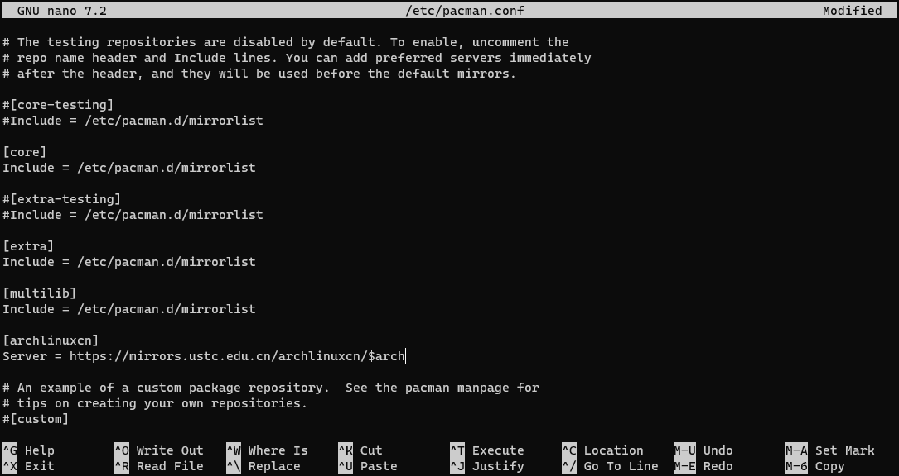
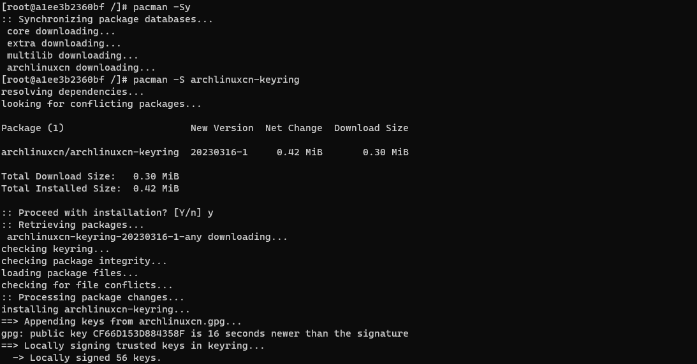

# Docker运行并配置ArchLinux

## 拉取镜像

```bash
docker pull archlinux:latest
```

## 运行容器

```bash
docker run -d -it --name myarch --privileged=true -v /C/Users/14752/dev/myarch:/home archlinux:latest /sbin/init
```

:::tip 命令解释

- `-d` 后台运行容器  
- `-it` 保持打开状态并分配一个tty  
- `--name` 容器名  
- `--privileged` 容器root权限  
    缺少此项会导致没有实际的root权限
- `-v` 挂载目录  
- `/sbin/init` 初始化systemd

:::

## 进入容器

```bash
docker exec -it myarch /bin/bash
```

## 配置mirrorlist镜像源(USTC)

```bash
echo "Server = https://mirrors.ustc.edu.cn/archlinux/\$repo/os/\$arch" > /etc/pacman.d/mirrorlist
```

**注意:** 使用`echo`需要在`$`前进行转义`\`

更新包管理器数据库:

```bash
pacman -Sy
```

安装`nano`:

```bash
pacman -S nano
```

## 配置multilib和archlinuxcn镜像源(USTC)

在 `/etc/pacman.conf` 文件添加:

```conf
[multilib]
Include = /etc/pacman.d/mirrorlist

[archlinuxcn]
Server = https://mirrors.ustc.edu.cn/archlinuxcn/$arch
```



更新pacman软件包签名:
```bash
rm -R /etc/pacman.d/gnupg/
gpg --refresh-keys
pacman-key --init && pacman-key --populate archlinux
```

更新包管理器数据库:

```bash
pacman -Sy
```

安装`archlinuxcn-keyring`包导入 GPG key


