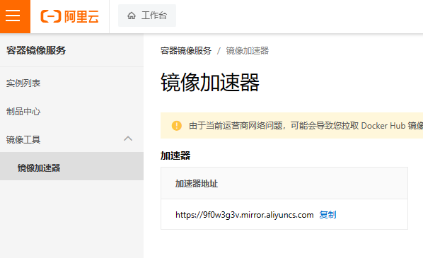
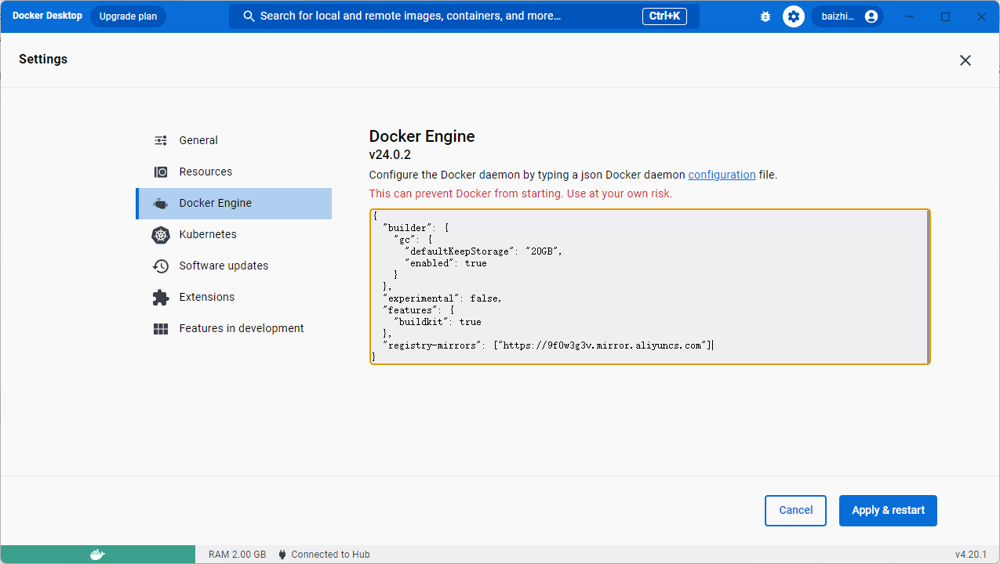

# 配置Docker镜像加速

文档: [阿里云容器镜像服务 ACR](https://help.aliyun.com/document_detail/60750.html)

## 获取加速地址

登录[容器镜像服务控制台](https://cr.console.aliyun.com/?spm=a2c4g.60750.0.0.19e6296aOMcb07)后在 **左侧导航栏** 选择 **镜像工具** > **镜像加速器**



复制加速器地址

## Linux配置

新建文件 `/etc/docker/daemon.json` 写入

```json
{
  "registry-mirrors": ["加速器地址"]
}
```

## Windows配置

在Docker设置里修改引擎配置文件(`json`格式), 写入

```json
"registry-mirrors": ["https://9f0w3g3v.mirror.aliyuncs.com"]
```

文档地址: https://docs.docker.com/engine/reference/commandline/dockerd

