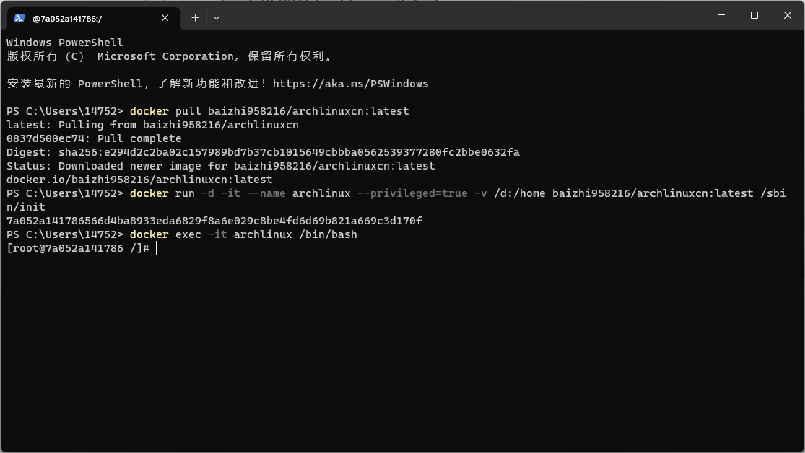

# 制作Docker镜像然后推送到Docker Hub

## 将当前系统打包

linux终端执行:

```bash
tar --numeric-owner --exclude=/home --exclude=/proc --exclude=/sys -cvf archlinux.tar /home
```

:::tip 由于我把Windows的D盘挂载到了容器/home下, 将打包好的系统镜像放到/home可以更方便后续上传
:::

:::warning 注意
`/proc` 文件系统下保存了CPU, 内存等文件信息  
`/sys` 文件系统下存放了当前物理设备文件信息  
同时也要注意排除**其它被挂载**的文件系统
:::

## 导入打包好的系统镜像

```bash
docker import archlinux.tar archlinuxcn
```

导入的镜像默认tag为archlinuxcn:latest

查看镜像信息

```bash
docker images
```


## 登录到Docker Hub

使用 `docker login` 命令登录到docker hub, 前提是已有docker hub账号


## 新建镜像仓库

进入[docker hub](https://hub.docker.com/repositories)新建镜像仓库


点击 <span style="padding: 8px 16px;background-color: rgb(8, 109, 215);color: rgb(255, 255, 255);border-radius: 4px;">Create repository</span>


完成仓库信息填写后点击<span style="padding: 8px 16px;background-color: rgb(8, 109, 215);color: rgb(255, 255, 255);border-radius: 4px;">Create</span>


## 新建带有仓库tag的镜像

格式: `docker tag 镜像名:tag 用户名/仓库名:tag`

```bash
docker tag archlinuxcn:latest baizhi958216/archlinuxcn:latest
```


## 推送到Docker Hub

格式: `docker push 用户名/仓库名:latest`

```bash
docker push baizhi958216/archlinuxcn:latest
```


## 拉取已推送的镜像

```bash
docker pull baizhi958216/archlinuxcn:latest
```


测试可用

