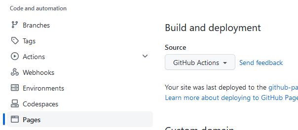

# Github Page 部署 vitepress 项目

::: tip
将在每次提交变更后自动部署
:::

1. 在项目设置里将`Page`的`Build and deployment`源设置为`Github Actions`
   
2. 根目录建立`.github/workflows`文件夹,在里面新建`deploy.yml`文件

::: tip
main 分支响应 github action, 此处应为提交变更的分支
:::

```yml
name: Deploy
on:
  workflow_dispatch: {}
  push:
    branches:
      - main
jobs:
  deploy:
    runs-on: ubuntu-latest
    permissions:
      pages: write
      id-token: write
    environment:
      name: github-pages
      url: ${{ steps.deployment.outputs.page_url }}
    steps:
      - uses: actions/checkout@v3
        with:
          fetch-depth: 0
      - uses: actions/setup-node@v3
        with:
          node-version: 16
      - run: npm i pnpm -g
      - run: pnpm install --frozen-lockfile
      - name: Build
        run: pnpm build
      - uses: actions/configure-pages@v2
      - uses: actions/upload-pages-artifact@v1
        with:
          path: docs/.vitepress/dist
      - name: Deploy
        id: deployment
        uses: actions/deploy-pages@v1
```
