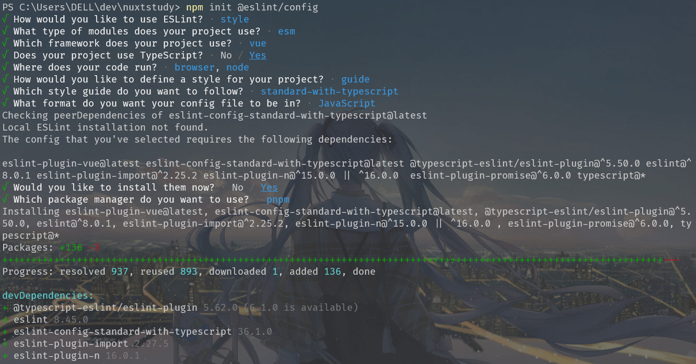

# 配置 ESLint

[Find and fix problems in your JavaScript code](https://eslint.org/)

用于查找并修复 JavaScript/TypeScript 代码中的问题。

## 安装

全局安装 eslint:

```bash
npm i -g eslint
eslint --init
```

单独项目中使用:

```bash
npm init @eslint/config
```



:::details 日志

```cmd
PS C:\Users\DELL\dev\nuxtstudy> npm init @eslint/config
√ How would you like to use ESLint? · style
√ What type of modules does your project use? · esm
√ Which framework does your project use? · vue
√ Does your project use TypeScript? · No / Yes
√ Where does your code run? · browser, node
√ How would you like to define a style for your project? · guide
√ Which style guide do you want to follow? · standard-with-typescript
√ What format do you want your config file to be in? · JavaScript
Checking peerDependencies of eslint-config-standard-with-typescript@latest
Local ESLint installation not found.
The config that you've selected requires the following dependencies:

eslint-plugin-vue@latest eslint-config-standard-with-typescript@latest @typescript-eslint/eslint-plugin@^5.50.0 eslint@^8.0.1 eslint-plugin-import@^2.25.2 eslint-plugin-n@^15.0.0 || ^16.0.0  eslint-plugin-promise@^6.0.0 typescript@*
√ Would you like to install them now? · No / Yes
√ Which package manager do you want to use? · pnpm
Installing eslint-plugin-vue@latest, eslint-config-standard-with-typescript@latest, @typescript-eslint/eslint-plugin@^5.50.0, eslint@^8.0.1, eslint-plugin-import@^2.25.2, eslint-plugin-n@^15.0.0 || ^16.0.0 , eslint-plugin-promise@^6.0.0, typescript@*
Packages: +136 -3
+++++++++++++++++++++++++++++++++++++++++++++++++++++++++++++++++++++++++++++++++++++++++++++++++++++++++++++++++++---
Progress: resolved 937, reused 893, downloaded 1, added 136, done

devDependencies:
+ @typescript-eslint/eslint-plugin 5.62.0 (6.1.0 is available)
+ eslint 8.45.0
+ eslint-config-standard-with-typescript 36.1.0
+ eslint-plugin-import 2.27.5
+ eslint-plugin-n 16.0.1
+ eslint-plugin-promise 6.1.1
+ eslint-plugin-vue 9.15.1
+ typescript 5.1.6

Done in 17.4s
A config file was generated, but the config file itself may not follow your linting rules.
Successfully created .eslintrc.js file in C:\Users\DELL\dev\nuxtstudy
PS C:\Users\DELL\dev\nuxtstudy>
```

:::

## 配置

:::code-group

```js [.eslintrc.js]
module.exports = {
    "env": {
        "browser": true,
        "es2021": true,
        "node": true
    },
    "extends": [
        "standard-with-typescript",
        "plugin:vue/vue3-essential"
    ],
    "overrides": [
        {
            "env": {
                "node": true
            },
            "files": [
                ".eslintrc.{js,cjs}"
            ],
            "parserOptions": {
                "sourceType": "script"
            }
        }
    ],
    "parserOptions": {
        "ecmaVersion": "latest",
        "sourceType": "module"
    },
    "plugins": [
        "vue"
    ],
    "rules": {
    }
}
```

:::

## 最后

一些编译产物不需要做代码校验需要添加 `.eslintignore` 文件，使用 `glob语法` 来匹配文件和目录(类似`.gitignore`)。