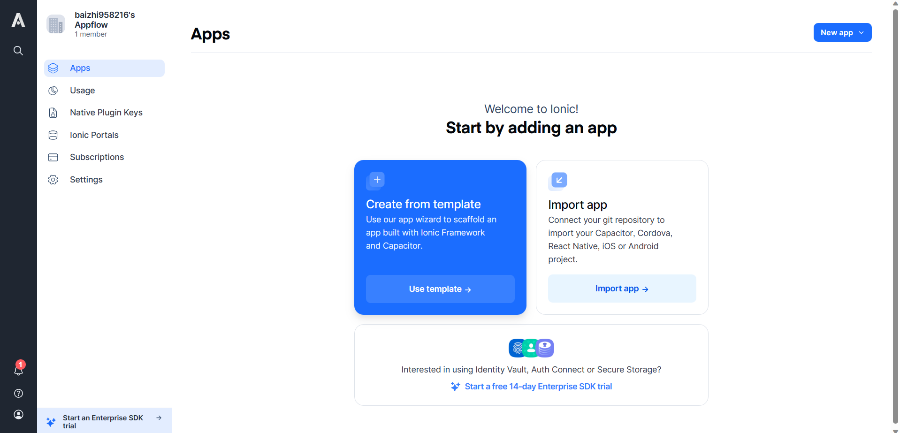
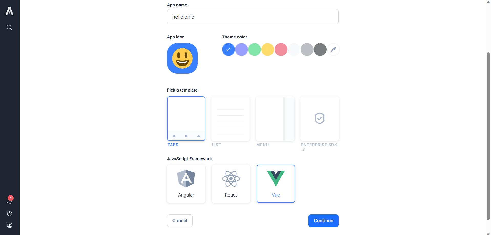
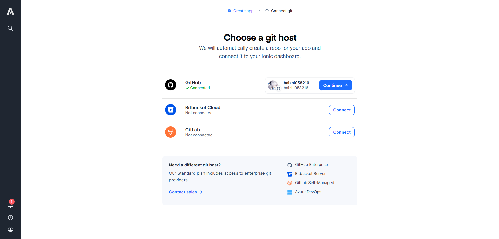

# 浅尝跨平台开发框架Ionic

[官网](https://ionicframework.com/)

## 安装

:::tip 设置`sharp`国内的镜像源

npm版本在8以及以下可以使用npm cli直接设置

```bash
npm config set sharp_binary_host "https://npmmirror.com/mirrors/sharp"
npm config set sharp_libvips_binary_host "https://npmmirror.com/mirrors/sharp-libvips"
```

npm版本大于8需要手动添加config

```bash
npm config edit
```

追加以下内容：

```txt
; sharp_binary_host=https://npmmirror.com/mirrors/sharp
; sharp_libvips_binary_host=https://npmmirror.com/mirrors/sharp-libvips
```

:::

安装ionic cli：

```bash
npm install -g @ionic/cli @capacitor/assets
```

## 通过ionic官方提供dashboard新建项目

打开[ionic dashboard](dashboard.ionicframework.com)

新建用户后点击Create from template



设置好应用模板信息后点击continue

:::tip App模板设置

可以选择不同的开发框架, Angular、React、Vue

:::



连接git账号新建ionic项目仓库




## 运行项目

将通过ionic dashboard新建的项目clone到本地

```bash
git clone https://github.com/baizhi958216/helloionic.git helloionic
cd helloionic
```

安装依赖

:::tip 注意

此过程会安装cypress，注意保持网络畅通

:::

```bash
pnpm i
```

启动网页版

```bash
ionic serve
```

## 打包安卓项目

:::tip 注意

ionic cordova暂不支持直接打包安卓项目，需要通过capacitor打包

:::

安装capacitor android

```bash
pnpm i @capacitor/core @capacitor/android
pnpm i -D @capacitor/cli
```

项目初始化capacitor

:::warning 注意

删除项目下的`capacitor.config.ts`

:::

```bash
npx cap init
```

新建`html`入口

在`public`目录下新建`index.html`：

```html
<!DOCTYPE html>
<html lang="zh">
  <head>
    <meta charset="UTF-8" />
    <meta name="viewport" content="width=device-width, initial-scale=1.0" />
    <title>helloionic</title>
  </head>
  <body></body>
</html>
```

初始化安卓项目

```bash
npx cap add android
```

调用安卓开发者工具打开项目

```bash
npx cap open android
```

可以通过cli或者开发者工具运行app

cli：
```bash
npx cap run android
```