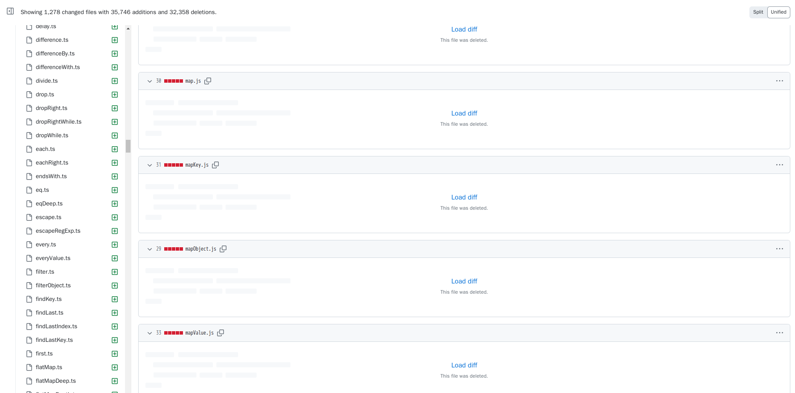
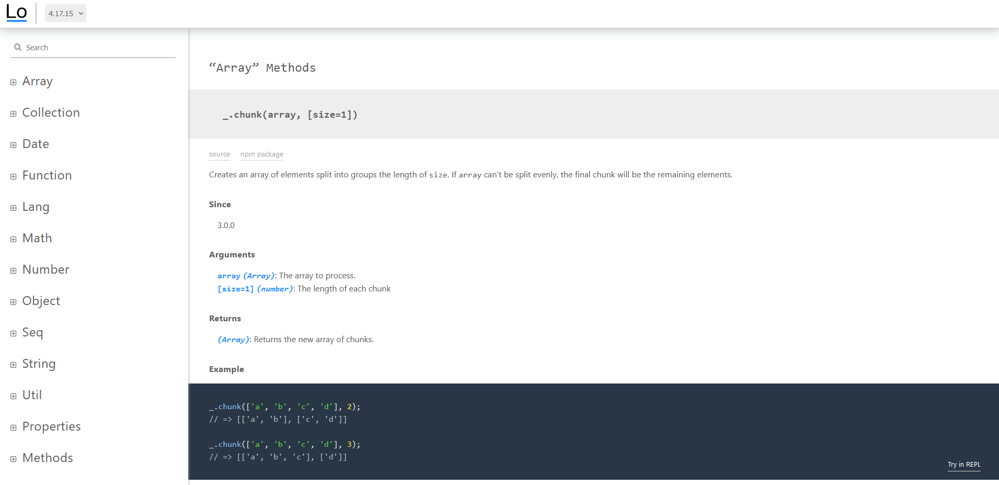

# Lodash

[官网](https://lodash.com/)

[Github 仓库](https://github.com/lodash/lodash)


## 目录

- [Lodash 是什么](#lodash-是什么)
- [2023 年了，还需要用 Lodash 吗？](#_2023-年了-还需要用-lodash-吗)
- [安装和使用](#安装和使用)

## Lodash 是什么

Lodash ~~是一个 JavaScript 的实用工具库~~，封装了 JavaScript 常用的函数和数据操作，提高了开发效率并且减少了代码量。

:::tip 使用TypeScript重写

2023年9月17日，lodash作者使用bun+js对项目进行了重构: [wip: migrate to bun](https://github.com/lodash/lodash/commit/97d4a2fe193a66f5f96d7b813bed96b35b5abf15)



:::

Lodash 是 Underscore.js 的前端大型衍生项目，提供了诸如`数组操作`，`字符串操作`，`对象操作`等工具函数。

Lodash 库是按照模块化方式进行构建，每个模块都可以单独使用。

## 2023 年了，还需要用 Lodash 吗？

ECMAScript 提出了很多新的方法，拓展了很多特性，很多功能已经不再需要使用 Lodash 就能实现，况且 Lodash 在 2021 年就停止了更新。

Github 上有个仓库解释了为什么不再需要 Lodash:[You Don`t Need Lodash Underscore](https://github.com/you-dont-need/You-Dont-Need-Lodash-Underscore)。

[youmightnotneed](https://youmightnotneed.com/lodash)也有相关资料关于 Lodash 实现与原生 ES 语法实现。

但是像`深度拷贝`、`链式调用`、`节流`、`防抖`等原生 ES 难以实现的操作还需要使用 Lodash，而且技多不压身，学一下也没坏处。

## 安装和使用

通过`pnpm`安装:

```bash
pnpm i lodash @types/lodash
```

使用:

```ts
import { chunk } from "lodash"; //[!code focus]
chunk(["a", "b", "c", "d"], 2); // [ [ 'a', 'b' ], [ 'c', 'd' ] ]
```

更多模块以及使用方式参考[官网文档](https://lodash.com/docs/4.17.15)



## 模块索引

::: details [Array](https://lodash.com/docs/4.17.15#chunk)

chunk

compact

concat

difference

differenceBy

differenceWith

drop

dropRight

dropRightWhile

dropWhile

fill

findIndex

findLastIndex

first -> head

flatten

flattenDeep

flattenDepth

fromPairs

head

indexOf

initial

intersection

intersectionBy

intersectionWith

join

last

lastIndexOf

nth

pull

pullAll

pullAllBy

pullAllWith

pullAt

remove

reverse

slice

sortedIndex

sortedIndexBy

sortedIndexOf

sortedLastIndex

sortedLastIndexBy

sortedLastIndexOf

sortedUniq

sortedUniqBy

tail

take

takeRight

takeRightWhile

takeWhile

union

unionBy

unionWith

uniq

uniqBy

uniqWith

unzip

unzipWith

without

xor

xorBy

xorWith

zip

zipObject

zipObjectDeep

zipWith

:::

::: details [Collection](https://lodash.com/docs/4.17.15#countBy)
countBy

each -> forEach

eachRight -> forEachRight

every

filter

find

findLast

flatMap

flatMapDeep

flatMapDepth

forEach

forEachRight

groupBy

includes

invokeMap

keyBy

map

orderBy

partition

reduce

reduceRight

reject

sample

sampleSize

shuffle

size

some

sortBy

:::

::: details [Date](https://lodash.com/docs/4.17.15#now)

now

:::

::: details [Function](https://lodash.com/docs/4.17.15#after)

after

ary

before

bind

bindKey

curry

curryRight

debounce

defer

delay

flip

memoize

negate

once

overArgs

partial

partialRight

rearg

rest

spread

throttle

unary

wrap

:::

::: details [Lang](https://lodash.com/docs/4.17.15#castArray)

castArray

clone

cloneDeep

cloneDeepWith

cloneWith

conformsTo

eq

gt

gte

isArguments

isArray

isArrayBuffer

isArrayLike

isArrayLikeObject

isBoolean

isBuffer

isDate

isElement

isEmpty

isEqual

isEqualWith

isError

isFinite

isFunction

isInteger

isLength

isMap

isMatch

isMatchWith

isNaN

isNative

isNil

isNull

isNumber

isObject

isObjectLike

isPlainObject

isRegExp

isSafeInteger

isSet

isString

isSymbol

isTypedArray

isUndefined

isWeakMap

isWeakSet

lt

lte

toArray

toFinite

toInteger

toLength

toNumber

toPlainObject

toSafeInteger

toString

:::

::: details [Math](https://lodash.com/docs/4.17.15#add)

add

ceil

divide

floor

max

maxBy

mean

meanBy

min

minBy

multiply

round

subtract

sum

sumBy

:::

::: details [Number](https://lodash.com/docs/4.17.15#clamp)

clamp

inRange

random

:::

::: details [Object](https://lodash.com/docs/4.17.15#assign)

assign

assignIn

assignInWith

assignWith

at

create

defaults

defaultsDeep

entries -> toPairs

entriesIn -> toPairsIn

extend -> assignIn

extendWith -> assignInWith

findKey

findLastKey

forIn

forInRight

forOwn

forOwnRight

functions

functionsIn

get

has

hasIn

invert

invertBy

invoke

keys

keysIn

mapKeys

mapValues

merge

mergeWith

omit

omitBy

pick

pickBy

result

set

setWith

toPairs

toPairsIn

transform

unset

update

updateWith

values

valuesIn

:::

::: details [Seq](https://lodash.com/docs/4.17.15#lodash)

\_

chain

tap

thru

prototype[Symbol.iterator]

prototype.at

prototype.chain

prototype.commit

prototype.next

prototype.plant

prototype.reverse

prototype.toJSON -> value

prototype.value

prototype.valueOf -> value

:::

::: details [String](https://lodash.com/docs/4.17.15#camelCase)

camelCase

capitalize

deburr

endsWith

escape

escapeRegExp

kebabCase

lowerCase

lowerFirst

pad

padEnd

padStart

parseInt

repeat

replace

snakeCase

split

startCase

startsWith

template

toLower

toUpper

trim

trimEnd

trimStart

truncate

unescape

upperCase

upperFirst

words

:::

::: details [Util](https://lodash.com/docs/4.17.15#attempt)

attempt

bindAll

cond

conforms

constant

defaultTo

flow

flowRight

identity

iteratee

matches

matchesProperty

method

methodOf

mixin

noConflict

noop

nthArg

over

overEvery

overSome

property

propertyOf

range

rangeRight

runInContext

stubArray

stubFalse

stubObject

stubString

stubTrue

times

toPath

uniqueId

:::

::: details [Properties](https://lodash.com/docs/4.17.15#VERSION)

VERSION

templateSettings

templateSettings.escape

templateSettings.evaluate

templateSettings.imports

templateSettings.interpolate

templateSettings.variable

:::

::: details [Methods](https://lodash.com/docs/4.17.15#templateSettings-imports-_)

templateSettings.imports.\_

:::

## 常用功能

## 防抖(debounce)

```vue
<script setup>
import { debounce } from "lodash";

const debounceMethod = debounce(() => {
  console.log("防抖: 延时2秒执行");
}, 2000);
</script>

<template>
  <div>
    <button @click="debounceMethod()">防抖</button>
  </div>
</template>
```

## 节流(throttle)

```vue
<script setup>
import { throttle } from "lodash";

const throttleMethod = throttle(() => {
  console.log("节流: 2秒内最多执行一次");
}, 2000);
</script>

<template>
  <div>
    <button @click="throttleMethod()">节流</button>
  </div>
</template>
```
