# 为git提交记录签名

## `-s`和`-S`

- [-s (signoff)](#signoff)

    在提交信息尾部追加提交者本地提交信息

    格式: `Signed-off-by 用户名 <邮箱>`

    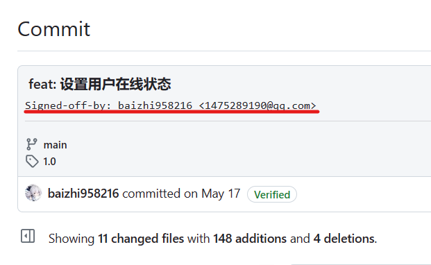

    :::tip 命令
    ```bash
    git commit -s
    ```
    :::

- [-S (gpg-sign)](#gpg-sign)

    使用gpg签名, 确保提交由本人进行, 提交后会新增`verified` tag

    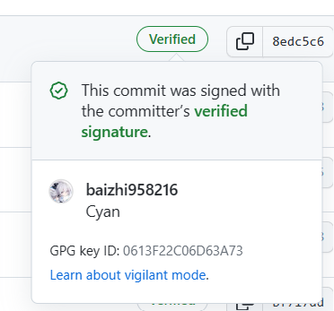

    :::tip 命令
    ```bash
    git commit -S
    ```
    :::

## 个人习惯

配置每次提交自动gpg签名
```bash
git config --global commit.gpgsign true
```
进行提交
```bash
git commit -s -m "提交信息"
```

## signoff

追加的提交者信息由git config的`user.name`以及`user.email`进行配置

```bash
git config --global user.name "baizhi958216"
git config --global user.email "1475289190@qq.com"
git config --list
```

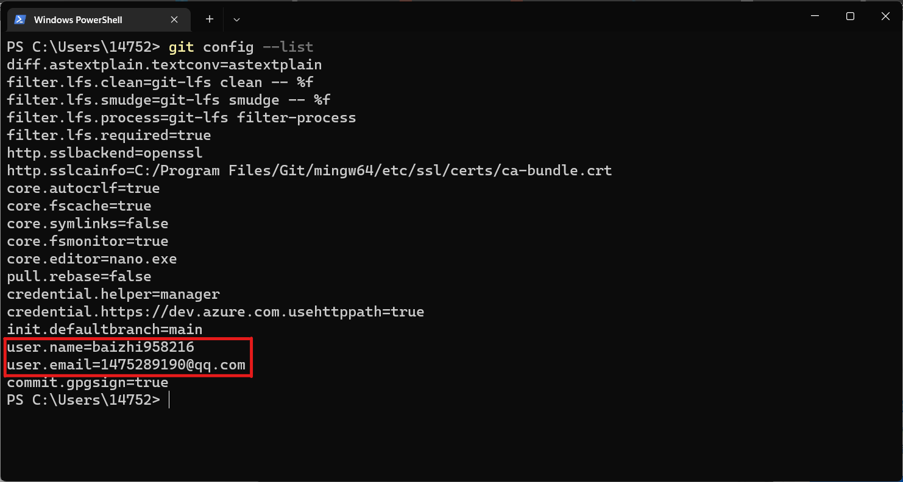

## gpg-sign

若提交者只是简单的使用用户名+邮箱进行提交签名, 需要注意的是这是可伪造的

使用gpg签名, 在gpg私钥未泄露情况下可以确保提交者是本人

### 生成签名

1. 在git bash里运行`gpg --full-generate-key`

    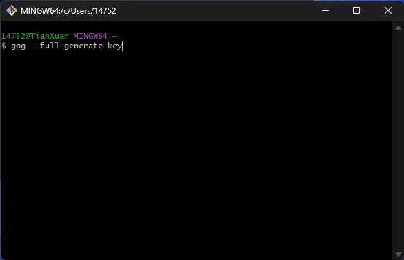
    
2. 选择密钥加密算法

    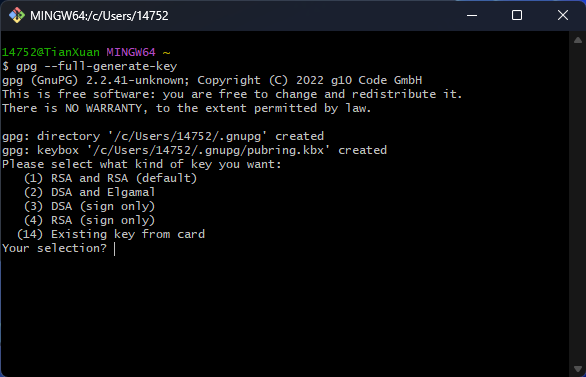

3. 设置密钥长度, 默认3072位

    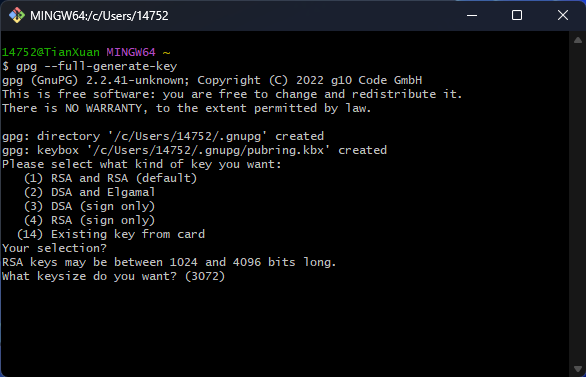

4. 密钥过期时间, 默认(0)永不过期

    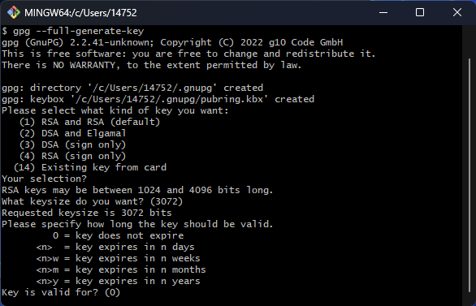

5. 确认以上配置

    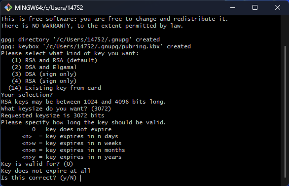

6. 输入用户名

    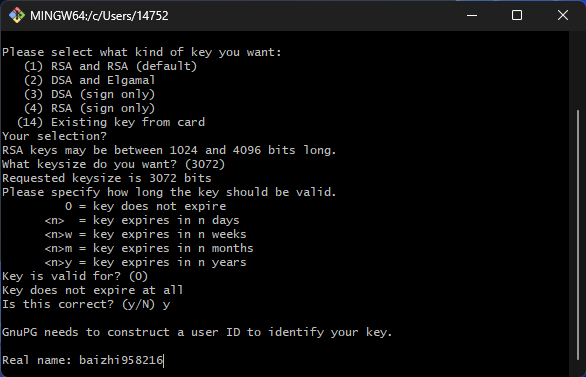

7. 输入用户邮箱

    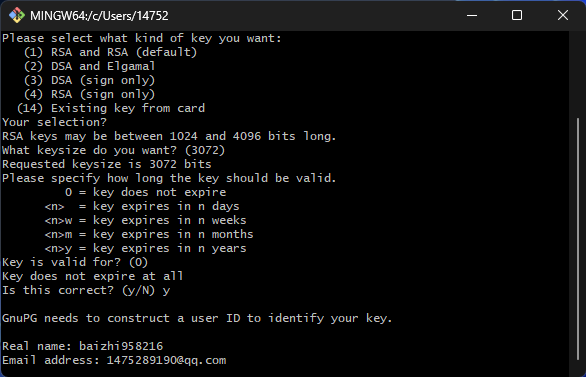

8. 输入注释, 可留空

    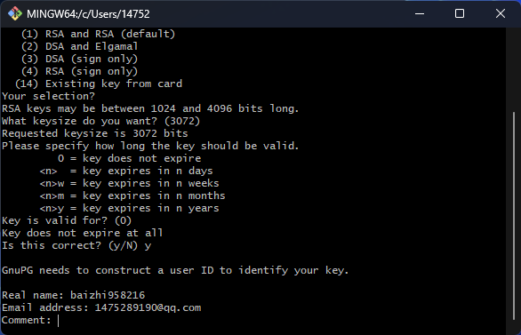

9. 在弹出的会话框输入密钥保护密码, 可留空

    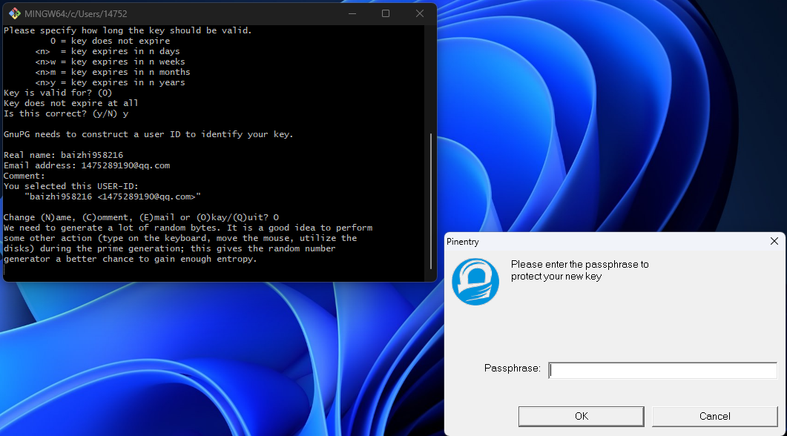

10. 确认不需要密钥保护密码

    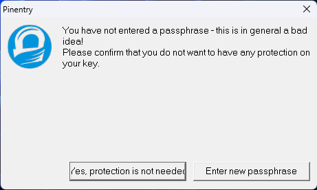

11. 完成gpg密钥生成

    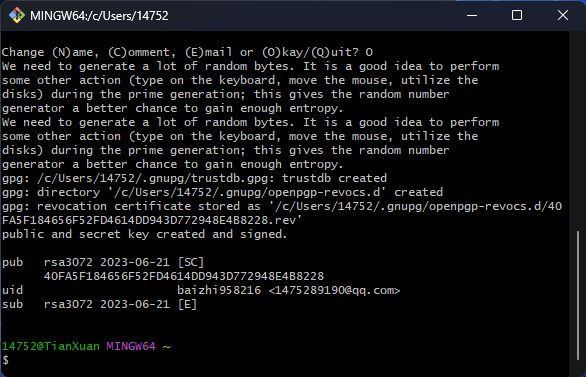

12. 尝试提交

    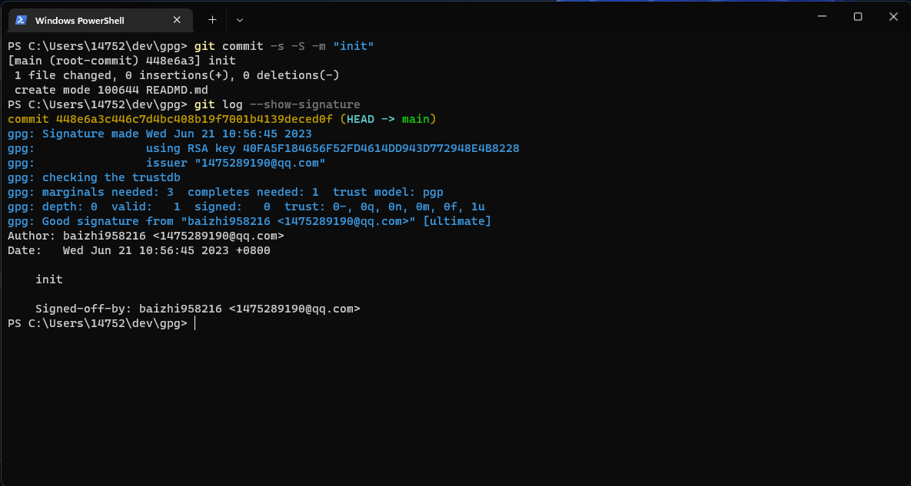

## gitea添加生成的gpg密钥

1. 在git bash执行`gpg --list-keys`查看已有gpg密钥
    
    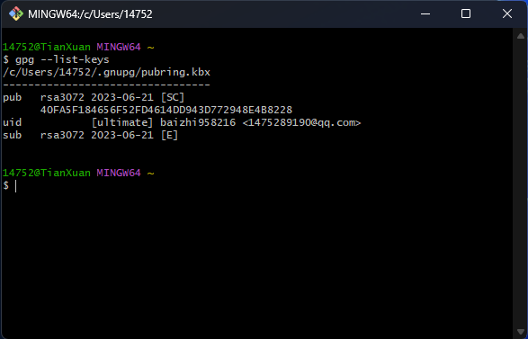

2. 执行`gpg --armor --export 用户名`到出gpg公钥
    
    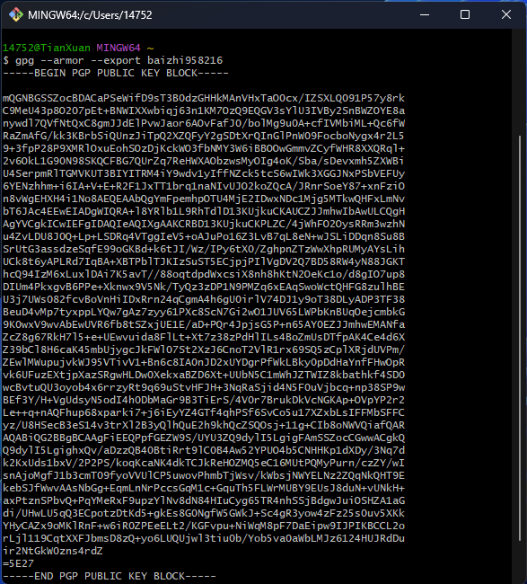

3. 将公钥复制
    
    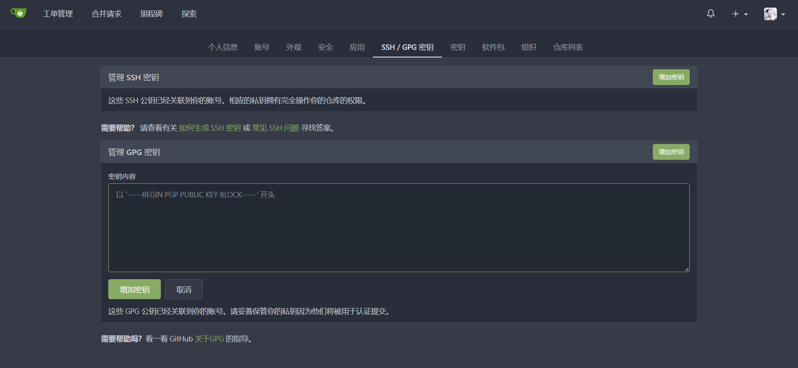

4. 完成gpg添加
    
    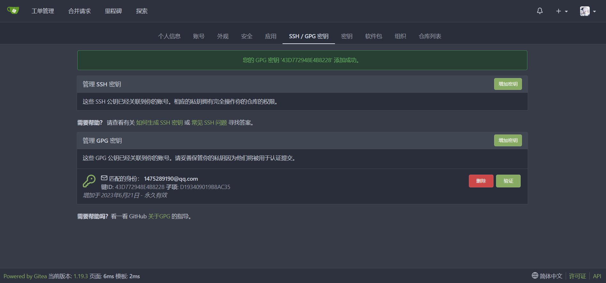
