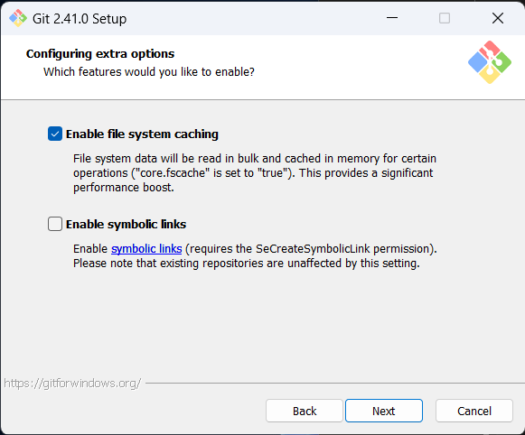

# git安装和配置

在`Linux`下通过包管理器安装git即可, 本文档主要针对`Windows`。

## 安装程序下载

[下载地址](https://git-scm.com/download/win)

## 安装过程

:::tip 一般来说一直下一步即可

:::

## 安装过程截图

:::tip 对于命令行用户

此处推荐使用`nano`, `vim`

:::

:::tip 修改默认分支名

github在2020年10月1日将默认分支由master修改为main

[详细说明](https://github.com/github/renaming)

当然，这取决于项目需求，一些代码仓库依然使用`master`，我只是同步github的变更

:::

## 配置git用户提交信息

