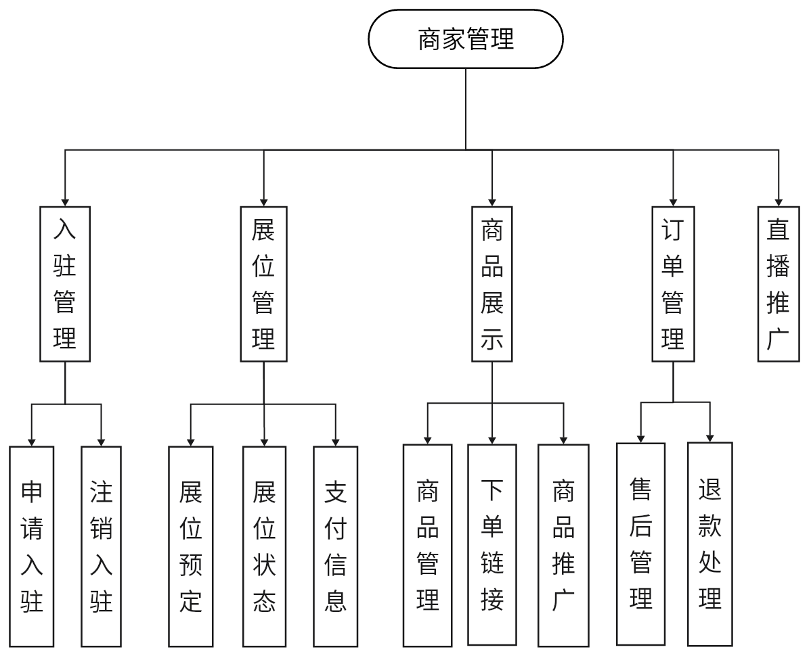

# 毕业设计

## 序言: 我要做什么，为什么要做这个东西？

我很喜欢二次元，特别是对于二次元周边这类的东西（手办、鼠标、鼠标垫、痛衣、联动。。。）基本上都还算满意，直到最近去了几次漫展，我发现大家会给Coser们拍照，对我这种社恐宅宅们拍完并不知道怎样才能让返图去到Coser手中，放到微博，小红书这些公共平台Coser们不一定会马上看到，质量的参差不齐还有可能会给Coser造成困扰，自己留着看吧`(哭)`。

基于此，我希望能有一个平台，汇总了漫展的具体时间，场次，邀请到的嘉宾，Coser可以通过平台注册声明参加漫展，宅宅可以将返图上传到指定漫展场次和Coser，然后Coser们可以拿到自己的返图。

## 这个平台是怎样的？

首先，平台的用户端是一个漫展资讯综合平台，为用户提供`各地漫展资讯`,`展方公布展览信息`，`用户购票`，`漫展时间提醒`，`Coser返图`服务，除此之外，有`杂谈区`供用户发表帖子讨论，有`**区`供用户进行图片、视频发布以及漫展现场直播。

管理端需要实现一个数据可视化功能，对`漫展综合`，`图片`，`视频`，`帖子`，`用户购票订单`有分析服务，对各个模块进行划分有数据的`增、删、改、查`管理的基础功能。

平台需要进行跨端处理，项目初期进行Web端开发，完成后逐步开始进行移动端适配。

域名和服务器考虑到需要实名，先放localhost跑着。

## 技术架构选型

### ~~Next.js~~

~~Next.js 是一个基于Node.JS的全栈 Web 框架。它通过扩展最新的 React 特性，并集成了基于 Rust 的强大 JavaScript 工具(SWC、Turbopack)，以实现最快的构建速度。它支持服务器端渲染(SSR)、静态站点生成(SSG)和自动代码拆分，还提供了更加方便的路由支持。Next.js 受到许多包括`抖音`、`英伟达`、`Nike`、`netflix`等大公司的青睐并且正在使用，性能十分出色。~~

~~[showcase](https://nextjs.org/showcase)~~

由于项目使用Tauri处理跨平台，Tauri尚不支持服务端渲染(SSR)，所以要对服务进行拆分。

拆分前后端的好处(或者说是关注点)：React负责向用户进行页面功能展示和交互，SpringBoot负责业务逻辑和数据处理，NodeJS负责前后端请求的转发和聚合，使得代码结构更加清晰。

强大的生态系统：React、SpringBoot和NodeJS都有活跃的社区和丰富的生态系统，提供了大量的工具、库和组件，可以加速开发过程，提高开发效率。

高性能和可扩展性：React的虚拟DOM和高效的渲染机制、SpringBoot的优化和自动化特性、NodeJS的非阻塞I/O和事件驱动机制，加上是使用BFF架构，后端新特性的更新更加方便拆出来进行灰度，总之很强。

### ReactJS

React作为三件套中性能最好的框架，它提供了组件化开发的能力(相比其它两个，React貌似更加关注这个)，构建用户界面更加模块化和可维护，并且它有一个庞大的生态系统，提供了丰富的第三方库和组件，加速开发进度。

组件化开发模式可以将平台的各个功能模块拆分成独立的组件，如漫展资讯、展览信息、用户购票等，提高代码的可维护性和复用性。

异步数据加载机制，可以在页面渲染前异步获取各地漫展资讯、展览信息等数据，提高页面加载速度和用户体验。

React Router可以实现平台内不同功能模块之间的路由管理，实现页面的无刷新加载和用户导航。

### NodeJS

BFF层的作用是将前端和后端之间的请求进行转发和聚合，NodeJS可以通过异步处理请求，提高响应速度和性能。

NodeJS是一个基于V8的服务器端运行环境，也可以通过C++调原生平台特性，它有非阻塞I/O和事件驱动的特性，能够处理并发请求。NodeJS的轻量级和高效性是作为BFF层最好的选择。

我选择GraphQL作为NodeJS的API层，主要是前端驱动的开发，减少后端接口返回参数过度获取。接收来自前端的请求，并将其转发到对应的SpringBoot后端服务中，聚合数据并返回给前端，实现各地漫展资讯、展览信息等功能的数据获取。

图片、视频上传: 使用NodeJS的文件上传功能，实现用户上传图片、视频等媒体文件，并将其存储到合适的存储系统（如云存储）中。

WebSocket实时通信: 使用NodeJS的WebSocket功能，实现漫展现场直播功能，将实时的图片、视频数据推送给用户端。

### SpringBoot
SpringBoot是一个基于Spring框架的快速开发框架，它提供了自动配置和约定优于配置的特性，减少工作量还内置了大量的功能和库，数据库访问、安全认证、API开发等。

### PostgreSQL

PostgreSQL 是另一个功能强大的关系型数据库，它具有高度的可扩展性和丰富的数据类型支持。它也是一个开源项目，拥有活跃的社区和广泛的功能。

数据结构化和关联：使用 PostgreSQL 设计和管理各个模块之间的数据结构和关系，可以创建表来存储漫展资讯、展览信息、用户购票订单、帖子、图片、视频等数据，并使用外键关联它们，以建立数据之间的关系。

数据一致性和完整性：PostgreSQL 提供强大的事务支持，可以确保对于复杂的数据操作，如用户购票、帖子发布、图片、视频的管理等，数据的一致性和完整性得到保证。这是非常重要的，以确保平台的数据始终处于正确的状态，用户能够正常使用各项功能。

复杂查询和数据分析：使用 PostgreSQL 的查询可以轻松地进行复杂的查询和数据分析。通过编写 SQL 查询语句，从漫展资讯、展览信息、用户购票订单、帖子、图片、视频等数据中提取和聚合所需的信息，以满足用户端和管理端对数据的需求。

数据可视化和分析：对于管理端的数据可视化功能，使用 PostgreSQL 的查询功能结合图表库（如D3.js、Chart.js等）来实现数据可视化。通过编写查询语句，对漫展综合、图片、视频、帖子、用户购票订单等数据进行聚合、过滤和计算，生成统计报表、图表或其他形式的数据可视化。

增删改查管理功能：使用 PostgreSQL，可以轻松实现对各个模块数据的增删改查管理功能。通过编写相应的 SQL 查询语句或使用 PostgreSQL 的ORM框架，如 Sequelize，Prisma 可以对漫展资讯、展览信息、用户购票订单、帖子、图片、视频等数据进行操作。

相比于 MongoDB， PostgreSQL在事务支持、数据一致性和完整性方面更加强大。

### Redis

Redis 是一个高性能的内存数据库，可以用作缓存层来提高平台的响应速度。可以将经常访问的数据存储在 Redis 中，以减少对主数据库的访问次数，从而加快数据读取速度。

高效的键值存储：Redis 提供了简单而灵活的键值存储模型，可以存储各种类型的数据，如字符串、列表、哈希表、集合等。可以存储和管理漫展资讯、展览信息、用户购票订单、帖子、图片、视频等数据。

发布/订阅功能：Redis 提供了发布/订阅功能，可以用于实现实时通知和事件处理。使用发布/订阅功能来实现漫展时间提醒、漫展现场直播等功能，以提供实时的信息推送和更新。

分布式锁和计数器：Redis 提供了分布式锁和计数器功能，可以用于实现并发控制和计数操作。使用分布式锁来保证对关键资源的原子性访问，使用计数器来统计用户购票数量、帖子浏览量等。

持久化和数据备份：Redis 提供了持久化选项，可以将数据存储在磁盘上，以保证数据的持久性。这对于避免数据丢失和进行数据备份非常重要，尤其是对于一些重要的业务数据。

需要注意的是，Redis 是一个内存数据库，它的存储空间有限。因此，对于较大的数据集，需要仔细考虑存储在 Redis 中的数据，并使用合适的缓存策略，以确保性能和可用性。

### Tauri

Tauri 是一个开源的框架，它结合了 Web 技术 和 Rust 语言，支持多种前端框架(Vue、React、Next、Nuxt、Svelte等)可以用于构建跨平台原生桌面应用程序，包括 Windows、Linux、Android 、IOS 和 Mac。

:::tip

Android、IOS目前在tauri 2.0 Beta

:::

## 课题的背景、目的和意义

### 背景：

近年来，漫展在全球范围内越来越受欢迎。漫展作为一个聚集了动漫、游戏、动画、电影等粉丝群体的重要活动，吸引了大量的参与者和观众。

然而，对于漫展的具体信息、时间安排、嘉宾邀请以及Cosers的返图等方面的管理和组织仍然存在漫展信息分散、难以及时更新等问题。

此外，漫展参与者之间的交流和互动也缺乏统一的交流平台。

因此，设计一个综合平台来汇总漫展信息、提供返图服务以及促进用户之间的交流具有重要意义。

### 目的：

设计和开发一个漫展综合平台，旨在为用户提供漫展资讯、购票服务、时间提醒、Coser返图服务以及交流互动的功能。

通过这个平台，用户可以方便地获取漫展的具体信息，购买门票，设置时间提醒，与其他用户分享和下载Cosers的返图，并参与讨论和交流。

同时，管理端还提供了数据分析和管理功能，有助于对漫展的综合数据、用户行为和平台运营情况进行监控和分析。

### 意义：

提供便捷的漫展资讯：通过平台，用户可以方便地获取到各地漫展的具体时间、场次和嘉宾等信息，为他们提供参展和观展的便利。

促进Cosers的互动和分享：平台允许Cosers将返图上传并与其他Cosers分享，促进他们之间的交流、启发和互动。

构建用户社区和讨论平台：通过杂谈区和视频区，用户可以发表帖子、分享图片和视频，以及进行漫展现场的直播，搭建起一个用户之间交流和互动的社区。

数据分析和管理：管理端提供数据可视化和管理功能，帮助管理员对漫展综合数据、用户行为和平台运营情况进行监控和分析，为平台的优化和改进提供依据。

## 课题的基本内容

新用户首先进行登录注册，进而可选认证Coser或商家（展方）。

流程图如下：

### 普通用户功能：

- 浏览漫展信息：查看漫展的日期、时间、地点、参展嘉宾等详细信息。

- 搜索漫展：通过关键词搜索感兴趣的漫展，并获取相关信息。

- 购票服务：在线购买漫展门票，选择座位、票档和支付方式。

- 个人资料管理：填写和更新个人资料，包括昵称、头像、个人简介等。

- 返图分享：上传和分享自己的Cosplay照片和作品，与其他用户互动和评论。

- 活动提醒：设置提醒功能，接收漫展相关活动的通知和提醒。

- 社区交流：参与交流社区，发表帖子、评论、点赞和关注其他用户。

- 漫展评价：对参加过的漫展进行评价和打分，提供参考和反馈。

- 消息通知：接收平台和其他用户发送的消息和通知。

- 直播互动：浏览漫展直播列表，选择感兴趣的直播进行观看。

- 点赞和分享：给喜欢的直播点赞，并通过社交媒体分享直播链接。

功能图结构图如下：

### Coser功能（注册Coser认证后开放）：

- Cosplay作品展示：上传和展示自己的Cosplay作品照片和视频。

- Coser社交：关注其他Coser，建立社交圈子，互相点赞和评论作品。

- 返图管理：查看和下载用户返图。

- 活动签到：参加漫展时进行签到，展示自己的Cosplay作品和参与度。

- 直播互动：通过直播平台与观众进行互动，回答问题和展示作品。

功能图结构图如下：

### 商家（展方）功能（注册商家后开放）：

- 商家入驻：申请成为漫展平台的商家，提交相关资料和展位需求。

- 展位管理：选择和预订合适的展位，管理展位状态和支付信息。

- 商品展示：上传和展示商家的相关商品，提供购买链接和详细描述。

- 订单管理：查看和管理用户的购买订单，处理订单退款和售后服务。

- 直播推广：商家可以通过直播平台展示和推广自己的商品和服务。

功能图结构图如下：

### 平台管理员功能：

- 用户管理：管理用户信息，包括注册审核、权限管理和封禁处理。

- 漫展管理：添加、编辑和删除漫展信息，管理漫展时间表和参展商家。

- 数据分析：分析平台数据，生成统计报表和图表，提供决策支持。

- 内容审核：审核和管理用户上传的返图、帖子和评论，确保内容符合平台规范。

- 技术支持：解决用户的技术问题和平台故障报告，提供技术支持和维护。

- 直播管理：审核和管理直播内容，确保直播内容符合平台规范。

功能图结构图如下：

 
## 设计课题的思路和方法

:::tip 设计思路
通过查阅、搜集活动管理平台、在线购票技术和社交系统相关数据，对漫展综合平台进行系统需求分析。

通过综合设计，实现漫展信息浏览、购票服务、用户社交互动等功能。

为了满足前端特定的需求和提高前端开发效率。通过将前端和后端的交互逻辑放置在BFF层，可以实现前后端的松耦合，提高系统的可维护性和可扩展性。

在这个架构中，前端使用React作为UI框架，BFF层使用Node.js实现，后端使用Spring Boot提供核心业务逻辑。

通过对平台功能测试，能实现漫展活动管理功能，应用于实际的漫展环境中，具有较好的应用性。
:::

:::tip 设计方法

基于BFF架构、React前端、Node.js BFF层和Spring Boot后端的设计方法如下：

a. 需求分析和接口设计：根据业务需求，设计BFF层的接口，并定义前端需要的数据格式和数据结构。

b. 前端开发：使用React框架进行前端开发，实现用户界面和用户交互功能。通过BFF层提供的接口获取数据和处理前端请求。

c. BFF开发：使用Node.js进行开发，实现前端需要的接口和数据处理逻辑。BFF层负责调用后端API或服务，并将数据适配为前端需要的格式。

d. 后端开发：使用Spring Boot开发后端服务，实现系统的核心业务逻辑和数据存储。后端服务提供RESTful API或其他形式的接口，供BFF层调用。

e. 接口文档：在设计过程中，编写清晰的接口文档，定义前后端之间的接口规范和数据格式。确保接口的一致性和数据的正确传递。

f. 安全和性能优化：在设计和开发过程中，考虑系统的安全性和性能优化。采用安全的认证和授权机制，确保数据的安全传输和访问权限。进行系统的性能测试和优化，提高系统的响应速度和并发处理能力。

g. 部署和监控：完成开发后，将前端应用、BFF层和后端服务分别部署到相应的服务器上。建立监控系统，实时监控系统的运行状态和性能指标，及时发现和解决问题。
:::

## 主要参考文献

[1] Alkhodary S. The Evaluation of Using Backend-For-Frontend in a Microservices Environment[J]. 2022

[2] Le D A. E-Commercial Full Stack Web Application Development: with React, Redux, NodeJS, and MongoDB[J]. 2023.

[3] Svensson M, Runemark A. Back-end for Front-end Connectorto Reduce Development Time: A Proof of Concept Project[J]. 2023.

[4] Kumar S, Thakral P. Spring Boot Application using Three Layered Architecture[J]. 2023.

[5] Christiaan Brand, Sriram Karra. The beginning of the end of the password. 2023

[6]刘冲. Cosplay亚文化变迁及参与者的媒介使用[D].四川外国语大学,2023.DOI:10.27348/d.cnki.gscwc.2022.000188. 

[7]黄纯悦,彭起,张拂晓等.多副本分布式事务处理关键技术及典型数据库系统综述[J].软件学报,2024,35(01):455-480.DOI:10.13328/j.cnki.jos.006822.

[8]李小红.在微服务下基于GraphQL构建通用一层[J].电脑知识与技术,2022,18(18):91-94.DOI:10.14004/j.cnki.ckt.2022.1217. 

[9]王祺朝. 基于SRS的高并发直播系统的研究与实现[D].西安电子科技大学,2023.DOI:10.27389/d.cnki.gxadu.2022.000599.

[10]罗靖,吴佳莹,何凯等.功能性极简主义在UI设计中的应用及其实例分析[J].工业控制计算机,2023,36(10):84-85+88.

[11]章周.上海工程技术大学交友网站的设计与实现[J].电脑知识与技术,2020,16(13):105-107.DOI:10.14004/j.cnki.ckt.2020.1634.

[12]杨明.Web前端性能优化方法研究分析[J].信息记录材料,2023,24(08):161-163.DOI:10.16009/j.cnki.cn13-1295/tq.2023.08.036.

[13]杭瑞山. Web前端网络拥堵问题的优化研究[D].浙江海洋大学,2023.DOI:10.27747/d.cnki.gzjhy.2023.000353.

[14]欧阳习彪,徐宝林.基于Docker容器的高并发Web系统架构设计与实现[J].现代计算机,2023,29(13):105-108.

[15]陈瑜,张雨萌.前后端分离应用容器化集成部署方案的设计与实现[J].软件,2023,44(01):77-80.
