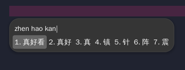

# ArchLinx 配置中文拼音输入法

使用的是 fcitx5

## 依赖

```bash
sudo pacman -S fcitx5 fcitx5-chinese-addons fcitx5-qt5 fcitx5-configtool
```

## 配置

在`.xprofile`追加:

```txt
export GTK_IM_MODULE=fcitx
export QT_IM_MODULE=fcitx
export XMODIFIERS="@im=fcitx"
```

## 启动

执行`fcitx5 & gnome-session`

## 主题

默认的 fcitx 主题有点丑，Gnome 可以使用[Input Method Panel](https://extensions.gnome.org/extension/261/kimpanel/)插件


