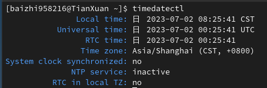
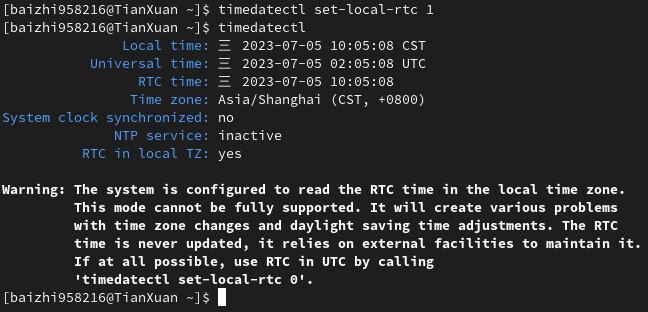

# Linux 与 Windows 时间不一致研究

## 各种时钟

:::tip GMT : Greenwich Mean Time

即格林尼治标准时间（世界时），以地球自转为基础的时间计量系统，但是由于地球自转的不均匀性以及地极的移动，单纯采用天文观测获得的时间是不均匀的，所以 GMT 不再作为世界标准时间使用。

:::

:::tip UTC：Universal Time Coordinated

即协调世界时，以原子时秒长为基础，在时刻上尽量接近于 GMT 的一种时间计量系统。为确保 UTC 与 GMT 相差不会超过 0.9 秒，在有需要的情况下会在 UTC 内加上正或负闰秒。UTC 现在作为世界标准时间使用。

当地时间会与世界标准时间（UTC）之间的偏移量来定义。这个偏移量可以表示为 UTC-或者 UTC+，后面接上偏移的小时或分钟数。

:::

:::tip RTC：Real-Time Clock

即实时时钟，安装在电子设备或实现其功能的 IC（集成电路）上的时钟。也称为硬件时钟。

即使计算机电源关闭也可保持运行，当计算机再次打开时，计算机内置的定时器时钟从 RTC 读取当前时间。

它仅能保存：年、月、日、时、分、秒这些时间数值，无法保存时间标准(UTC 或 localtime)和是否使用夏令时调节。

:::

世界上不同地区所在的时区是不同的，这些时区决定了当地的本地时间。比如北京处于东八区，即北京时间为 UTC + 8，如果 UTC 时间现在是上午 6 点整，那么北京时间为 14 点整。

## Linux 与 Windows 时间不一致的原因

时间表示有两个标准：localtime 和 UTC(Coordinated Universal Time) 。

:::tip 时间标准由操作系统设定

Windows 默认使用 localtime  
Mac OS 默认使用 UTC  
UNIX 系列的操作系统两者都有

:::

如果机器上安装多个操作系统，硬件使用的是本地时间，可能多个操作系统都进行 夏令时调整，导致时间错乱。计算机在多个时区切换时，也会出现问题。

## 解决办法

通过`timedatectl`查看系统时间信息

使用`timedatectl set-local-rtc 1`将硬件时间设置为 localtime

