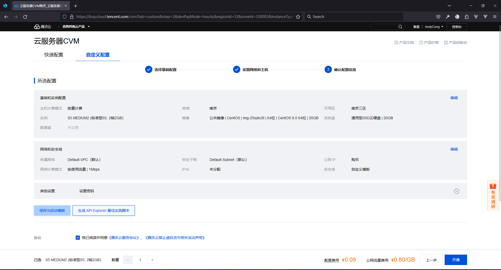

# 腾讯云搭建 httpd 服务

## 购买云服务器

[购买地址](https://buy.cloud.tencent.com/cvm)


1. 选择`按量计费`
2. 寻找价格合适的服务器
   
3. 镜像选择`CentOS 8.0 64位`
4. 存储使用`20GB`
   

## 设置网络和主机

1. 带宽选择`1MBPS`
   
2. 登录方式选择`设置密码`
   

## 确认配置信息



## 等待实例创建


## 得到公网 IP

复制公网 IP


## ssh 连接服务器

1. 打开终端

   

2. 运行`ssh root@服务器IP`

   

3. 输入`yes`回车\

   

4. 输入设置的密码

   

5. 回车
6. 进入服务器

   

## 安装 httpd

```bash
yum -y install httpd
```


## 检查 httpd 服务

```bash
rpm -qa | grep httpd
```


## 部署 html 文件

```bash
nano /var/www/html/index.html
```


## 重启 httpd 服务

```bash
service httpd restart
```


## 验证


## html 模板

```html
<!DOCTYPE html>
<html lang="zh">
  <head>
    <meta charset="UTF-8" />
    <meta name="viewport" content="width=device-width, initial-scale=1.0" />
    <title>白云白金瀚!</title>
  </head>
  <body>
    <h1>整个**一半姓高</h1>
    <ul>
      <li><a href="">高启辉</a></li>
      <li><a href="">高启生</a></li>
      <li><a href="">高启萌</a></li>
      <li><a href="">高启聪</a></li>
      <li><a href="">高启扬</a></li>
      <li><a href="">高启静</a></li>
    </ul>
  </body>
</html>
```
