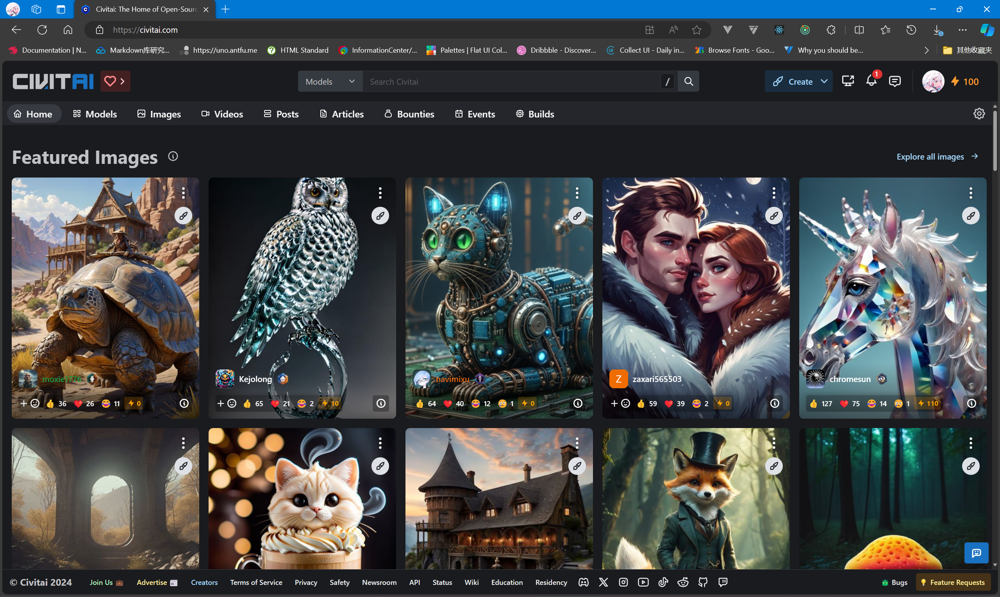

# 玩玩 Stable Diffusion

## 前提

* 不低于16G内存的电脑

* 拥有至少4G显存的显卡

* 拥有Nvidia CUDA支持的显卡

* 良好的国际联网

## 检查硬件支持情况

- 打开任务管理器检查内存和显存情况


- 打开Nvidia控制面板检查CUDA支持情况(帮助->系统信息->组件)

:::tip

记住版本号

:::


## 安装必要依赖

- Python 3

下载地址: [python-3.12.2](https://www.python.org/ftp/python/3.12.2/python-3.12.2-amd64.exe)

- Nvidia CUDA Toolkit

:::warning
注意版本号需要和在 ***Nvidia控制面板检查CUDA支持情况*** 提供的 ***主版本号.子版本号*** 一致
:::

下载地址：[CUDA](https://developer.nvidia.com/cuda-toolkit-archive)

- Stable Diffusion Webui

下载地址：[stable-diffusion-webui](https://github.com/AUTOMATIC1111/stable-diffusion-webui/archive/refs/heads/master.zip)

:::tip

记得解压

:::

## 启动Stable Diffusion Webui

在以上条件就绪后，运行 ***webui-user.bat***


:::warning

首次启动需要下载项目依赖，耐心等待~

:::

## 配置中文环境

切换到 **Extensions** 选项卡， 点击 **Install from URL** 选项卡

输入插件仓库地址：

```txt
https://github.com/hanamizuki-ai/stable-diffusion-webui-localization-zh_Hans.git
```


安装完成后点击 **Installed** 选项卡，点击 **Apply and restart UI**


## 使用模型绘图

**civitai** 是一个很棒的AI模型社区



### 点一个比较规范的生成示例，有以下要素：


### 下载所需要的资源，并且根据指定目录存放：


### 开始绘图

选择绘图模型（先点刷新）：


除以上需要下载的资源，剩余的字段(提示词、采样方法、迭代步数...)可以根据需要进行填入，点击生成

生成的效果图：

