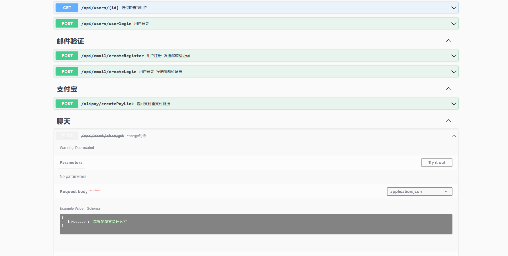

# NestJS Swagger 接口设置 Deprecated(过期)标签



一个接口不再使用通常会给到 `deprecated`, 如下

```ts
/**
*
* @deprecated ChatGPT接口
*
*/
@Post('/chatgpt')
@ApiOperation({ summary: 'chatgpt对话' }) // [!code focus]
@ApiResponse({
  status: 201,
  description: '自定义状态码',
  type: GptMessageDto,
})
chatgpt(@Body() messageDto: GptMessageDto) {
    return this.chatService.createGPTMessageDto(messageDto);
}
```

如果需要在 Swagger 中展示, 可以在`@ApiOperation`装饰器配置 `deprecated`

```ts
/**
 *
 * @deprecated ChatGPT接口
 *
 */
@Post('/chatgpt')
@ApiOperation({ summary: 'chatgpt对话', deprecated: true }) // [!code focus]
@ApiResponse({
  status: 201,
  description: '自定义状态码',
  type: GptMessageDto,
})
chatgpt(@Body() messageDto: GptMessageDto) {
  return this.chatService.createGPTMessageDto(messageDto);
}
```
