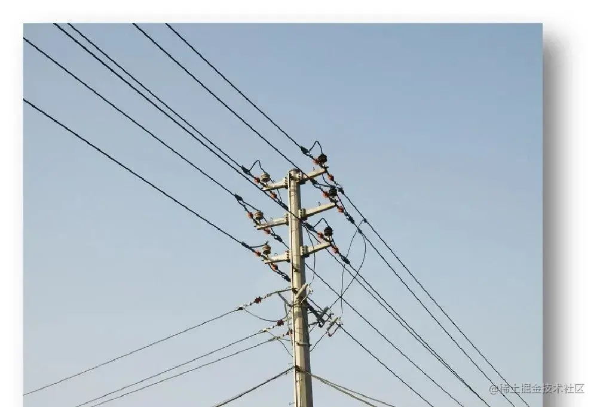
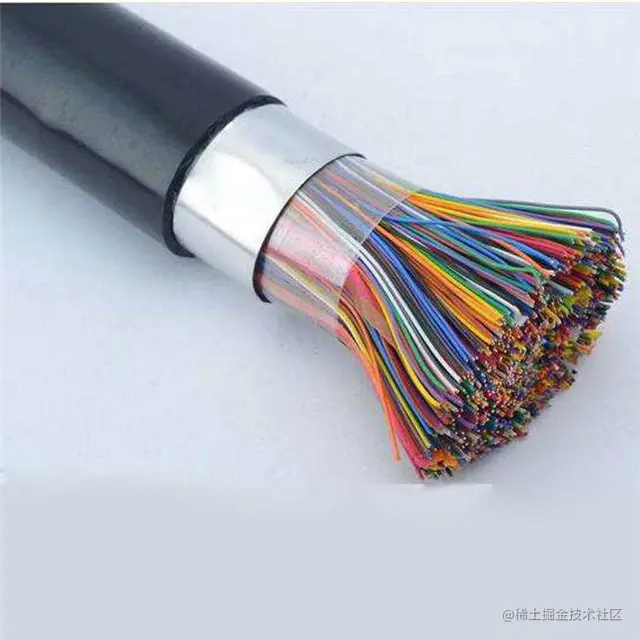
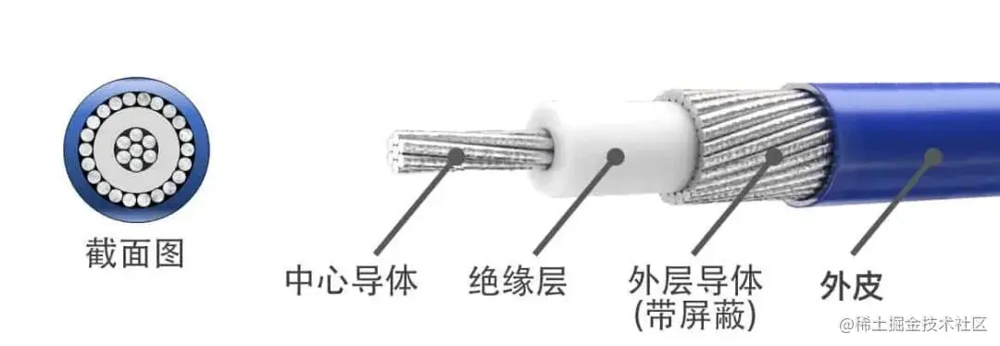
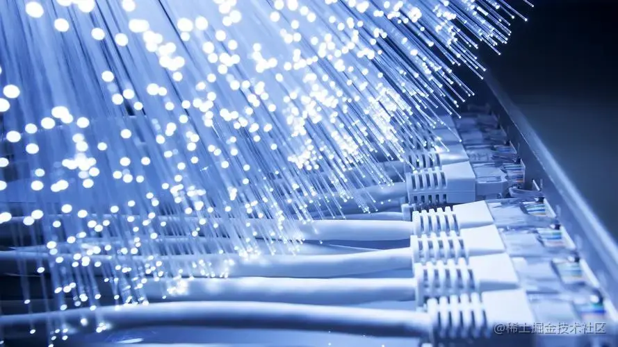
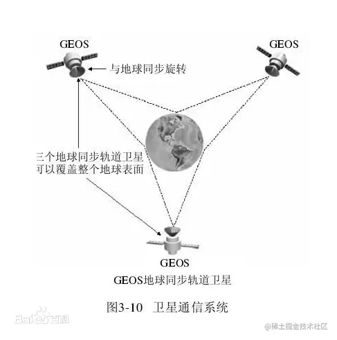
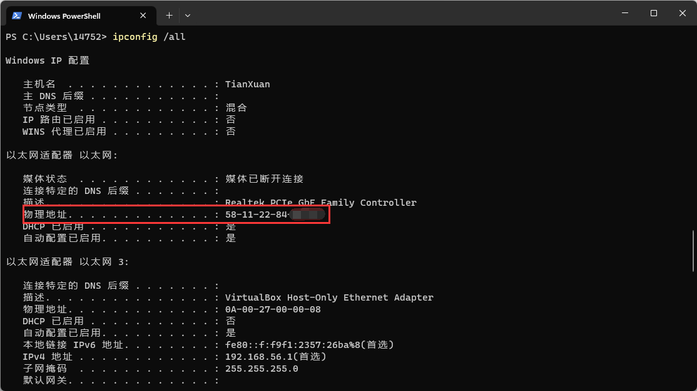

# [OSI 七层模型](https://en.wikipedia.org/wiki/OSI_model)

计算系统之间的通信被分为七个不同的抽象层：

- 物理层 (Physical)
- 数据链路层 (Data Link)
- 网络层 (Network)
- 传输层 (Transport)
- 会话层 (Session)
- 表示层 (Presentation)
- 应用层 (Application)

## 历史 [History](https://en.wikipedia.org/wiki/OSI_model#History)

在 20 世纪 70 年代早期和中期，网络主要是由政府赞助（英国的 NPL 网络、美国的 ARPANET、法国的 CYCLADES）或供应商使用专有标准开发，例如 IBM 的系统网络架构和数字设备公司的 DEC 网。 公共数据网络才刚刚开始出现，这些网络在 1970 年代后期开始使用 X.25 标准。

OSI 模型的开发始于 70 年代后期， 1980 年代由国际标准化组织 `(ISO)` 开放系统互连小组 `(Open Systems Interconnection group)` 提出草案。

::: tip 大约 1973 年至 1975 年:

英国的分组交换系统(实验性)需要更高级别的网络协议

英国国家计算中心出版的`《Why Distributed Computing》`对计算机系统的未来进行了大量的研究，

于是，英国在 1977 年 3 月于悉尼举行的 ISO 会议上提出了一个国际标准委员会来涵盖这一领域的案例。
:::

从 1977 年开始，ISO 发起了一项`开发通用网络标准和方法`的计划。 国际电报电话咨询委员会`(CCITT)`也采用了类似的流程。 两个机构都制定了类似网络模型的定义文件。 英国贸易和工业部担任秘书处，英国大学`(Universities in the United Kingdom)`开发了对应标准的原型。

1978 年 2 月，法国软件工程师休伯特·齐默尔曼`(Hubert Zimmermann)`首次在华盛顿特区定义了原始形式的 OSI 模型，ISO 于 1980 年发布了标准完善的草案。

::: tip 1983 年:
CCITT 和 ISO 文件合并形成了`开放系统互连的基本参考模型`，通常称为`开放系统互连参考模型`、`OSI 参考模型`，或简称为 `OSI 模型`。

于 1984 年由 ISO 作为标准 ISO 7498 和更名为 CCITT（现在称为国际电信联盟电信标准化部门或 ITU-T）作为标准 X.200 发布。

:::

OSI 有两个主要组成部分：

- 一个网络抽象模型(基本参考模型或七层模型)
- 一组特定协议

七层模型的概念是由 `Honeywell Information Systems` 的 `Charles Bachman` 提出。 OSI 设计的各个方面都是从 NPL 网络、ARPANET、CYCLADES、EIN 和国际网络工作组 (IFIP WG6.1) 的经验中演变而来的。 在这个模型中，网络系统被划分为多个层。 在每一层中，一个或多个实体实现其功能。 每个实体仅与其下一层直接交互，并提供接口供其上层使用。

::: warning OSI 模型仍然用作教学和文档的参考

然而，最初为该模型构想的 OSI 协议并没有得到普及。

一些工程师认为 OSI 参考模型仍然与云计算相关。 其他人则说原始的 OSI 模型不适合当今的网络协议，并建议采用一种简化的方法。
:::

## 定义 [Definitions](https://en.wikipedia.org/wiki/OSI_model#Definitions)

通信协议使一台主机中的实体能够与另一台主机中同一层的实体进行交互。

OSI 模型，抽象地描述了 N-1 层向 N 层提供的功能，其中 N 是在本地主机中运行的七层协议之一。

在每个 N 层，通信设备（N 层对等体）的两个实体通过 N 层协议交换协议数据单元 (PDU)。 每个 PDU 都包含一个称为服务数据单元 (SDU) 的有效载荷，以及与协议相关的页眉或页脚。

:::tip 两个通信 OSI 兼容设备的数据处理过程如下：
要传输的数据在传输设备的最顶层（N 层）组成协议数据单元（PDU）。

PDU 被传递到第 N-1 层，在那里它被称为服务数据单元 (SDU)。

在第 N-1 层，SDU 与标题、页脚或两者连接，产生第 N-1 层 PDU。 然后它被传递到第 N-2 层。

该过程一直持续到到达最低级别，数据从该级别传输到接收设备。

在接收设备上，数据作为一系列 SDU 从最低层传递到最高层，同时从每一层的页眉或页脚连续剥离，直到到达最顶层，最后一个数据被消耗掉。
:::

:::tip 标准文件

OSI 模型在 ISO/IEC 7498 中定义，它由以下部分组成：

     ISO/IEC 7498-1 基本模型
     ISO/IEC 7498-2 安全架构
     ISO/IEC 7498-3 命名和寻址
     ISO/IEC 7498-4 管理框架

ISO/IEC 7498-1 也作为 ITU-T Recommendation X.200 发布。
:::

## [对应协议](https://en.wikipedia.org/wiki/OSI_model#Comparison_to_other_networking_suites)

| OSI Layer  |                                      OSI protocols                                      |            TCP/IP protocols |
| ---------- | :-------------------------------------------------------------------------------------: | --------------------------: |
| 应用层     |                        FTAM X.400 X.500 DAP ROSE RTSE ACSE CMIP                         |         HTTP HTTPS FTP SMTP |
| 表示层     |                         ISO/IEC 8823 X.266 ISO/IEC 9576-1 X.236                         |            MIME SSL/TLS XDR |
| 会话层     |                         ISO/IEC 8327 X.255 ISO/IEC 9548-1 X.235                         |         Socket TCP/RTP/PPTP |
| 传输层     |               ISO/IEC 8073 TP0 TP1 TP2 TP3 TP4(X.224) ISO/IEC 8602 X.234                |           TCP UDP SCTP DCCP |
| 网络层     | ISO/IEC 8208 X.25(PLP) ISO/IEC 8878 X.223 ISO/IEC 8473-1 CLNP X.233 ISO/IEC 10589 IS-IS | IP IPsec ICMP IGMP OSPF RIP |
| 数据链路层 |          ISO/IEC 7666 X.25(LAPB) Token Bus X.222 ISO/IEC 8802-2 LLC(type 1/2)           |               PPP SBTV SLIP |
| 物理层     |                     X.25(X.21bisEIA/TIA-232EIA/TIA-449EIA-530G.703)                     |                           / |

## 第一层: 物理层 [Physical layer](https://en.wikipedia.org/wiki/OSI_model#Layer_1:_Physical_layer)

物理层是直接和物理介质打交道的。
物理层的设备：网卡，网线，集线器，中继器，调制解调器

物理层信道：

- 有线信道-明线（电线杆上面的线路，易受影响而逐渐被电缆取代）
  
- 有线信道-对称电缆（由多对双绞线组成的线缆）
  
- 有线信道-同轴电缆（四层: 中心导体、绝缘层、外层导体、外皮）
  
- 有线信道-光纤（玻璃或塑料制成的纤维，利用全反射原理传输）
  
- 无线信道-无线电波（以辐射无线电波为传输方式）
  

在这一层通过（电、光、无线电波），会获取他们对应的传送信号：电压，转换成 010101010101 这样未经组织的数据，单位为`bit`，叫做`比特流`。

## 第二层: 数据链路层 [Data link layer](https://en.wikipedia.org/wiki/OSI_model#Layer_2:_Data_link_layer)

:::tip `IEEE 802` 将数据链路层划分为两个子层

- 介质访问控制（MAC）层：负责控制网络中设备访问和数据传输的权限。

- 逻辑链路控制（LLC）层：负责识别和封装网络层协议，并控制错误检查和帧同步。

IEEE 802 网络（如：802.3 以太网、802.11 Wi-Fi 和 802.15.4 Zigbee）的 MAC 和 LLC 层在数据链路层操作。

点对点协议`（PPP）`是一种数据链路层协议，可以在几个不同的物理层上运行，例如`同步（synchronous）`
:::

建立逻辑连接、进行硬件地址寻址、差错校验等功能。

将`比特流`组合成字节进而加入 MAC 地址组合成帧，单位：`数据帧`。（可以通过 MAC 地址知道发送者、接收者、数据内容以及分组）

通过`广播`的形式进行传输，局域网内所有的计算机都能收到消息

## 第三层: 网络层 [Network layer](https://en.wikipedia.org/wiki/OSI_model#Layer_3:_Network_layer)

建立”主机到主机”的通信

数据链路层的数据在这一层转换为`数据包`，通过路径选择、分段组合、顺序、进/出路由等控制，将信息从一个网络设备传送到另一个网络设备。

- 1. 寻址：
     在网络层进行的 IP 寻址称为逻辑寻址，网络中的每台计算机都有一个唯一的 IP 地址。网络层为每个网段分配发送方和接收方的 IP 地址，形成一个 IP 数据包。分配 IP 地址是为了确保每个数据包都能到达正确的目的地。
- 2. 路由：
     路由是一种将数据包从源端移动到目的端的方法，在同一个网络中的内部通信并不需要网络层设备，仅仅靠数据链路层就可以完成相互通信，对于不同的网络之间相互通信则必须借助`路由器`等三层设备。

我们的路由器就是在第三层工作的

以太网协议，依靠 MAC 地址发送数据。理论上，单单依靠 MAC 地址，上海的网卡就可以找到洛杉矶的网卡了，技术上是可以实现的。

:::warning 但是，这样做有一个重大的缺点：
以太网采用广播方式发送数据包，所有成员人手一“包”，不仅效率低，而且局限在发送者所在的子网络。

也就是说，如果两台计算机不在同一个子网络，广播是传不过去的。因此，必须找到一种方法，能够区分哪些 MAC 地址属于同一个子网络，哪些不是。

如果是同一个子网络，就采用广播方式发送，否则就采用”路由”方式向不同的子网络分发数据包。
:::

这就导致了网络层的诞生。

它的作用是引进一套新的地址，使得我们能够区分不同的计算机是否属于同一个子网络，这套地址就叫做“网络地址”，简称“网址”。

:::info 关于网址
规定网络地址的协议，叫做 IP 协议。它所定义的地址，就被称为 IP 地址。  
目前，广泛采用的是 IP 协议第四版，简称 IPv4。目前 IPv4 资源不足，开始推广 IPv6。  
IP 协议的作用主要有两个，一个是为每一台计算机分配 IP 地址，另一个是确定哪些地址在同一个子网络。
:::

网络地址帮助我们确定计算机所在的子网络，MAC 地址则将数据包送到该子网络中的目标网卡。

因此，从逻辑上可以推断，必定是`先处理网络地址，然后再处理 MAC 地址。`

所以知道了对方的 MAC 地址以及对方的 IP 地址，IP 数据包将会放在以太网数据包里发送出去。

一般来说，对方的 IP 地址是已知的，但是 MAC 地址未知。所以，需要一种机制，能够从 IP 地址得到 MAC 地址：

- 1. 把数据包传送到两个子网络连接处的“网关”（gateway），让网关去处理。
- 2. 如果两台主机在同一个子网络，那么我们可以用 ARP 协议，得到对方的 MAC 地址

:::info IP 数据包
IP 数据包分为“标头”和“数据”两个部分，根据 IP 协议发送的数据，就叫做 IP 数据包，其中必定包括 IP 地址信息。  
  
但是，以太网数据包只包含 MAC 地址，并没有 IP 地址的栏位。那么需要把 IP 数据包直接放进以太网数据包的“数据”部分，不用修改以太网的规格。
“标头”部分主要包括版本、长度、IP 地址等信息，“数据”部分则是 IP 数据包的具体内容。
  
:::

## 第四层: 传输层 [Transport layer](https://en.wikipedia.org/wiki/OSI_model#Layer_4:_Transport_layer)

定义端口号`（0-65535）`，建立”端口到端口”的通信。

在 IP 数据包中加入端口信息，这就需要新的协议。

:::tip UDP
UDP 具有较好的实时性，没有三次握手和四次挥手，效率比 TCP 高，速度快但是不稳定，常用于直播和游戏。  
最简单的实现叫做 UDP 协议，它的格式几乎就是在数据前面，加上端口号。  
  
“标头”部分主要定义了发出端口和接收端口，”数据”部分就是具体的内容。然后，把整个 UDP 数据包放入 IP 数据包的”数据”部分
  
:::

UDP 协议的优点是比较简单，容易实现，但是缺点是可靠性较差，一旦数据包发出，无法知道对方是否收到。

为了解决这个问题，提高网络可靠性，TCP 协议就诞生了。可以近似认为，它就是有确认机制的 UDP 协议，每发出一个数据包都要求确认。

:::tip TCP
TCP 是面向连接的协议，并且 TCP 是可靠的（三次握手和四次挥手），因此速度也会相应降低。

如果有一个数据包遗失，就收不到确认，发出方就知道有必要重发这个数据包。因此，TCP 协议能够确保数据不会遗失。

TCP 数据包和 UDP 数据包一样，都是内嵌在 IP 数据包的”数据”部分。TCP 数据包没有长度限制，理论上可以无限长，但是为了保证网络的效率，通常 TCP 数据包的长度不会超过 IP 数据包的长度，以确保单个 TCP 数据包不必再分割。
:::

## 第五层: 会话层 [Session layer](https://en.wikipedia.org/wiki/OSI_model#Layer_5:_Session_layer)

会话层在`两台或多台计算机之间`建立、管理和终止本地和远程应用程序之间的连接，这被称为“会话”。

由于 DNS 和其他名称解析协议在该层的这一部分中运行，会话层的常见功能包括用户登录、名称查找和用户登出等功能。

- 允许发送发和接收方启动或停止请求会话，允许双方发生拥塞时依然能保持会话。
- 提供全双工、半双工或单工操作，并建立用于检查点、挂起、重新启动和终止两个相关数据流（例：音频和视频流）之间的会话的过程。

`检查点（Checkpoints）`定义了一个最接近成功通信的点，并且定义了当发生内容丢失或损坏时需要回滚以便恢复丢失或损坏数据的点，即`断点下载`的原理

## 第六层: 表示层 [Presentation layer](https://en.wikipedia.org/wiki/OSI_model#Layer_6:_Presentation_layer)

- 表示层进行`数据格式化`和`数据转换`，将人类能读懂的信息和计算机能读懂的信息进行转换。

- 表示层处理协议转换、数据加密、数据解密、数据压缩、数据解压缩、操作系统之间数据表示的不兼容性以及图形命令。

- 表示层将数据转换为应用层接受的形式，以便通过网络发送。

:::tip
由于表示层将数据和图形转换为应用层的显示格式，因此表示层有时被称为语法层。  
因此，表示层通过`ASN.1`的基本编码规则协商语法结构的传输，该规则具有将`EBCDIC 编码`的文本文件转换为`ASCII 编码`的文件，或将对象和其他数据结构从 XML 序列化和反序列化为 XML 等功能
:::

## 第七层: 应用层 [Application layer](https://en.wikipedia.org/wiki/OSI_model#Layer_7:_Application_layer)

应用层是 OSI 模型中最接近最终用户的层，这意味着 OSI 应用层和用户都直接与软件应用程序交互，该软件应用程序实现了客户端和服务器之间的通信组件。

应用层通过常见的协议（HTTP、FTP、SMB/CIFS、TFTP 和 SMTP）进行文件共享、消息处理和数据库访问等。

## 参考

[小满 zs Bilibili: 前端-网络课程](https://www.bilibili.com/video/BV1rL411a7UN)  
[Chris Kang CSDN: 深入浅出搞懂网络的五层协议](https://blog.csdn.net/wangyuankl123/article/details/80928303)  
[维基百科: OSI model](https://en.wikipedia.org/wiki/OSI_model)  
[JavaGuide: OSI 和 TCP/IP 网络分层模型详解（基础）](https://javaguide.cn/cs-basics/network/osi-and-tcp-ip-model.html)  
[小满 zs 掘金: OSI 七层网络参考模型](https://juejin.cn/post/7228893159069548599)
