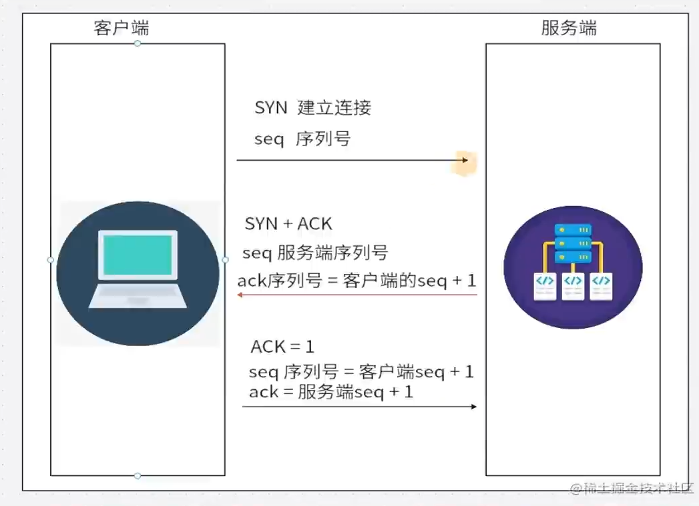
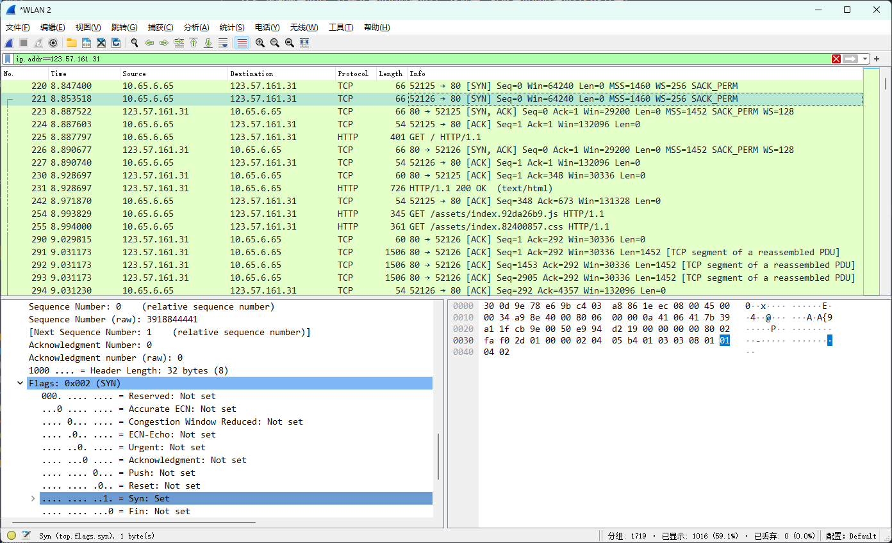
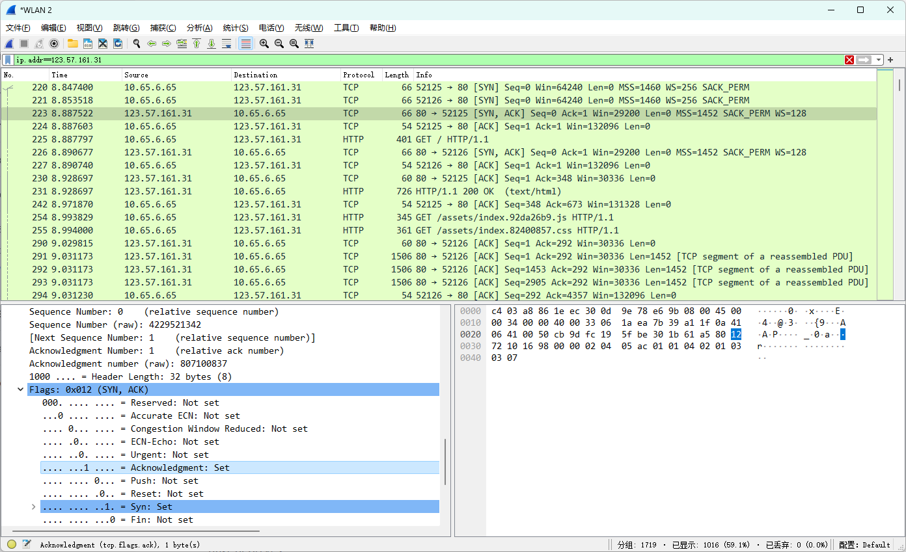
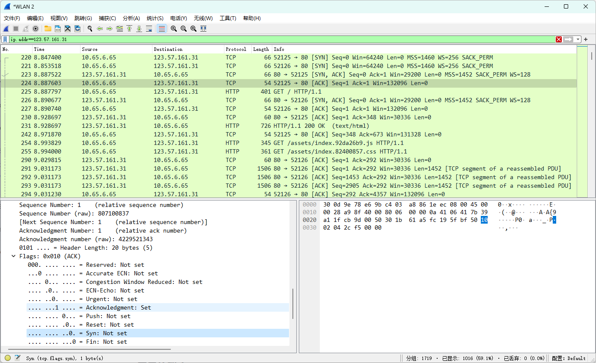
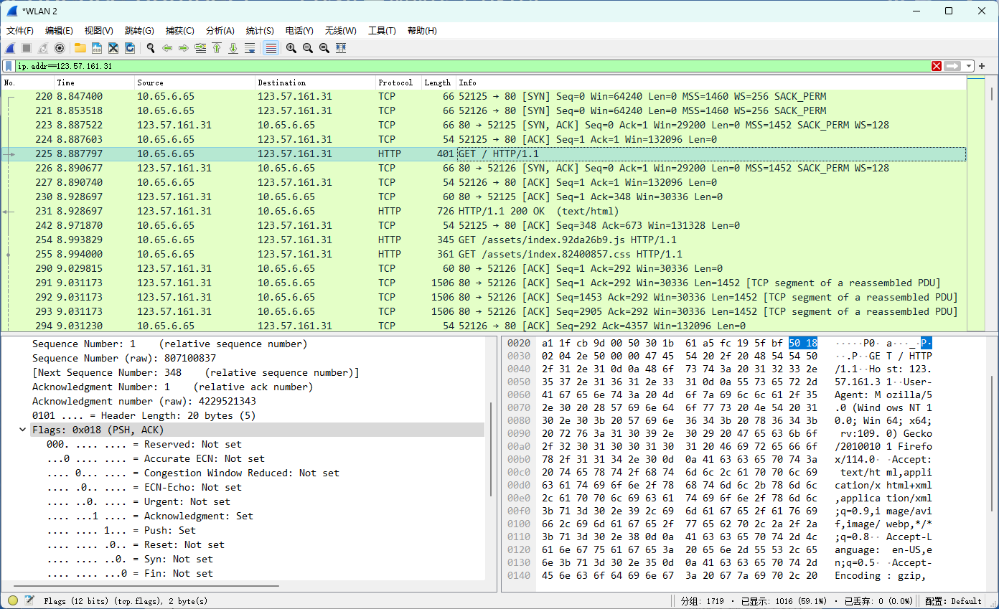

# TCP 三次握手

TCP 是面向连接的，在建立连接的时候进行三次握手，释放连接的时候进行四次挥手。

三次握手的目的是建立可靠的通信信道，双方确认彼此的接收与发送是正常的。

- Seq: 随机生成的一串序列号(sequence number)
- Ack: 确认号 Ack=Seq+1(acknowledgement number)
- SYN: 同步(Synchronization)
- ACK: 确认(Acknowledgment)

## 第一次握手

客户端发送带有 [SYN] 标志的数据包(包含随机生成的 Seq)到服务器，客户端进入 SYN_SEND 状态，等待服务器确认。

此时 SYN 为 1，Seq 为 0(未必为 0，随机生成的一串序列号，看 raw)：

## 第二次握手

开启 ACK，服务器发送带有 [SYN, ACK] 标志的数据包(服务器生成 Seq，客户端的 Seq+1)到客户端，服务器进入 SYN_RECV 状态。

服务器把 SYN 发回去是为了建立并确认服务器到客户端的通信。

此时 SYN 为 1，Seq 为 0，Ack 为 1(Seq+1)：

## 第三次握手

客户端发送带有 [ACK] 标志的数据包到服务端，此时客户端和服务器都进入 ESTABLISHED 状态，完成三次握手。

此时 SYN 为 0，Seq 为 1(通过一定算法得出第一次握手生成的 Seq+1)，ACK 为 1(服务器的 Seq+1)：

## 发起 HTTP 请求

三次握手完成后发起 HTTP 请求：

