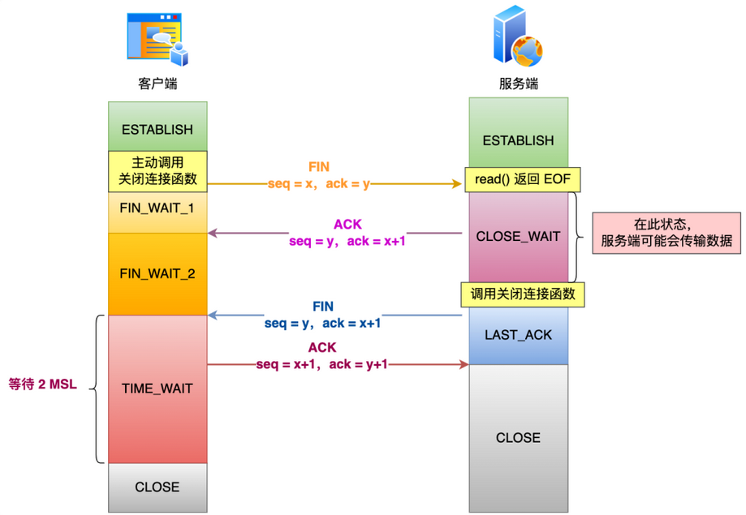
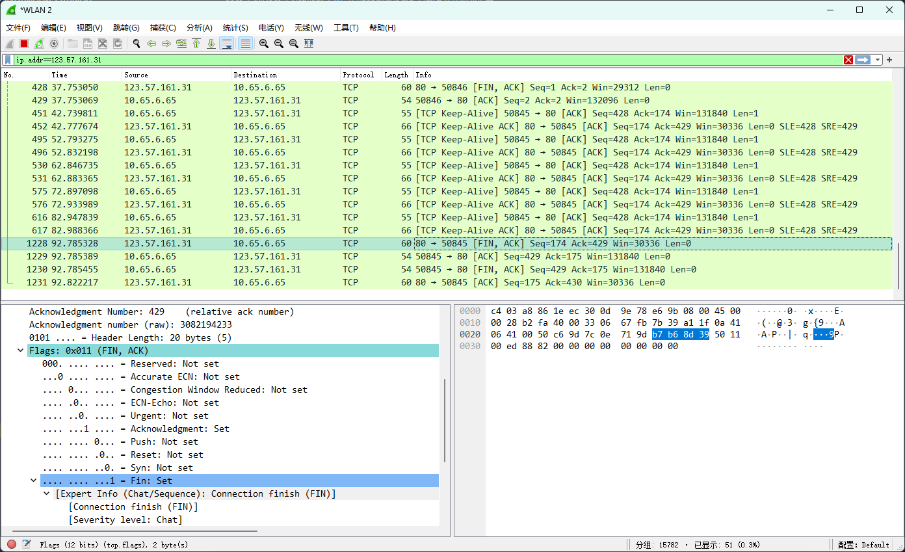

# TCP 四次挥手

因为 TCP 是全双工模式，需要四次挥手才可关闭连接，在此之前，服务器和客户端都是 ESTABLISHED 状态

在 socket 编程中，哪一方先执行 close()操作，则先进行挥手。一般为客户端先发起挥手。

:::tip 关于三次挥手

- 1.若服务器没有数据发送给客户端，第二次跟第三次挥手会合并
- 2.延迟确认

:::

## TCP 的十一种状态

:::tip TCP 的十一种状态

- LISTEN - 侦听来自远方 TCP 端口的连接请求；
- SYN-SENT - 在发送连接请求后等待匹配的连接请求；
- SYN-RECEIVED - 在收到和发送一个连接请求后等待对连接请求的确认；
- ESTABLISHED - 代表一个打开的连接，数据可以传送给用户；
- FIN-WAIT-1 - 等待远程 TCP 的连接中断请求，或先前的连接中断请求的确认；
- FIN-WAIT-2 - 从远程 TCP 等待连接中断请求；
- CLOSE-WAIT - 等待从本地用户发来的连接中断请求；
- CLOSING - 等待远程 TCP 对连接中断的确认；
- LAST-ACK - 等待原来发向远程 TCP 的连接中断请求的确认；
- TIME-WAIT - 等待足够的时间以确保远程 TCP 接收到连接中断请求的确认；
- CLOSED - 没有任何连接状态；

:::

## 第一次挥手

客户端向服务器发送一段 TCP 报文表明想要释放 TCP 连接，标记位为`[FIN]`

报文中会指定一个随机生成的序列号`(Seq)`

客户端进入 `FIN-WAIT-1` 状态，即半关闭阶段，并且停止向服务端发送通信数据。

## 第二次挥手

服务器接收到客户端的 `[FIN]` 报文后，结束 `ESTABLISHED` 阶段，进入 `CLOSE-WAIT` 状态。

返回一段 TCP 报文，标记位为`[ACK]：（第一次挥手的 Seq+1）`。

客户端进入 `FIN-WAIT-2` 状态。

## 第三次挥手

服务器端在接收到第二次挥手发出 ACK 确认报文后，将遗留的待传数据传送给客户端。

传输完成后经过 `CLOSE-WAIT` 阶段，做好释放服务器端到客户端的连接准备。

再次向客户端发出一段 TCP 报文，标记位为 `[FIN]`。

报文中会指定一个随机生成的序列号`(Seq)`

服务器端进入 `LAST-ACK` 状态。并且停止向客户端发送数据。

## 第四次挥手

客户端收到从服务器发来的 TCP 报文，确认了服务器已经做好释放连接的准备，进入 `TIME-WAIT` 状态。

客户端向服务器发送一段报文，标记位为 `[ACK]`。

报文中会指定一个随机生成的序列号`(第三次挥手的Seq+1)`。

随后客户端开始在 TIME-WAIT 阶段等待 `2 MSL`（若服务器在`2 MSL`内无数据传输，客户端进入 `CLOSED` 阶段）。

:::tip 2 MSL
MSL(Maximum Segment Lifetime) : 一个片段在网络中最大的存活时间

2MSL 就是一个发送和一个回复所需的最大时间。如果直到 2MSL，Client 都没有再次收到 FIN，那么 Client 推断 ACK 已经被成功接收，则结束 TCP 连接。
:::

服务器端收到从客户端发出的 TCP 报文后进入 CLOSED 状态，正式确认关闭服务器端到客户端方向上的连接。

完成「四次挥手」。

