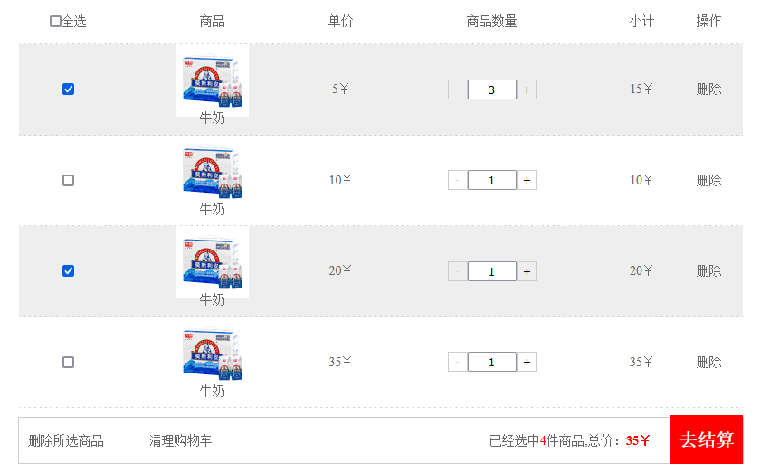

# 商城网站购物车实现

## 题目

参照购物车 HTML 代码，依次完成购物车的商品全选、增减商品数量、修改商品小计、计算商品总额、删除商品、选中商品添加背景 等功能，完成实验报告；

## 最终结果



## 步骤分析

1. 像 JQuery 一样, 造个`$`函数来选取页面元素

```js
const $ = (el) => {
  return document.querySelectorAll(el).length > 1
    ? document.querySelectorAll(el)
    : document.querySelector(el);
};
```

2. 选取所有需要用到的元素

```js
// 购物车DOM
let allCarBody = [...$("#carBody tr")];
// 总数
const totalCount = $("#totalCount");
// 总价
const totalPrice = $("#totalPrice");
// 全选按钮
const all = $("#all");
// 单选按钮列表
const s_ck = $(".s_ck");
// 删除操作列表
const del = $(".del");
// 添加按钮
const add = $(".add");
// 减少按钮
const reduce = $(".reduce");
// 清理购物车
const clear = $(".clear");
// 删除所选商品
const delall = $(".del-all");
// 商品数量输入框
const input = $(".count-c input");
```

3. 写个 Counter 类用来计算商品总数, 小计等

```js
class Counter {
  #shopList = [];
  constructor(el) {
    el.forEach((item, index) => {
      // 商品单价
      const perprice = item.querySelector(".price").innerText.split("￥")[0];
      // 商品数量
      const count = item.querySelector(".count-c").querySelector("input").value;
      this.#shopList.push({
        id: index,
        checked: item.querySelector(".s_ck").checked,
        perprice: perprice,
        count: count,
        price: perprice * count,
      });
    });
  }

  // 商品数量
  countPer(index) {
    return this.#shopList[index].count;
  }

  // 商品小计
  pricePer(index) {
    return this.#shopList[index].price;
  }

  // 总数
  getTotalCount() {
    let count = 0;
    this.#shopList.forEach((el) => {
      if (el.checked) {
        count = count + +el.count;
      }
    });
    return count;
  }

  // 总价
  getTotalPrice() {
    let price = 0;
    this.#shopList.forEach((el) => {
      if (el.checked) {
        price = price + +el.price;
      }
    });
    return price;
  }

  // 已选列表
  getTotalChecked() {
    return this.#shopList.filter((el) => el.checked);
  }

  // 获取购物车列表
  getShopList() {
    return this.#shopList;
  }
}
```

4. countAll 函数实例化 Counter, 修改 DOM

```js
const countAll = () => {
  const counter = new Counter(allCarBody);
  all.checked =
    counter.getTotalChecked().length == counter.getShopList().length
      ? true
      : false;
  totalCount.innerText = counter.getTotalCount();
  totalPrice.innerText = `${counter.getTotalPrice()}￥`;
  if ($(".total") && $(".total").length > 1) {
    $(".total").forEach((el, index) => {
      $(".total")[index].innerText = `${counter.pricePer(index)}￥`;
    });
  }
};
```

5. 设置背景色

```js
const setBackground = (el, options) => {
  if (all.checked && options) {
    el.style.backgroundColor = "#eee";
    return;
  }
  el.style.backgroundColor = el.style.backgroundColor ? "" : "#eee";
};
```

6. 监听购物车全选框

```js
all.addEventListener("click", () => {
  allCarBody.forEach((el) => {
    setBackground(el, true);
    el.querySelector(".s_ck").checked = all.checked ? true : false;
  });
  if (!all.checked) {
    totalCount.innerText = 0;
    totalPrice.innerText = "0￥";
  } else {
    countAll();
  }
});
```

7. 监听商品单选框

```js
s_ck.forEach((el) => {
  if (el.checked) {
    setBackground(el.parentNode.parentNode);
  }
  el.addEventListener("click", () => {
    setBackground(el.parentNode.parentNode);
    countAll();
  });
});
```

8. 监听商品增加`+`按钮

```js
add.forEach((el, index) => {
  el.addEventListener("click", function () {
    const count = Number(this.parentNode.querySelector("input").value);
    if (count >= 1) {
      reduce[index].removeAttribute("disabled");
    }
    this.parentNode.querySelector("input").value = count + 1;
    countAll();
  });
});
```

9. 监听商品减少`-`按钮

```js
reduce.forEach((el, index) => {
  el.addEventListener("click", function () {
    const count = Number(this.parentNode.querySelector("input").value);
    if (count <= 2) {
      reduce[index].setAttribute("disabled", true);
    }
    this.parentNode.querySelector("input").value = count - 1;
    countAll();
  });
});
```

10. 监听手动输入商品数量

```js
input.forEach((el) => {
  el.addEventListener("input", () => {
    allCarBody = [...document.querySelectorAll("#carBody tr")];
    countAll();
  });
});
```

11. 监听单个商品删除事件

```js
del.forEach((el, index) => {
  el.addEventListener("click", () => {
    el.parentNode.parentNode.remove();
    allCarBody = [...document.querySelectorAll("#carBody tr")];
    countAll();
  });
});
```

12. 监听清理购物车事件

```js
clear.addEventListener("click", () => {
  $("#carBody").remove();
  allCarBody = [];
  countAll();
});
```

13. 监听删除所选商品事件

```js
delall.addEventListener("click", () => {
  const del = [...document.querySelectorAll("#carBody tr")].filter(
    (el) => el.querySelector(".s_ck").checked
  );
  del.forEach((item) => item.remove());
  allCarBody = [...document.querySelectorAll("#carBody tr")];
  countAll();
});
```

14. 初始化购物车小计数据(1 个单价为 `10￥`的商品不能是 `20￥`吧)

```js
window.onload = () => countAll();
```

## 全部代码

```html
<!DOCTYPE html>
<html lang="en">
  <head>
    <meta charset="UTF-8" />
    <meta name="viewport" content="width=device-width, initial-scale=1.0" />
    <meta http-equiv="X-UA-Compatible" content="ie=edge" />
    <title>购物车全选功能</title>
    <!-- 引入初始化 -->
    <style>
      * {
        margin: 0;
        padding: 0;
      }

      ul {
        list-style: none;
      }

      a {
        text-decoration: none;
        color: #666;
      }

      body {
        background: #fff;
        color: #666;
        font-size: 14px;
      }

      input {
        outline: none;
      }

      .clearfix::before,
      .clearfix::after {
        content: "";
        display: block;
        clear: both;
      }

      .clearfix {
        *zoom: 1;
      }
    </style>
    <!-- 引入购物车样式 -->
    <style>
      table {
        width: 800px;
        margin: 0 auto;
        border-collapse: collapse;
      }

      th {
        font: normal 14px/50px "宋体";
        color: #666;
      }

      th,
      td {
        border: none;
        text-align: center;
        border-bottom: 1px dashed #ccc;
      }

      input[type="checkbox"] {
        width: 13px;
        height: 13px;
      }

      tbody p {
        position: relative;
        bottom: 10px;
      }

      tbody .add,
      tbody .reduce {
        float: left;
        width: 22px;
        height: 22px;
        border: 1px solid #ccc;
        text-align: center;
        background: none;
        outline: none;
        cursor: pointer;
      }

      tbody input[type="text"] {
        width: 50px;
        float: left;
        height: 18px;
        text-align: center;
      }

      tbody .count-c {
        width: 98px;
        margin: 0 auto;
      }

      button[disabled] {
        color: #ddd;
        cursor: not-allowed;
      }

      tbody tr:hover {
        background: #eee;
      }

      tbody tr.active {
        background: rgba(241, 209, 149, 0.945);
      }

      .controls {
        width: 790px;
        margin: 10px auto;
        border: 1px solid #ccc;
        line-height: 50px;
        padding-left: 10px;
        position: relative;
      }

      .controls .del-all,
      .controls .clear {
        float: left;
        margin-right: 50px;
      }

      .controls p {
        float: right;
        margin-right: 100px;
      }

      .controls span {
        color: red;
      }

      .controls .pay {
        position: absolute;
        right: 0;
        width: 80px;
        height: 54px;
        background: red;
        font: bold 20px/54px "宋体";
        color: #fff;
        text-align: center;
        bottom: -1px;
      }

      .controls .total-price {
        font-weight: bold;
      }
    </style>
  </head>

  <body>
    <div class="car">
      <table>
        <thead>
          <tr>
            <th><input type="checkbox" id="all" />全选</th>
            <th>商品</th>
            <th>单价</th>
            <th>商品数量</th>
            <th>小计</th>
            <th>操作</th>
          </tr>
        </thead>
        <tbody id="carBody">
          <tr>
            <td>
              <input class="s_ck" type="checkbox" readonly />
            </td>
            <td>
              
              <p>牛奶</p>
            </td>
            <td class="price">5￥</td>
            <td>
              <div class="count-c clearfix">
                <button class="reduce" disabled>-</button>
                <input type="text" value="1" />
                <button class="add">+</button>
              </div>
            </td>
            <td class="total">5￥</td>
            <td>
              <a href="javascript:" class="del">删除</a>
            </td>
          </tr>
          <tr>
            <td>
              <input class="s_ck" type="checkbox" />
            </td>
            <td>
              
              <p>牛奶</p>
            </td>
            <td class="price">10￥</td>
            <td>
              <div class="count-c clearfix">
                <button class="reduce" disabled>-</button>
                <input type="text" value="1" />
                <button class="add">+</button>
              </div>
            </td>
            <td class="total">20￥</td>
            <td>
              <a href="javascript:" class="del">删除</a>
            </td>
          </tr>
          <tr>
            <td>
              <input class="s_ck" type="checkbox" />
            </td>
            <td>
              
              <p>牛奶</p>
            </td>
            <td class="price">20￥</td>
            <td>
              <div class="count-c clearfix">
                <button class="reduce" disabled>-</button>
                <input type="text" value="1" />
                <button class="add">+</button>
              </div>
            </td>
            <td class="total">40￥</td>
            <td>
              <a href="javascript:" class="del">删除</a>
            </td>
          </tr>
          <tr>
            <td>
              <input class="s_ck" type="checkbox" />
            </td>
            <td>
              
              <p>牛奶</p>
            </td>
            <td class="price">35￥</td>
            <td>
              <div class="count-c clearfix">
                <button class="reduce" disabled>-</button>
                <input type="text" value="1" />
                <button class="add">+</button>
              </div>
            </td>
            <td class="total">70￥</td>
            <td>
              <a href="javascript:" class="del">删除</a>
            </td>
          </tr>
        </tbody>
      </table>
      <div class="controls clearfix">
        <a href="javascript:" class="del-all">删除所选商品</a>
        <a href="javascript:" class="clear">清理购物车</a>
        <a href="javascript:" class="pay">去结算</a>
        <p>
          已经选中<span id="totalCount">0</span>件商品;总价：<span
            id="totalPrice"
            class="total-price"
            >0￥</span
          >
        </p>
      </div>
    </div>
    <script>
      const $ = (el) => {
        return document.querySelectorAll(el).length > 1
          ? document.querySelectorAll(el)
          : document.querySelector(el);
      };

      // 购物车DOM
      let allCarBody = [...$("#carBody tr")];
      // 总数
      const totalCount = $("#totalCount");
      // 总价
      const totalPrice = $("#totalPrice");
      // 全选按钮
      const all = $("#all");
      // 单选按钮列表
      const s_ck = $(".s_ck");
      // 删除操作列表
      const del = $(".del");
      // 添加按钮
      const add = $(".add");
      // 减少按钮
      const reduce = $(".reduce");
      // 清理购物车
      const clear = $(".clear");
      // 删除所选商品
      const delall = $(".del-all");
      // 商品数量输入框
      const input = $(".count-c input");

      class Counter {
        #shopList = [];
        constructor(el) {
          el.forEach((item, index) => {
            // 商品单价
            const perprice = item
              .querySelector(".price")
              .innerText.split("￥")[0];
            // 商品数量
            const count = item
              .querySelector(".count-c")
              .querySelector("input").value;
            this.#shopList.push({
              id: index,
              checked: item.querySelector(".s_ck").checked,
              perprice: perprice,
              count: count,
              price: perprice * count,
            });
          });
        }

        // 商品数量
        countPer(index) {
          return this.#shopList[index].count;
        }

        // 商品小计
        pricePer(index) {
          return this.#shopList[index].price;
        }

        // 总数
        getTotalCount() {
          let count = 0;
          this.#shopList.forEach((el) => {
            if (el.checked) {
              count = count + +el.count;
            }
          });
          return count;
        }

        // 总价
        getTotalPrice() {
          let price = 0;
          this.#shopList.forEach((el) => {
            if (el.checked) {
              price = price + +el.price;
            }
          });
          return price;
        }

        // 已选列表
        getTotalChecked() {
          return this.#shopList.filter((el) => el.checked);
        }

        // 获取购物车列表
        getShopList() {
          return this.#shopList;
        }
      }

      // 修改价格
      const countAll = () => {
        const counter = new Counter(allCarBody);
        all.checked =
          counter.getTotalChecked().length == counter.getShopList().length
            ? true
            : false;
        totalCount.innerText = counter.getTotalCount();
        totalPrice.innerText = `${counter.getTotalPrice()}￥`;
        if ($(".total") && $(".total").length > 1) {
          $(".total").forEach((el, index) => {
            $(".total")[index].innerText = `${counter.pricePer(index)}￥`;
          });
        }
      };

      // 设置背景色
      const setBackground = (el, options) => {
        if (all.checked && options) {
          el.style.backgroundColor = "#eee";
          return;
        }
        el.style.backgroundColor = el.style.backgroundColor ? "" : "#eee";
      };

      // 购物车全选
      all.addEventListener("click", () => {
        allCarBody.forEach((el) => {
          setBackground(el, true);
          el.querySelector(".s_ck").checked = all.checked ? true : false;
        });
        if (!all.checked) {
          totalCount.innerText = 0;
          totalPrice.innerText = "0￥";
        } else {
          countAll();
        }
      });

      // 商品单选
      s_ck.forEach((el) => {
        if (el.checked) {
          setBackground(el.parentNode.parentNode);
        }
        el.addEventListener("click", () => {
          setBackground(el.parentNode.parentNode);
          countAll();
        });
      });

      // 商品增
      add.forEach((el, index) => {
        el.addEventListener("click", function () {
          const count = Number(this.parentNode.querySelector("input").value);
          if (count >= 1) {
            reduce[index].removeAttribute("disabled");
          }
          this.parentNode.querySelector("input").value = count + 1;
          countAll();
        });
      });

      // 商品减
      reduce.forEach((el, index) => {
        el.addEventListener("click", function () {
          const count = Number(this.parentNode.querySelector("input").value);
          if (count <= 2) {
            reduce[index].setAttribute("disabled", true);
          }
          this.parentNode.querySelector("input").value = count - 1;
          countAll();
        });
      });

      // 商品删除
      del.forEach((el, index) => {
        el.addEventListener("click", () => {
          el.parentNode.parentNode.remove();
          allCarBody = [...document.querySelectorAll("#carBody tr")];
          countAll();
        });
      });

      // 清理购物车
      clear.addEventListener("click", () => {
        $("#carBody").remove();
        allCarBody = [];
        countAll();
      });

      // 删除所选商品
      delall.addEventListener("click", () => {
        const del = [...document.querySelectorAll("#carBody tr")].filter(
          (el) => el.querySelector(".s_ck").checked
        );
        del.forEach((item) => item.remove());
        allCarBody = [...document.querySelectorAll("#carBody tr")];
        countAll();
      });

      // 手动输入商品数量
      input.forEach((el) => {
        el.addEventListener("input", () => {
          allCarBody = [...document.querySelectorAll("#carBody tr")];
          countAll();
        });
      });

      //初始化
      window.onload = () => countAll();
    </script>
  </body>
</html>
```
