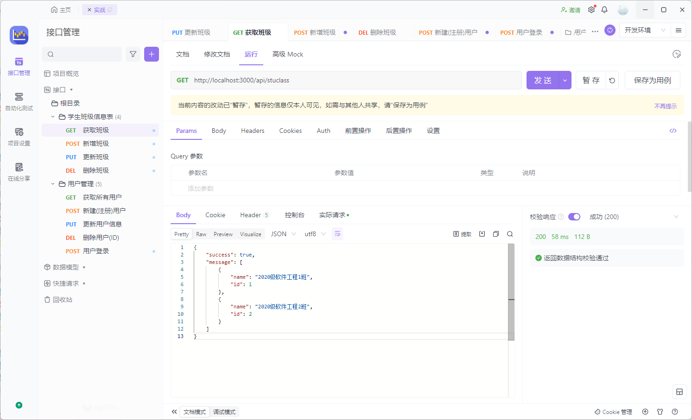
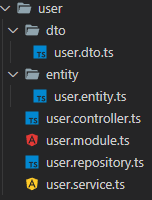
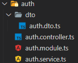
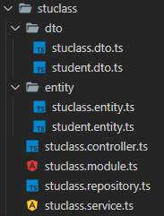

# MySQL 实战演练

## 题目

项目要求：

1、完成注册、登录功能

2、实现一个模块的增删查改，比如实现班级管理系统中的班级列表、添加班级、修改班级、删除班级功能

## 最终结果



## 步骤分析

1. 新建项目
2. 设计数据库
3. 设计模块
4. 连接路由
5. 测试
6. 部署

## 拉取 NodeJS (TypeScript) 项目初始模板

```bash
git clone git@github.com:baizhi958216/NodeJS-TS-Starter.git
```

- 进入`NodeJS-TS-Starter`运行`pnpm i`初始化项目

## 配置 mysql2 数据库连接池

- 运行`pnpm i mysql2`

- 新建`config`文件夹, 在`config`文件夹新建`db.config.ts`文件

db.config.ts

```ts
import { Pool, createPool } from "mysql2";
export const pool: Pool = createPool({
  // 数据库地址
  host: "localhost",
  // 数据库登录用户名
  user: "root",
  // 数据库登录用户密码
  password: "123456",
  // 数据库名
  database: "nodedb",
});
```

## 工具封装

新建`util`文件夹

1. 正则工具(路由会使用到)

`regexp.util.ts`

```ts
const regexCache: { [key: string]: RegExp } = {};
export function getRegExp(url: string): RegExp {
  if (!regexCache[url]) {
    regexCache[url] = new RegExp(`^${url}/?(\\d*)$`, "i");
  }
  return regexCache[url];
}
```

2. 请求工具(使请求序列化成 JSON 格式)

`reqdata.util.ts`

```ts
import { IncomingMessage } from "http";

export const reqdata = <T>(req: IncomingMessage): Promise<T> => {
  return new Promise((resolve, reject) => {
    let data = "";
    req.on("data", (chunk) => {
      data += chunk.toString();
    });
    req.on("end", async () => {
      resolve(JSON.parse(data));
    });
  });
};
```

3. 响应工具(使响应反序列化成 JSON 格式)

`resdata.util.ts`

```ts
import { ServerResponse } from "http";

export const resdata = (
  statusCode: number,
  res: ServerResponse,
  message?: any
) => {
  res.writeHead(statusCode, { "Content-Type": "application/json" });
  res.end(message ? JSON.stringify(message) : null);
};
```

## 新建用户模块

- 新建文件夹  
  `user`,存放用户模块  
  `user/dto`,存放用户数据模型  
  `user/entity`,存放用户实体

- 新建文件  
   `user/user.controller.ts`,控制器  
   `user/user.module.ts`,模块  
   `user/user.service.ts`,服务  
   `user/user.repository.ts`,数据库操作  
   `user/dto/user.dto.ts`,用户数据模型  
   `user/entity/user.entity.ts`,用户实体  
     
   `user.entity.ts`

  ```ts
  import { RowDataPacket } from "mysql2";
  export interface UserEntity extends RowDataPacket {
    /**
     * @param username 用户名
     */
    username: string;
    /**
     * @param password 密码
     */
    password: string;
  }
  ```

  `user.dto.ts`

  ```ts
  export interface IUser {
    /**
     * @param id 用户ID
     */
    id?: number;
    /**
     * @param username 用户名
     */
    username: string;
    /**
     * @param password 密码
     */
    password: string;
  }
  ```

  `user.repository.ts`

  ```ts
  import { OkPacket, ResultSetHeader } from "mysql2";
  import { pool } from "../config/db.config";
  import { UserEntity } from "./entity/user.entity";
  import { IUser } from "./dto/user.dto";

  export class UserRepository {
    // 查找全部用户
    findAll(): Promise<UserEntity[]> {
      return new Promise((resolve, reject) => {
        pool.query<UserEntity[]>("select * from users", (err, res) => {
          if (err) reject(err);
          else resolve(res);
        });
      });
    }
    // 根据ID查找用户
    findById(id: number): Promise<UserEntity | undefined> {
      return new Promise((resolve, reject) => {
        pool.query<UserEntity[]>(
          "select * from users where id=?",
          [id],
          (err, res) => {
            if (err) reject(err);
            else resolve(res?.[0]);
          }
        );
      });
    }
    // 根据用户名查找用户
    findByName(name: string): Promise<UserEntity | undefined> {
      return new Promise((resolve, reject) => {
        pool.query<UserEntity[]>(
          "select * from users where username=?",
          [name],
          (err, res) => {
            if (err) reject(err);
            else resolve(res?.[0]);
          }
        );
      });
    }
    // 新增用户
    createUser(user: IUser): Promise<IUser> {
      return new Promise((resolve, reject) => {
        pool.query<OkPacket>(
          "insert into users (username,password) values(?,?)",
          [user.username, user.password],
          (err, res) => {
            if (err) reject(err);
            else
              this.findById(res.insertId)
                .then((user) => resolve(user!))
                .catch(reject);
          }
        );
      });
    }
    // 更新用户信息
    updateUser(user: IUser): Promise<string> {
      return new Promise((resolve, reject) => {
        pool.query<ResultSetHeader>(
          "update users set password=? where username=?",
          [user.password, user.username],
          (err, res) => {
            if (err) reject(err);
            else resolve(res.info);
          }
        );
      });
    }
    // 根据用户ID删除用户
    removeUserById(id: number): Promise<number> {
      return new Promise((resolve, reject) => {
        pool.query<OkPacket>(
          "delete from users where id = ?",
          [id],
          (err, res) => {
            if (err) reject(err);
            else resolve(res.affectedRows);
          }
        );
      });
    }
    // 根据用户名删除用户
    removeUserByUserName(username: string): Promise<number> {
      return new Promise((resolve, reject) => {
        pool.query<OkPacket>(
          "delete from users where username = ?",
          [username],
          (err, res) => {
            if (err) reject(err);
            else resolve(res.affectedRows);
          }
        );
      });
    }
  }
  ```

  `user.service.ts`

  ```ts
  import { UserRepository } from "./user.repository";
  import { IUser } from "./dto/user.dto";
  export class UserService {
    constructor(private readonly userRepository: UserRepository) {}

    // 获取所有用户
    async getAllUsers() {
      return await this.userRepository.findAll();
    }

    // 新增用户
    async createUser(
      userDto: IUser
    ): Promise<{ success: boolean; message: any }> {
      return new Promise((resolve, reject) => {
        this.userRepository
          .createUser(userDto)
          .then((res) => {
            resolve({ success: true, message: res });
          })
          .catch((err) => {
            resolve({ success: false, message: err });
          });
      });
    }

    // 通过ID删除用户
    async deleteUser(userid: number) {
      const result = await this.userRepository.removeUserById(userid);
      return { success: !!result, message: result };
    }

    // 更新用户
    async updateUser(
      userDto: IUser
    ): Promise<{ success: boolean; message: any }> {
      return new Promise((resolve, reject) => {
        this.userRepository
          .updateUser(userDto)
          .then((res) => {
            resolve({ success: true, message: res });
          })
          .catch((err) => {
            resolve({ success: false, message: err });
          });
      });
    }
  }
  ```

  `user.controller.ts`

  ```ts
  import { IncomingMessage, ServerResponse } from "http";
  import { UserService } from "./user.service";
  import { reqdata } from "../util/reqdata.util";
  import { UserEntity } from "./entity/user.entity";
  import { resdata } from "../util/resdata.util";
  import { IUser } from "./dto/user.dto";

  export class UserController {
    constructor(private readonly userService: UserService) {}

    // 新增用户
    async createUser(req: IncomingMessage, res: ServerResponse) {
      const user = await reqdata<UserEntity>(req);
      const data = await this.userService.createUser(user);
      if (!data.success) {
        resdata(500, res, data);
      } else {
        resdata(200, res, {
          success: true,
          message: "新建用户成功",
        });
      }
    }

    // 删除用户
    async deleteUser(req: IncomingMessage, res: ServerResponse) {
      const user = await reqdata<IUser>(req);
      const data = await this.userService.deleteUser(user.id!);
      if (!data.success) {
        resdata(500, res, data);
      } else {
        resdata(204, res);
      }
    }

    // 更新用户
    async updateUser(req: IncomingMessage, res: ServerResponse) {
      const user = await reqdata<UserEntity>(req);
      const data = await this.userService.updateUser(user);
      if (!data.success) {
        resdata(500, res, data);
      } else {
        resdata(200, res, {
          success: true,
          message: "更新用户信息成功",
        });
      }
    }

    //获取全部用户
    async getAllUsers(res: ServerResponse) {
      const users = await this.userService.getAllUsers();
      if (!users) {
        resdata(500, res, {
          success: false,
          message: "",
        });
      } else {
        resdata(200, res, {
          success: true,
          message: users,
        });
      }
    }
  }
  ```

  `user.module.ts`

  ```ts
  import { UserRepository } from "./user.repository";
  import { UserService } from "./user.service";
  import { UserController } from "./user.controller";
  import { IncomingMessage, ServerResponse } from "http";

  export class UserModule {
    userRepository = new UserRepository();
    userService = new UserService(this.userRepository);
    userController = new UserController(this.userService);

    constructor(
      private readonly req: IncomingMessage,
      private readonly res: ServerResponse
    ) {}

    listen() {
      switch (this.req.method) {
        case "POST":
          this.userController.createUser(this.req, this.res);
          break;
        case "DELETE":
          this.userController.deleteUser(this.req, this.res);
          break;
        case "PUT":
          this.userController.updateUser(this.req, this.res);
          break;
        case "GET":
          this.userController.getAllUsers(this.res);
          break;
        default:
          this.res.statusCode = 404;
          this.res.end();
          break;
      }
    }
  }
  ```

## 新建登录校验模块

- 新建文件夹  
  `auth`,存放校验模块  
  `auth/dto`,存放数据模型

- 新建文件  
   `auth/auth.controller.ts`,控制器  
   `auth/auth.module.ts`,模块  
   `auth/auth.service.ts`,服务  
   

  `auth.dto.ts`

  ```ts
  export interface IAuth {
    /**
     * @param username 用户名
     */
    username: string;

    /**
     * @param password 密码
     */
    password: string;
  }
  ```

  `auth.service.ts`

  ```ts
  import { UserRepository } from "../user/user.repository";
  import { IAuth } from "./dto/auth.dto";

  export class AuthService {
    constructor(private readonly userRepository: UserRepository) {}
    async auth(authUser: IAuth): Promise<{ success: boolean; message: any }> {
      const { username, password } = authUser;
      return new Promise((resolve, reject) => {
        this.userRepository
          .findByName(username)
          .then((res) => {
            if (res && res.password == password) {
              resolve({
                success: true,
                message: res,
              });
            } else {
              resolve({
                success: false,
                message: "用户不存在或密码错误",
              });
            }
          })
          .catch((err) =>
            resolve({
              success: false,
              message: err,
            })
          );
      });
    }
  }
  ```

  `auth.controller.ts`

  ```ts
  import { IncomingMessage, ServerResponse } from "http";
  import { AuthService } from "./auth.service";
  import { reqdata } from "../util/reqdata.util";
  import { IAuth } from "./dto/auth.dto";
  import { resdata } from "../util/resdata.util";

  export class AuthController {
    constructor(private readonly authService: AuthService) {}

    async userAuth(req: IncomingMessage, res: ServerResponse) {
      const user = await reqdata<IAuth>(req);
      const data = await this.authService.auth(user);
      if (!data.success) {
        resdata(401, res, {
          success: false,
          message: data,
        });
      } else {
        resdata(200, res, {
          success: true,
          message: "登录成功",
        });
      }
    }
  }
  ```

  `auth.module.ts`

  ```ts
  import { IncomingMessage, ServerResponse } from "http";
  import { UserRepository } from "../user/user.repository";
  import { AuthController } from "./auth.controller";
  import { AuthService } from "./auth.service";

  export class AuthModule {
    userRepository = new UserRepository();
    authService = new AuthService(this.userRepository);
    authController = new AuthController(this.authService);

    constructor(
      private readonly req: IncomingMessage,
      private readonly res: ServerResponse
    ) {}

    listen() {
      switch (this.req.method) {
        case "POST":
          this.authController.userAuth(this.req, this.res);
          break;
        default:
          this.res.statusCode = 404;
          this.res.end();
          break;
      }
    }
  }
  ```

## 新建学生-班级模块

- 新建文件夹  
  `stuclass`,存放校验模块  
  `stuclass/dto`,存放学生-班级数据模型  
  `stuclass/entity`,存放学生-班级实体

- 新建文件  
   `stuclass/stuclass.controller.ts`,控制器  
   `stuclass/stuclass.module.ts`,模块  
   `stuclass/stuclass.service.ts`,服务  
   `stuclass/dto/stuclass.dto.ts`,班级数据模型  
   `stuclass/dto/student.dto.ts`,学生数据模型  
   `stuclass/entity/stuclass.entity.ts`,班级实体  
   `stuclass/entity/student.entity.ts`,学生实体  
   

  `stuclass/dto/stuclass.dto.ts`

  ```ts
  export interface IStuClass {
    /**
     * @param id 班级ID，主键，自动递增
     */
    id: number;
    /**
     * @param name 班级名称
     */
    name: string;
  }
  ```

  `stuclass/dto/student.dto.ts`

  ```ts
  export interface IStudent {}
  ```

  `stuclass/entity/stuclass.entity.ts`

  ```ts
  import { RowDataPacket } from "mysql2";

  export interface StuClassEntity extends RowDataPacket {
    /**
     * @param id 班级ID，主键，自动递增
     */
    id: number;
    /**
     * @param name 班级名称
     */
    name: string;
  }
  ```

  `stuclass/entity/student.entity.ts`

  ```ts
  import { RowDataPacket } from "mysql2";

  export interface StudentEntity extends RowDataPacket {
    /**
     * @param id 学生学号，主键
     */
    student_id: number;

    /**
     * @param name 学生姓名
     */
    name: string;

    /**
     * @param gender 学生性别
     */
    gender: string;

    /**
     * @param age 学生年龄
     */
    age: number;

    /**
     * @param class_id 学生所在班级的班级ID，外键，关联到班级表的ID
     */
    class_id: number;
  }
  ```

  `stuclass/stuclass.repository.ts`

  ```ts
  import { ResultSetHeader } from "mysql2";
  import { pool } from "../config/db.config";
  import { IStuClass } from "./dto/stuclass.dto";
  import { StuClassEntity } from "./entity/stuclass.entity";

  export class StuClassRepository {
    // 班级列表(id)
    getClass(class_id: string): Promise<StuClassEntity[]> {
      return new Promise((resolve, reject) => {
        pool.query<StuClassEntity[]>(
          `select
            class.name as class_name,
            class.id as class_id,
            student.student_id as student_id,
            student.gender as student_gender,
            student.age as student_age,
            student.class_id as student_class_id
            from class join student on class.id=student.class_id where class.id=?`,
          [class_id],
          (err, res) => {
            if (err) reject(err);
            else resolve(res);
          }
        );
      });
    }
    // 所有班级列表
    getClasses(): Promise<StuClassEntity[]> {
      return new Promise((resolve, reject) => {
        pool.query<StuClassEntity[]>(
          `select class.name,class.id from class`,
          (err, res) => {
            if (err) reject(err);
            else resolve(res);
          }
        );
      });
    }

    // 添加班级
    addClass(stuClassDto: IStuClass): Promise<ResultSetHeader> {
      /* 
        INSERT INTO class VALUES (class_id, class_name);
        */
      return new Promise((resolve, reject) => {
        pool.query(
          `
          insert into class value (?,?)
          `,
          [stuClassDto.id, stuClassDto.name],
          (err, res) => {
            if (err) reject(err);
            else resolve(res as ResultSetHeader);
          }
        );
      });
    }

    // 添加学生
    addStudent() {
      /* 
        INSERT INTO student VALUES (student_id, student_name, student_gender,   student_age, student_class_id);
        */
    }

    // 修改班级
    updateClass(stuClassDto: IStuClass): Promise<ResultSetHeader> {
      return new Promise((resolve, reject) => {
        pool.query<ResultSetHeader>(
          `
            update class set name=? where id=?
            `,
          [stuClassDto.name, stuClassDto.id],
          (err, res) => {
            if (err) reject(err);
            else resolve(res as ResultSetHeader);
          }
        );
      });
    }

    // 修改学生
    updateStudent() {}

    // 删除班级
    removeClass(id: number): Promise<ResultSetHeader> {
      return new Promise((resolve, reject) => {
        pool.query<ResultSetHeader>(
          "delete from class where id = ?",
          [id],
          (err, res) => {
            if (err) reject(err);
            else resolve(res as ResultSetHeader);
          }
        );
      });
    }

    // 开除学生
    removeStudent() {}
  }
  ```

  `stuclass/stuclass.service.ts`

  ```ts
  import { QueryError, ResultSetHeader } from "mysql2";
  import { IStuClass } from "./dto/stuclass.dto";
  import { StuClassRepository } from "./stuclass.repository";

  export class StuClassService {
    constructor(private readonly stuClassRepository: StuClassRepository) {}

    async getClasses() {
      return await this.stuClassRepository.getClasses();
    }

    async getClass(class_id: string) {
      return await this.stuClassRepository.getClass(class_id);
    }

    async addClass(stuClassDto: IStuClass): Promise<{
      success: boolean;
      message: ResultSetHeader | QueryError;
    }> {
      return new Promise((resolve, reject) => {
        this.stuClassRepository
          .addClass(stuClassDto)
          .then((res) =>
            resolve({
              success: true,
              message: res,
            })
          )
          .catch((err) =>
            resolve({
              success: false,
              message: err,
            })
          );
      });
    }

    async updateClass(stuClassDto: IStuClass): Promise<{
      success: boolean;
      message: ResultSetHeader | QueryError;
    }> {
      return new Promise((resolve, reject) => {
        this.stuClassRepository
          .updateClass(stuClassDto)
          .then((res) =>
            resolve({
              success: true,
              message: res,
            })
          )
          .catch((err) =>
            resolve({
              success: false,
              message: err,
            })
          );
      });
    }

    async removeClass(id: number): Promise<{
      success: boolean;
      message: ResultSetHeader | QueryError;
    }> {
      return new Promise((resolve, reject) => {
        this.stuClassRepository
          .removeClass(id)
          .then((res) =>
            resolve({
              success: true,
              message: res,
            })
          )
          .catch((err) =>
            resolve({
              success: false,
              message: err,
            })
          );
      });
    }
  }
  ```

  `stuclass/stuclass.controller.ts`

  ```ts
  import { IncomingMessage, ServerResponse } from "http";
  import { StuClassService } from "./stuclass.service";
  import { reqdata } from "../util/reqdata.util";
  import { resdata } from "../util/resdata.util";
  import { IStuClass } from "./dto/stuclass.dto";

  export class StuClassController {
    constructor(private readonly stuClassService: StuClassService) {}
    // 添加班级
    async createClass(req: IncomingMessage, res: ServerResponse) {
      const data = await this.stuClassService.addClass(
        await reqdata<IStuClass>(req)
      );
      if (!data.success) {
        resdata(500, res, data);
      } else {
        resdata(200, res, {
          success: true,
          message: "新建班级成功",
        });
      }
    }
    // 删除班级
    async deleteClass(req: IncomingMessage, res: ServerResponse) {
      const { id } = await reqdata<{ id: number }>(req);
      const data = await this.stuClassService.removeClass(id);
      if (!data.success) {
        resdata(500, res, data);
      } else {
        resdata(200, res, {
          success: true,
          message: "删除成功",
        });
      }
    }
    // 修改班级
    async updateClass(req: IncomingMessage, res: ServerResponse) {
      const classes = await this.stuClassService.updateClass(
        await reqdata<IStuClass>(req)
      );
      if (!classes) {
        resdata(500, res, {
          success: false,
          message: classes,
        });
      } else {
        resdata(200, res, {
          success: true,
          message: "班级更新成功",
        });
      }
    }
    // 获取班级
    async getClasses(res: ServerResponse, class_id?: string) {
      let classes;
      if (class_id) {
        classes = await this.stuClassService.getClass(class_id);
      } else {
        classes = await this.stuClassService.getClasses();
      }
      if (!classes) {
        resdata(500, res, {
          success: false,
          message: "",
        });
      } else {
        resdata(200, res, {
          success: true,
          message: classes,
        });
      }
    }
  }
  ```

  `stuclass/stuclass.module.ts`

  ```ts
  import { IncomingMessage, ServerResponse } from "http";
  import { StuClassRepository } from "./stuclass.repository";
  import { StuClassService } from "./stuclass.service";
  import { StuClassController } from "./stuclass.controller";

  export class StuClassModule {
    stuClassRepository = new StuClassRepository();
    stuClassService = new StuClassService(this.stuClassRepository);
    stuClassController = new StuClassController(this.stuClassService);

    constructor(
      private readonly req: IncomingMessage,
      private readonly res: ServerResponse
    ) {}
    listen() {
      switch (this.req.method) {
        case "POST":
          this.stuClassController.createClass(this.req, this.res);
          break;
        case "DELETE":
          this.stuClassController.deleteClass(this.req, this.res);
          break;
        case "PUT":
          this.stuClassController.updateClass(this.req, this.res);
          break;
        case "GET":
          this.stuClassController.getClasses(
            this.res,
            this.req.url?.split("/stuclass/")[1]
          );
          break;
        default:
          this.res.statusCode = 404;
          this.res.end();
          break;
      }
    }
  }
  ```

## 配置路由

- 新建`router`文件夹, 在`router`文件夹新建`index.ts`

`index.ts`

```ts
import { AuthModule } from "../auth/auth.module";
import { StuClassModule } from "../stuclass/stuclass.module";
import { UserModule } from "../user/user.module";

export const routes: {
  [key: string]: typeof UserModule | typeof StuClassModule | typeof AuthModule;
} = {
  "/api/user": UserModule,
  "/api/stuclass": StuClassModule,
  "/api/auth": AuthModule,
};
```

## 启动服务器

- 编辑 `app.ts`

```ts
import { log } from "console";
import { createServer } from "http";
import { routes } from "./router";
import { getRegExp } from "./util/regexp.util";

createServer((req, res) => {
  const { url } = req;
  // 路由匹配
  const match = Object.keys(routes).find((route) =>
    getRegExp(route).test(url!)
  );
  if (match) {
    const moduleClass = routes[match];
    const instance = new moduleClass(req, res);
    instance.listen();
  } else {
    res.statusCode = 404;
    res.end();
  }
  // 监听3000端口
}).listen(3000, () => {
  log(
    "\x1b[34m%s\x1b[0m",
    `
  😀 NodeJS服务启动...
  🚀 http://localhost:3000
  `
  );
});
```

- 运行 `pnpm start`
