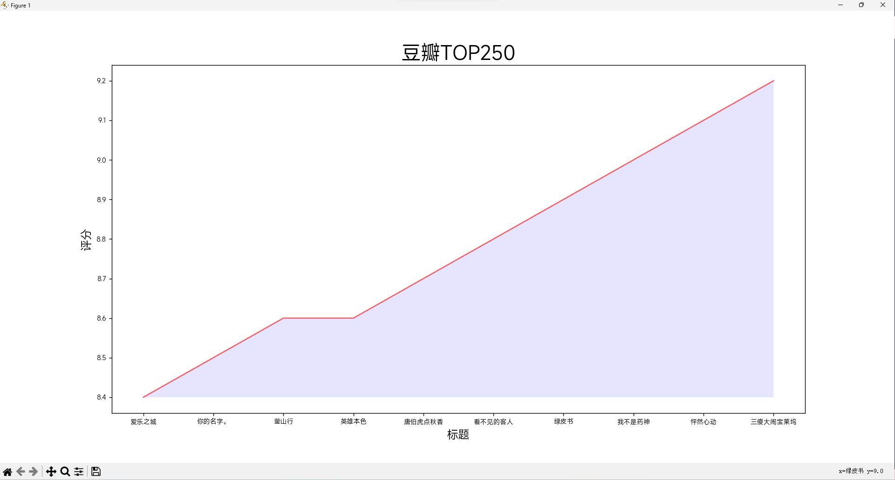

# CSV 绘制折线图



## CSV 文件

```xsl
影片标题,年份,评分,评论数,剧情
爱乐之城,2016,8.4,882177,剧情 爱情 歌舞
你的名字。,2016,8.5,1391106,剧情 爱情 动画
釜山行,2016,8.6,1185000,动作 惊悚 灾难
英雄本色,1986,8.6,533359,剧情 动作 犯罪
唐伯虎点秋香,1993,8.7,1065798,喜剧 爱情 古装
看不见的客人,2016,8.8,1241993,剧情 犯罪 悬疑 惊悚
绿皮书,2018,8.9,1627739,剧情 喜剧 传记 音乐
我不是药神,2018,9.0,2078273,剧情 喜剧
怦然心动,2010,9.1,1813362,剧情 喜剧 爱情
三傻大闹宝莱坞,2009,9.2,1841049,剧情 喜剧 爱情 歌舞
```

## 安装 matplotlib

```bash
pip install matplotlib
```

## 绘图

```python
import csv
from matplotlib import pyplot as plt
plt.rcParams["font.sans-serif"]=["MiSans"]

filename='data.csv'

with open(filename,'r',encoding='utf-8') as f:
    reader=csv.reader(f)
    header_row=next(reader)

    a,b,c,d,e=[],[],[],[],[]  # 将影片标题,年份,评分,评论数,剧情储存在列表中
    for row in reader: # 遍历reader列表
        a.append(row[0])
        b.append(row[1])
        c.append(row[2])
        d.append(row[3])
        e.append(row[4])

    # 绘制图表
    fig=plt.figure(dpi=128,figsize=(8,6)) # 绘图窗口
    plt.plot(a,c,c='red',alpha=0.6) # 第一个x，第二个y，第三个图形颜色

    # 设置图形的格式
    plt.title("豆瓣TOP250",fontsize=24) # 标题
    plt.xlabel("标题",fontsize=14) # x轴标题
    plt.ylabel("评分",fontsize=14) # y轴标题
    plt.tick_params(axis='both',which='major',labelsize=8) # 坐标轴格式

    # 着色
    plt.fill_between(a,c,facecolor='blue',alpha=0.1)

    plt.show()
```
