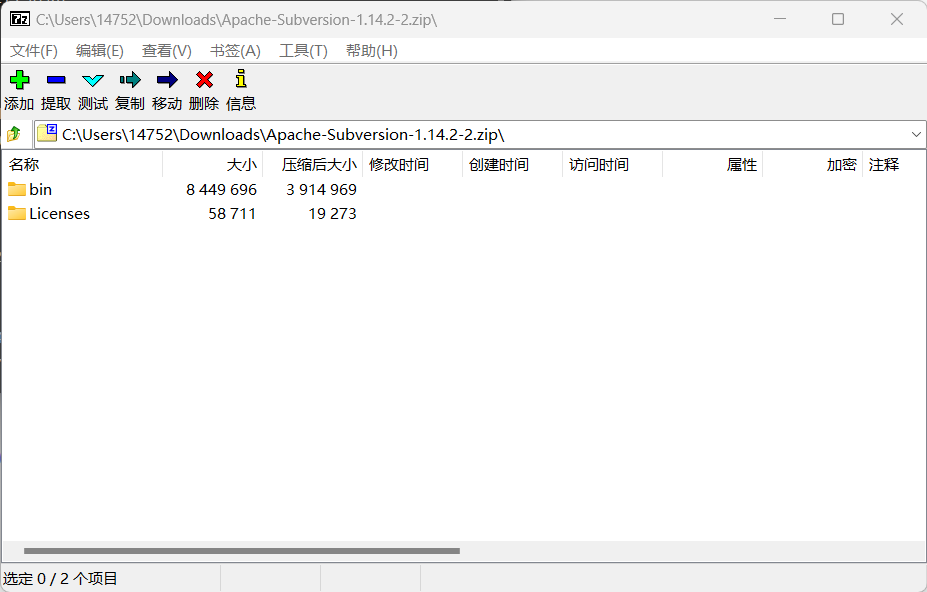
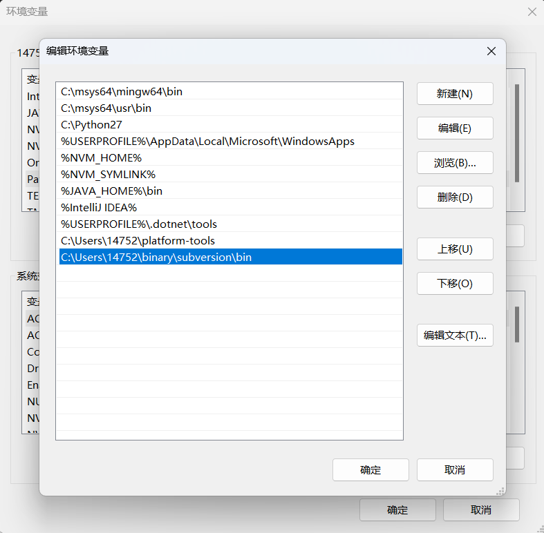
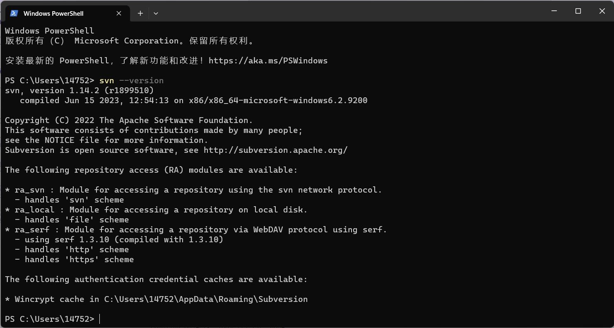

# SVN 从安装到入门

在 Linux 服务器环境下无法使用类似`TortoiseSVN`这样的GUI工具，而我们需要在服务器进行代码拉取或者提交等操作，因此，文档仅介绍命令行运行 svn。

## 安装

- Linux:

  :::code-group

  ```bash [ArchLinux]
  sudo pacman -S subversion
  ```

  ```bash [Ubuntu]
  sudo apt install subversion
  ```

  ```bash [CentOS]
  sudo yum install subversion
  ```

  :::

- Windows:

  1. 从 visualsvn 下载命令行工具: https://www.visualsvn.com/downloads/  
     
  2. 解压后将二进制路径添加到环境变量
     
  3. 测试是否可用
     ```ps
     svn --version
     ```
     
