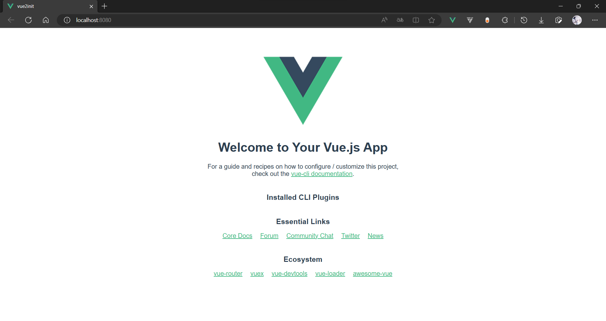
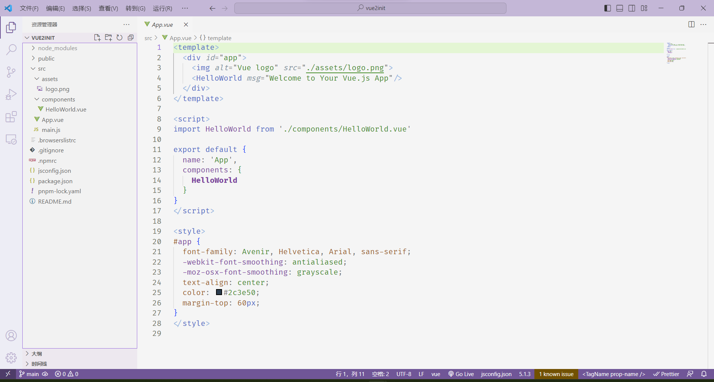

# Vue2 从安装到入门

:::warning IE8 以及以下的浏览器慎重考虑是否使用 Vue.js，其使用了大量的 ECMAScript5(ES5) 特性

浏览器 ES5 支持情况：https://caniuse.com/es5

:::

## 为什么还要学习 Vue2

2023 年 5 月 18 日，Vue3 已经迭代到[v3.3.4](https://github.com/vuejs/core/releases/tag/v3.3.4)版本，社区也产出了适应 Vue3 的 [VueUse](https://github.com/vueuse/vueuse)，[Pinia](https://github.com/vuejs/pinia)，[VantUI](https://github.com/youzan/vant)，[ElementPlus](https://github.com/element-plus/element-plus) 等等优秀的插件和组件库，实际上已经完全可以搭建出企业级项目。

相比之下，Vue2 以及一些基于 Vue2 的插件已经停止开发和维护，Vue2 还有什么值得学习的？为什么不直接上 Vue3？

个人总结了以下几点原因：

- Vue2 已经够用，完成开发上线即可
- 团队技术栈为 Vue2，知识积累较多，不需要花费时间统一升级知识库
- 项目需要追求稳定性，一些 Vue2 遇到的坑都能在网上找到答案
- 浏览器兼容性问题，Proxy、BigInt、WeakMap 等无法完全 Profill
- 企业有老项目需要维护，由于项目体积较大导致迁移至 Vue3 较为困难

**技术为业务服务**，在国内甚至在全球范围内仍然还有很多业务需要适配到 IE，Vue2 依旧是主力军。

如果已经学习了 Vue3，相信 JavaScript 的基础已经过关，再加上 Vue 核心思想的理解，Vue2 几乎没有上手难度。

## 安装

### 通过 CDN 直接引入：

```html
<!DOCTYPE html>
<html lang="zh">
  <head>
    <meta charset="UTF-8" />
    <title>Vue2</title>
    <script src="https://cdn.jsdelivr.net/npm/vue@2.7.14/dist/vue.min.js"></script> // [!code focus]
  </head>
  <body>
    <div id="app">
      <p>{{ vue }}</p>
      <button v-on:click="vueit">点击事件</button>
    </div>

    <script>
      new Vue({
        el: "#app",
        data: {
          vue: "baizhi958216",
        },
        methods: {
          vueit() {
            this.vue = "Vue2这是";
          },
        },
      });
    </script>
  </body>
</html>
```

### 通过 NPM 安装：

```bash
npm install vue@^2
```

### 通过命令行工具（CLI）：

安装vuecli

```bash
npm install -g @vue/cli
```

:::details 安装日志

```cmd
C:\Users\14752> npm install -g @vue/cli
npm WARN deprecated source-map-url@0.4.1: See https://github.com/lydell/source-map-url#deprecated
npm WARN deprecated urix@0.1.0: Please see https://github.com/lydell/urix#deprecated
npm WARN deprecated resolve-url@0.2.1: https://github.com/lydell/resolve-url#deprecated
npm WARN deprecated source-map-resolve@0.5.3: See https://github.com/lydell/source-map-resolve#deprecated
npm WARN deprecated apollo-datasource@3.3.2: The `apollo-datasource` package is part of Apollo Server v2 and v3, which are now deprecated (end-of-life October 22nd 2023). See https://www.apollographql.com/docs/apollo-server/previous-versions/ for more details.
npm WARN deprecated apollo-server-errors@3.3.1: The `apollo-server-errors` package is part of Apollo Server v2 and v3, which are now deprecated (end-of-life October 22nd 2023). This package's functionality is now found in the `@apollo/server` package. See https://www.apollographql.com/docs/apollo-server/previous-versions/ for more details.
npm WARN deprecated apollo-server-plugin-base@3.7.2: The `apollo-server-plugin-base` package is part of Apollo Server v2 and v3, which are now deprecated (end-of-life October 22nd 2023). This package's functionality is now found in the `@apollo/server` package. See https://www.apollographql.com/docs/apollo-server/previous-versions/ for more details.
npm WARN deprecated apollo-server-types@3.8.0: The `apollo-server-types` package is part of Apollo Server v2 and v3, which are now deprecated (end-of-life October 22nd 2023). This package's functionality is now found in the `@apollo/server` package. See https://www.apollographql.com/docs/apollo-server/previous-versions/ for more details.
npm WARN deprecated apollo-server-express@3.12.0: The `apollo-server-express` package is part of Apollo Server v2 and v3, which are now deprecated (end-of-life October 22nd 2023). This package's functionality is now found in the `@apollo/server` package. See https://www.apollographql.com/docs/apollo-server/previous-versions/ for more details.
npm WARN deprecated apollo-reporting-protobuf@3.4.0: The `apollo-reporting-protobuf` package is part of Apollo Server v2 and v3, which are now deprecated (end-of-life October 22nd 2023). This package's functionality is now found in the `@apollo/usage-reporting-protobuf` package. See https://www.apollographql.com/docs/apollo-server/previous-versions/ for more details.
npm WARN deprecated apollo-server-env@4.2.1: The `apollo-server-env` package is part of Apollo Server v2 and v3, which are now deprecated (end-of-life October 22nd 2023). This package's functionality is now found in the `@apollo/utils.fetcher` package. See https://www.apollographql.com/docs/apollo-server/previous-versions/ for more details.
npm WARN deprecated subscriptions-transport-ws@0.11.0: The `subscriptions-transport-ws` package is no longer maintained. We recommend you use `graphql-ws` instead. For help migrating Apollo software to `graphql-ws`, see https://www.apollographql.com/docs/apollo-server/data/subscriptions/#switching-from-subscriptions-transport-ws    For general help using `graphql-ws`, see https://github.com/enisdenjo/graphql-ws/blob/master/README.md
npm WARN deprecated apollo-server-core@3.12.0: The `apollo-server-core` package is part of Apollo Server v2 and v3, which are now deprecated (end-of-life October 22nd 2023). This package's functionality is now found in the `@apollo/server` package. See https://www.apollographql.com/docs/apollo-server/previous-versions/ for more details.

added 868 packages in 21s
PS C:\Users\14752>
```

:::

使用vuecli创建新项目

```bash
vue create vue2init
```

::: details 执行日志

```cmd
Vue CLI v5.0.8
? Please pick a preset: (Use arrow keys)
  Default ([Vue 3] babel, eslint)
  Default ([Vue 2] babel, eslint)
> Manually select features

Vue CLI v5.0.8
? Please pick a preset: Manually select features
? Check the features needed for your project: (Press <space> to select, <a> to toggle all, <i> to invert selection, and
<enter> to proceed)
 ( ) Babel
 ( ) TypeScript
 ( ) Progressive Web App (PWA) Support
 ( ) Router
 ( ) Vuex
 ( ) CSS Pre-processors
>( ) Linter / Formatter
 ( ) Unit Testing
 ( ) E2E Testing

Vue CLI v5.0.8
? Please pick a preset: Manually select features
? Check the features needed for your project:
? Choose a version of Vue.js that you want to start the project with
  3.x
> 2.x

Vue CLI v5.0.8
? Please pick a preset: Manually select features
? Check the features needed for your project:
? Choose a version of Vue.js that you want to start the project with 2.x
? Where do you prefer placing config for Babel, ESLint, etc.? (Use arrow keys)
> In dedicated config files
  In package.json

Vue CLI v5.0.8
? Please pick a preset: Manually select features
? Check the features needed for your project:
? Choose a version of Vue.js that you want to start the project with 2.x
? Where do you prefer placing config for Babel, ESLint, etc.? In dedicated config files
? Save this as a preset for future projects? (y/N) n

Vue CLI v5.0.8
✨  Creating project in C:\Users\14752\dev\vue2\vue2init.
🗃  Initializing git repository...
⚙️  Installing CLI plugins. This might take a while...

🚀  Invoking generators...
📦  Installing additional dependencies...

⚓  Running completion hooks...

📄  Generating README.md...

🎉  Successfully created project vue2init.
👉  Get started with the following commands:

 $ cd vue2init
 $ pnpm run serve

PS C:\Users\14752\dev\vue2>

```

:::

运行项目

```bash
cd vue2init
pnpm run serve
```

:::details 运行日志

```cmd
PS C:\Users\14752\dev\vue2> cd vue2init
PS C:\Users\14752\dev\vue2\vue2init> pnpm run serve

> vue2init@0.1.0 serve C:\Users\14752\dev\vue2\vue2init
> vue-cli-service serve

 INFO  Starting development server...


 DONE  Compiled successfully in 2704ms                                                                          00:02:38


  App running at:
  - Local:   http://localhost:8080/
  - Network: http://192.168.1.2:8080/

  Note that the development build is not optimized.
  To create a production build, run pnpm run build.
```

:::

进入开发预览页面




## CLI项目主要代码

文件扩展名为 `.vue` 的叫做单文件组件（SFC）。



::: code-group

```js [main.js]
import Vue from 'vue'
import App from './App.vue'

Vue.config.productionTip = false

new Vue({
  render: function (h) { return h(App) },
}).$mount('#app')
```

```vue [App.vue]
<template>
  <div id="app">
    
    <HelloWorld msg="Welcome to Your Vue.js App"/>
  </div>
</template>

<script>
import HelloWorld from './components/HelloWorld.vue'

export default {
  name: 'App',
  components: {
    HelloWorld
  }
}
</script>

<style>
#app {
  font-family: Avenir, Helvetica, Arial, sans-serif;
  -webkit-font-smoothing: antialiased;
  -moz-osx-font-smoothing: grayscale;
  text-align: center;
  color: #2c3e50;
  margin-top: 60px;
}
</style>
```

```vue [components/HelloWorld.vue]
<template>
  <div class="hello">
    <h1>{{ msg }}</h1>
    <p>
      For a guide and recipes on how to configure / customize this project,<br>
      check out the
      <a href="https://cli.vuejs.org" target="_blank" rel="noopener">vue-cli documentation</a>.
    </p>
    <h3>Installed CLI Plugins</h3>
    <ul>
    </ul>
    <h3>Essential Links</h3>
    <ul>
      <li><a href="https://vuejs.org" target="_blank" rel="noopener">Core Docs</a></li>
      <li><a href="https://forum.vuejs.org" target="_blank" rel="noopener">Forum</a></li>
      <li><a href="https://chat.vuejs.org" target="_blank" rel="noopener">Community Chat</a></li>
      <li><a href="https://twitter.com/vuejs" target="_blank" rel="noopener">Twitter</a></li>
      <li><a href="https://news.vuejs.org" target="_blank" rel="noopener">News</a></li>
    </ul>
    <h3>Ecosystem</h3>
    <ul>
      <li><a href="https://router.vuejs.org" target="_blank" rel="noopener">vue-router</a></li>
      <li><a href="https://vuex.vuejs.org" target="_blank" rel="noopener">vuex</a></li>
      <li><a href="https://github.com/vuejs/vue-devtools#vue-devtools" target="_blank" rel="noopener">vue-devtools</a></li>
      <li><a href="https://vue-loader.vuejs.org" target="_blank" rel="noopener">vue-loader</a></li>
      <li><a href="https://github.com/vuejs/awesome-vue" target="_blank" rel="noopener">awesome-vue</a></li>
    </ul>
  </div>
</template>

<script>
export default {
  name: 'HelloWorld',
  props: {
    msg: String
  }
}
</script>

<!-- Add "scoped" attribute to limit CSS to this component only -->
<style scoped>
h3 {
  margin: 40px 0 0;
}
ul {
  list-style-type: none;
  padding: 0;
}
li {
  display: inline-block;
  margin: 0 10px;
}
a {
  color: #42b983;
}
</style>
```

:::

## 核心功能

:::details 文本插值

采用简洁的模板语法来声明式地将数据渲染进 DOM。

```vue
<template>
  <div>{{ message }}</div>
</template>

<script>
export default {
  name: 'App',
  data() {
    return {
      message: 'Hello Vue!'
    }
  }
}
</script>
```

:::

:::details 绑定元素属性

```vue
<template>
  <span v-bind:title="message">
    鼠标悬停几秒钟查看此处动态绑定的提示信息！
  </span>
</template>

<script>
export default {
  name: 'App',
  data() {
    return {
      message: '页面加载于 ' + new Date().toLocaleString()
    }
  }
}
</script>
```

:::

:::details 条件与循环

`v-if`条件渲染，可搭配`v-else-if`、`v-else`使用

```vue
<template>
  <div v-if="seen">因为seen是true，元素正常渲染</div>
</template>

<script>
export default {
  name: 'App',
  data() {
    return {
      seen: true
    }
  }
}
</script>
```

循环5次，输出5个li
```vue
<template>
  <ul>
    <li v-for="i in 5">{{ i }}</li>
  </ul>
</template>

<script>
export default {
  name: 'App',
}
</script>
```

:::

:::details 双向绑定元素属性

```vue
<template>
  <div>
    <div>{{ userName }}</div>
    <input v-model="userName" />
  </div>
</template>

<script>
export default {
  name: 'App',
  data() {
    return {
      userName: '用户名'
    }
  }
}
</script>
```

:::

:::details 组件化应用构建

::: code-group

```vue [App.vue]
<template>
  <div>
    <Button />
  </div>
</template>

<script>
import Button from './Button.vue'
export default {
  name: 'App',
  components: { Button }
}
</script>
```

```vue [Button.vue]
<template>
    <div>
        <button>按钮</button>
    </div>
</template>
  
<script>
export default {
    name: 'Button',
}
</script>
```

:::


## 其它

Vue2文档: https://v2.vuejs.org/v2/guide/installation.html