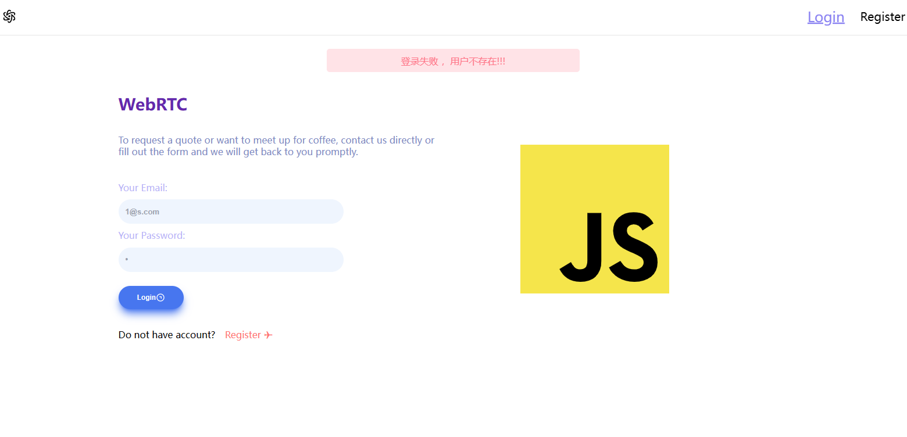

# 封装一个供编程式使用的消息提示组件



## 目的

通过函数调用，在页面弹出消息提示。

```ts
import { PopMessage } from '@/components/RPop'

PopMessage.warn('警告: ')

PopMessage.success('成功!')

PopMessage.tip('提示: ')

PopMessage.tip('错误!!!')
```


## 分析

创建一个单例组件，在调用之初去建立好DOM节点插入到顶层。

```ts
private constructor() {
  const VNode = createVNode(RPopVue, {
    pop: PopMessage.pop
  });
  render(VNode, document.body);
}
```

执行实例静态方法时先去判断实例是否存在。

```ts
private static getInstance(): PopMessage {
  if (!PopMessage.instance) {
    PopMessage.instance = new PopMessage();
  }

  return PopMessage.instance;
}
```

下一步是通过修改组件props(`content`,`type`)来修改消息内容和消息类型，

通过修改`show`属性去控制组件在DOM中的渲染。

```ts
PopMessage.pop.content = 'message';
PopMessage.pop.type = 'success' || 'danger' || 'warn' || 'tip';
PopMessage.pop.show = true || false;
```

## 全部代码

:::code-group

```ts [src/components/RPop/index.ts]

import { createVNode, reactive, render } from 'vue';
import RPopVue from './src/RPop.vue';

class PopMessage {
  private static instance: PopMessage;
  
  private static readonly pop = reactive({
    content: '',
    show: false,
    type: ''
  });

  private constructor() {
    const VNode = createVNode(RPopVue, {
      pop: PopMessage.pop
    });
    render(VNode, document.body);
  }

  private static getInstance(): PopMessage {
    if (!PopMessage.instance) {
      PopMessage.instance = new PopMessage();
    }

    return PopMessage.instance;
  }

  private static showMessage(message: string, type: string) {
    const instance = PopMessage.getInstance();
    PopMessage.pop.content = message;
    PopMessage.pop.type = type;
    PopMessage.pop.show = true;
    setTimeout(() => {
      PopMessage.pop.show = false;
    }, 3000);

    return instance;
  }

  static success(message: string) {
    return PopMessage.showMessage(message, 'success');
  }

  static danger(message: string) {
    return PopMessage.showMessage(message, 'danger');
  }

  static warn(message: string) {
    return PopMessage.showMessage(message, 'warn');
  }

  static tip(message: string) {
    return PopMessage.showMessage(message, 'tip');
  }
}

export { PopMessage };


```

```vue [src/components/RPop/src/RPop.vue]
<template>
  <transition
    enter-active-class="animate__animated animate__fadeInDown"
    leave-active-class="animate__animated animate__fadeOutUp"
  >
    <div v-if="props.pop.show" class="absolute items-end w-full top-0 flex justify-center h-[8rem]">
      <div :class="messageClasses">
        <slot>{{ pop.content }}</slot>
      </div>
    </div>
  </transition>
</template>
<script setup lang="ts">
import { computed } from 'vue';
import type { RPop } from './RPop';
const props = withDefaults(
  defineProps<RPop>(),
  {
    pop: () => {
      return {
        content: '',
        show: false,
        type: 'success'
      }
    }
  }
)

const messageClasses = computed(() => {
  const typeClasses = {
    success: 'bg-emerald/20 text-emerald',
    danger: 'bg-rose/20 text-rose',
    tip: 'bg-sky/20 text-sky',
    warn: 'bg-amber/20 text-amber',
  };
  
  return `relative h-2.5rem w-fit p-x-[8rem] flex justify-center items-center b-rd-[5px] ${typeClasses[props.pop.type] || 'bg-emerald/20 text-emerald'}`;
});
</script>
```

```ts [src/components/RPop/src/RPop.ts]
type RPop = {
  pop: {
    content: string
    show: boolean,
    type: 'success'|'warn'|'danger'|'tip'
  }
}

export type { RPop }
```

:::
