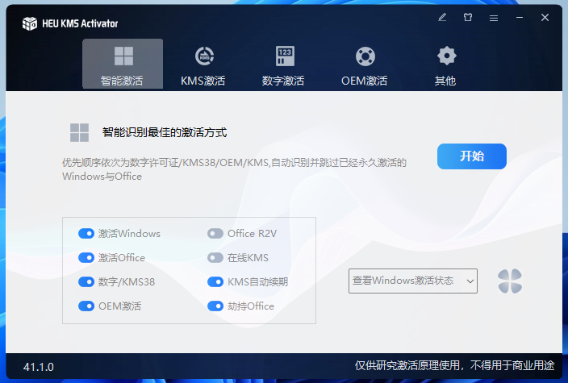
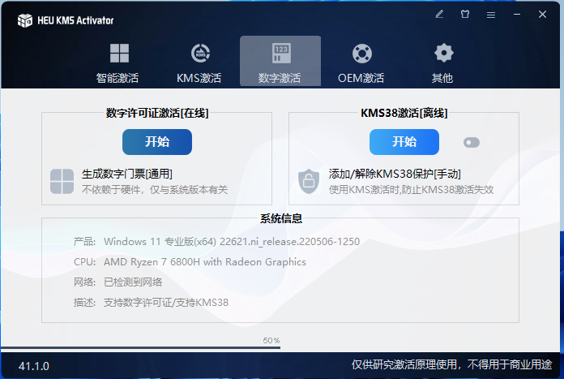
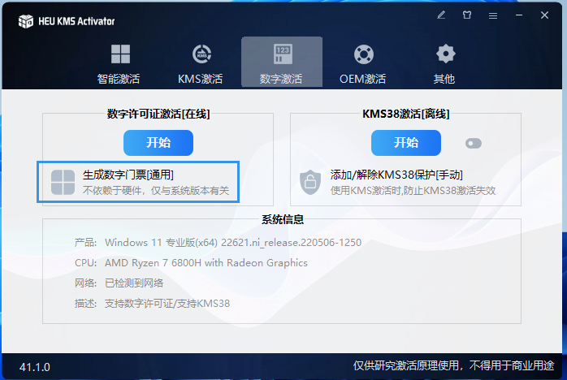
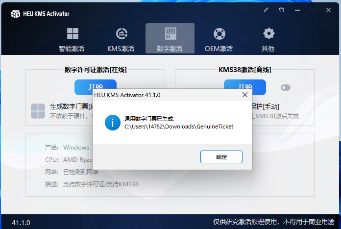
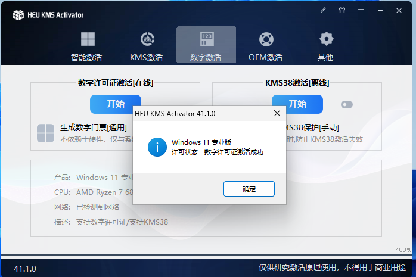
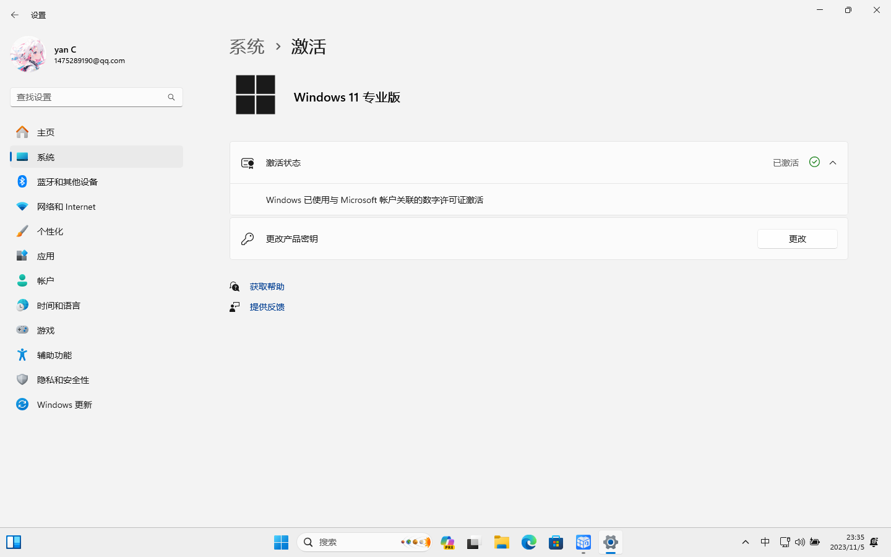

# 通过数字激活 Windows 11 专业版

非常感谢[知彼而知己](https://github.com/zbezj)提供HEU_KMS_Activator的长期更新和维护。

## 一、下载HEU_KMS_Activator

:::danger 注意

下载前需要关闭`杀毒软件`(包括Windows自带的`Windows Defender`), 否则HEU_KMS_Activator会被当做恶意软件删除。

关闭方式自行百度。

:::

下载地址1: [Github Release](https://github.com/zbezj/HEU_KMS_Activator/releases)

下载地址2: [蓝奏云](https://wwi.lanzoup.com/b05gumbe) 密码:9xum 

下载地址3: [百度网盘](https://pan.baidu.com/s/14U3zIG4tG6ZdMBrHaPaLzw?pwd=c65c)

## 激活Windows

:::danger 注意

记得关闭杀毒软件

:::

打开`HEU_KMS_Activator`

进入`数字激活`项

`数字许可证激活[在线]`栏中点击`生成数字门票[通用]`

`数字许可证激活[在线]`栏中点击开始

等待激活完成

## 完成激活

