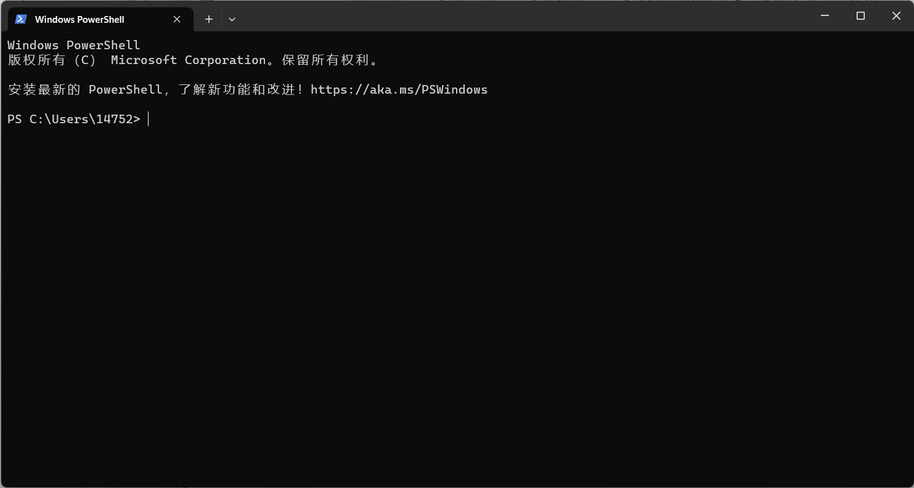
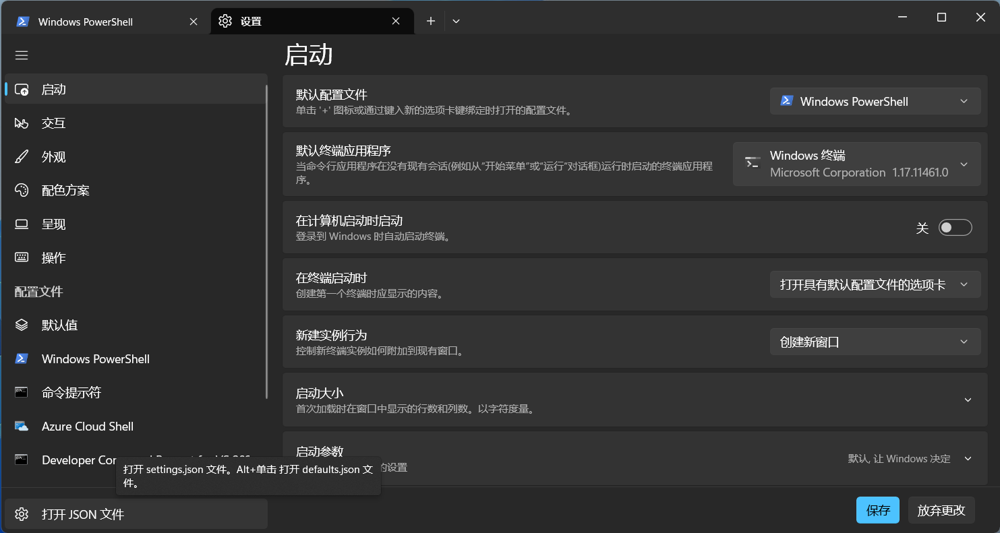
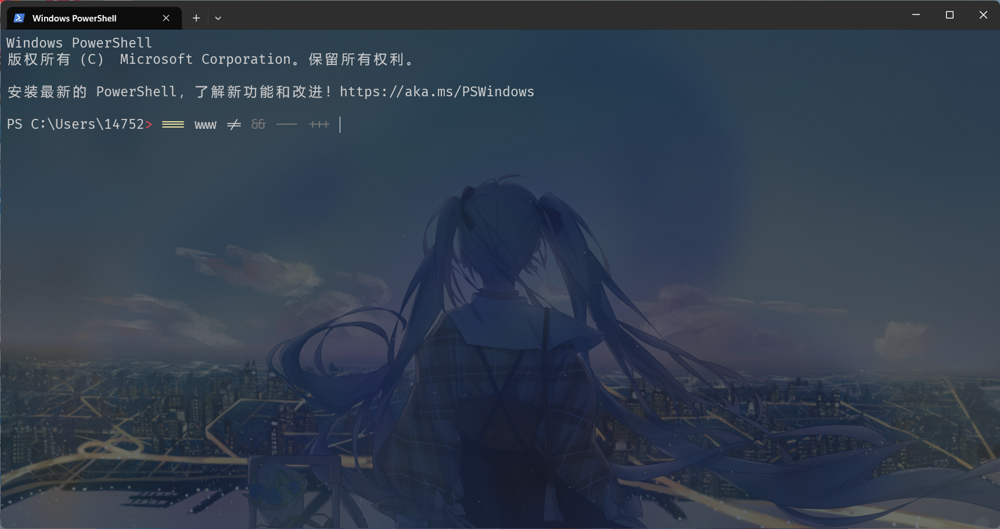

# 美化 Windows Terminal(终端)

[微软文档](https://learn.microsoft.com/zh-cn/windows/terminal/)

这是默认的终端



打开`setting.json`


需要修改的地方是**profiles**下的**defaults**, 配置每一个窗口的默认样式

```json
{
  // ...
  "profiles": {
    "defaults": {}
    // ...
  }
}
```

常用的一些配置项:

```json
{
  "font": {
    "face": "Fira Code" // 字体
  },
  "backgroundImage": "C:\\Users\\14752\\Pictures\\Pixiv\\104921066_p0.png", // 终端背景图片
  "useAcrylic": true, // 亚克力效果
  "backgroundImageOpacity": 0.1, // 终端背景图片透明度
  "opacity": 10 // 终端透明度
}
```


