# 官网 U 盘引导安装 Windows 11 专业版

## 一、下载镜像

官网下载链接: [Microsoft Windows11 Download](https://www.microsoft.com/zh-cn/software-download/windows11)

1. 滚动页面到 `下载 Windows 11 磁盘映像 (ISO)`, 下拉选择`Windows 11 (multi-edition ISO)` :

- 点击`下载`:
    <el-card shadow="always"> 
    
    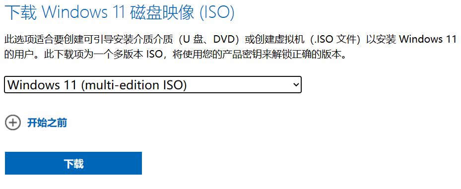
    
    </el-card>

2. `选择产品语言`下拉选择你所熟悉的语言, 我更倾向于***简体中文***

    <el-card shadow="always"> 
    
    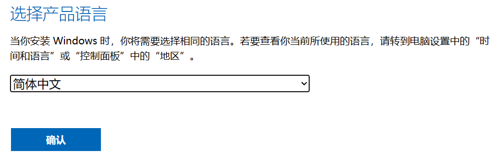

    </el-card>

3. 点击`确认`出现`64-bit Download`按钮, 点击它:

    <el-card shadow="always"> 

    

    </el-card>

:::tip 可以将链接复制到`迅雷`下载

<el-card shadow="always"> 

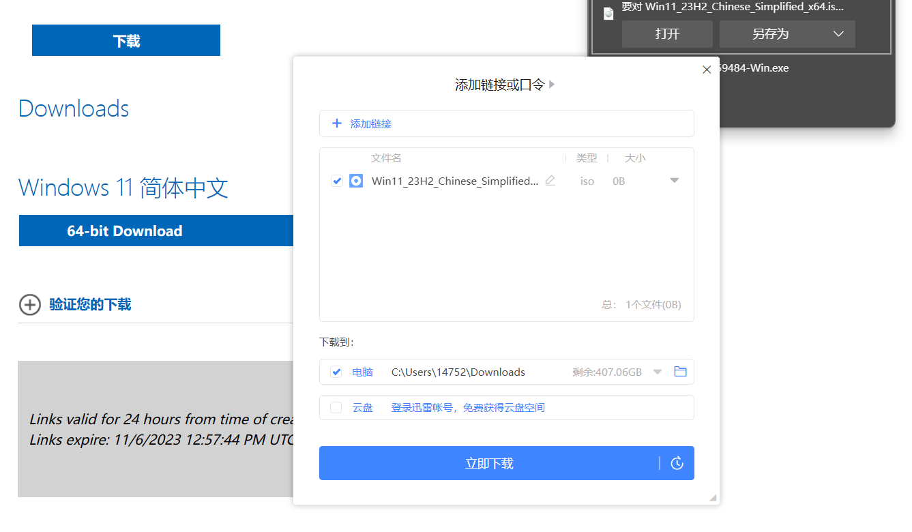

</el-card>

下载速度会相对快些

<el-card shadow="always"> 

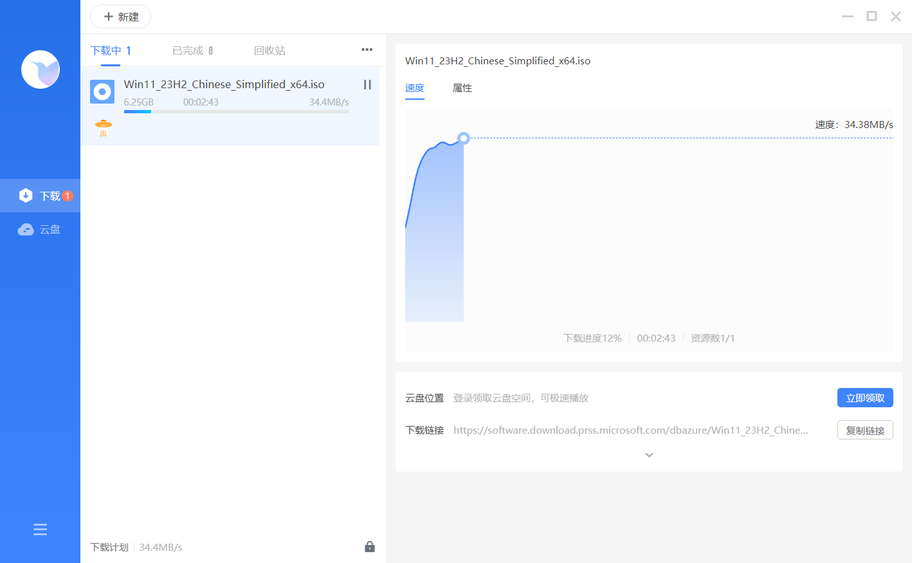

</el-card>

:::

## 二、下载rufus

`Rufus` 是一款格式化和创建 USB 启动盘的辅助工具。

适用于以下场景：

- 需要将可引导 ISO (Windows、Linux、UEFI 等) 刻录到 USB 安装媒介的情况
- 需要处理未安装操作系统的设备的情况
- 需要在 DOS 环境下刷写 BIOS 或其他固件的情况
- 需要运行低级工具的情况

官网下载链接: [Rufus Download](https://rufus.ie/zh/)

滚动页面到`最新版本`

<el-card shadow="always"> 

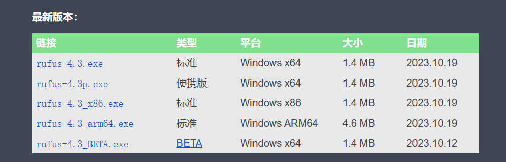

</el-card>

点击`rufus-4.3p.exe`下载 rufus 便携版

## 三、制作U盘引导

:::warning 注意

- 制作前请确保以下文件已完成下载并且插入`一个U盘`或者`一个移动硬盘`。

<el-card shadow="always">
    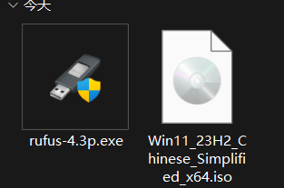
</el-card>

- 制作前请确保已完成 U 盘资料备份(制作 U 盘引导将会格式化(清空)U 盘内容)。

:::

1. 打开`rufus`, `设备`项应默认选择你所插入的`U盘`或者`移动硬盘`

<el-card shadow="always">
    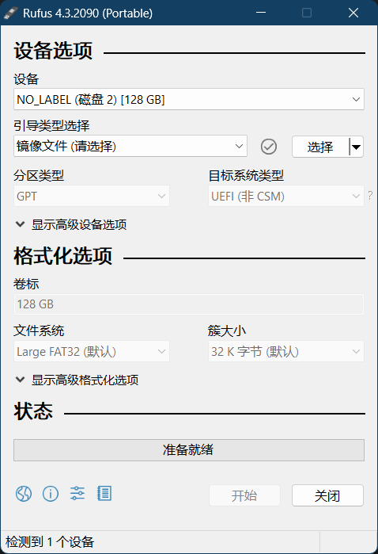
</el-card>

2. 点击`目标系统类型`菜单上方的`选择`, 双击之前下载的[镜像](#一、下载镜像)

<el-card shadow="always">
    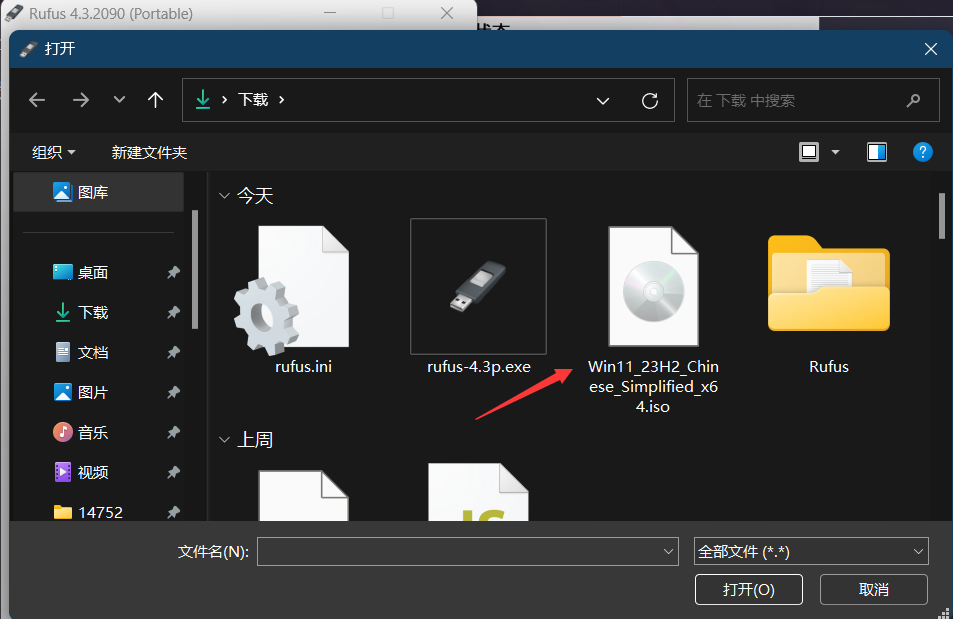
</el-card>

3. 此时 rufus 应是以下界面

<el-card shadow="always">
    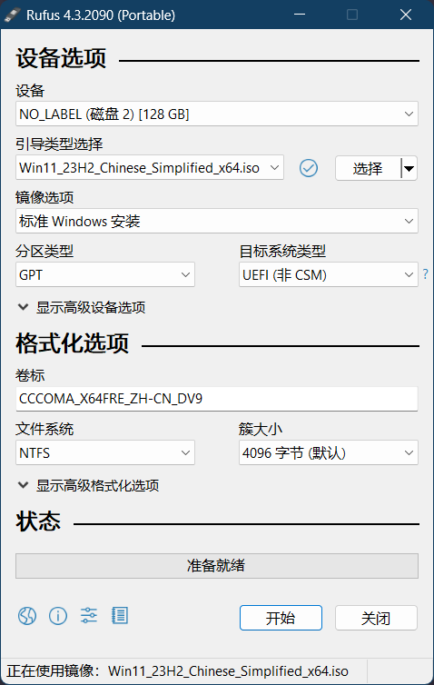
</el-card>

4. 点击`开始`, 将弹出的窗口的已选选项***全部取消***

<el-card shadow="always">
    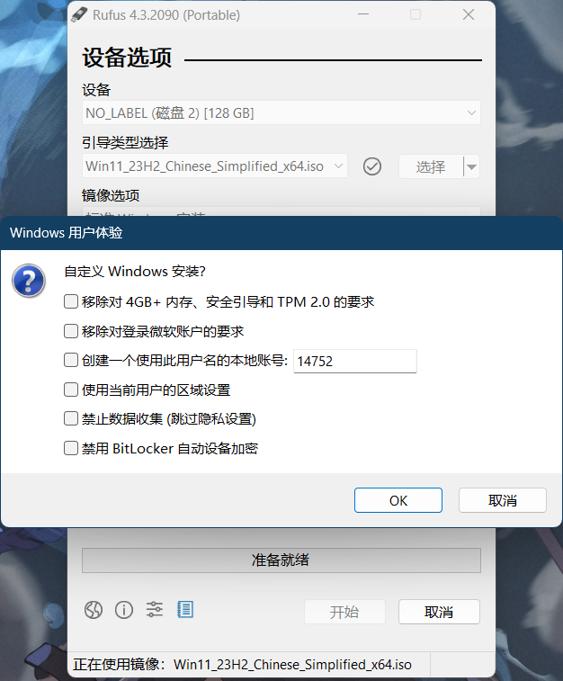
</el-card>

5. 格式化警告窗口点击`OK`进行写入 (请确保已完成 U 盘资料备份)

<el-card shadow="always">
    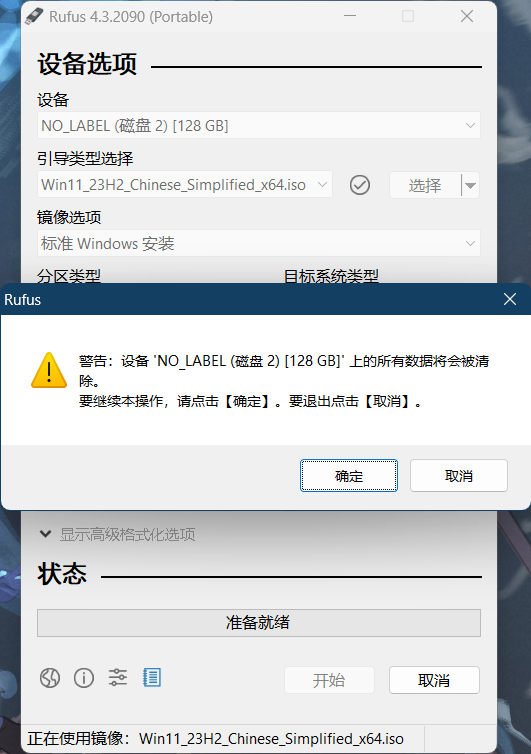
</el-card>

6. 等待镜像完成复制

<el-card shadow="always">
   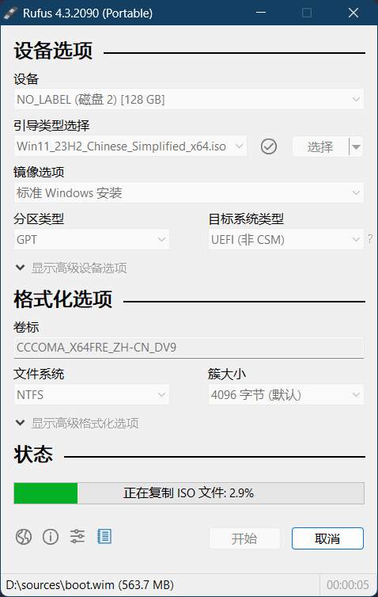
</el-card>

<el-card shadow="always">
   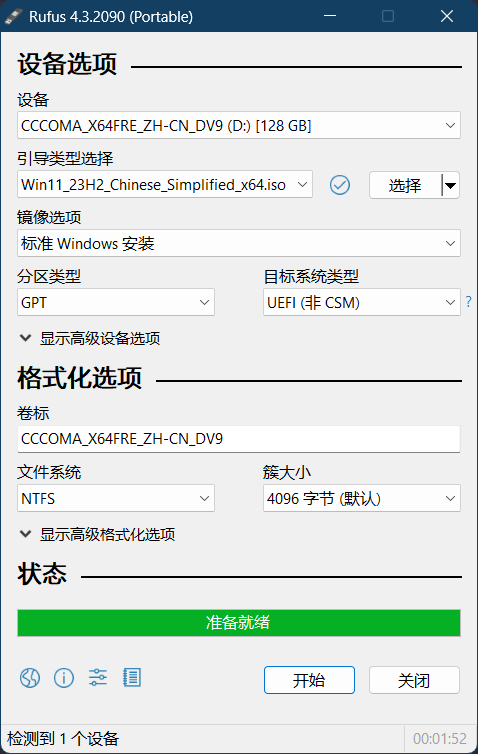
</el-card>

## 四、引导 U 盘启动

1. 完成[制作 U 盘引导](#三、制作u盘引导)后, 将 U 盘插入***待安装系统的设备***USB 接口上。

2. 按下设备电源键并且使用 U 盘引导分区启动

以下是各大厂商 U 盘引导启动快捷键

组装电脑:

| 品牌         | 快捷键     | 品牌         | 快捷键     |
| ------------ | ---------- | ------------ | ---------- |
| 华硕主板     | F8         | 铭瑄主板     | ESC        |
| 双敏主板     | F8         | 磐英主板     | ESC        |
| 映泰主板     | F9         | 盈通主板     | ESC        |
| 冠铭主板     | F9         | 磐正主板     | ESC        |
| 翔升主板     | F10        | 捷波主板     | ESC        |
| 微星主板     | F11        | 杰微主板     | ESC \|F8   |
| 华擎主板     | F11        | 七彩虹主板   | ESC \| F11 |
| 昂达主板     | F11        | 精英主板     | ESC \| F11 |
| 技嘉主板     | F12        | 梅捷主板     | ESC \| F12 |
| Intel 主板   | F12        | 富士康主板   | ESC \| F12 |
| 致铭主板     | F12        | 顶星主板     | F11 \| F12 |
| 斯巴达卡主板 | ESC        | 冠盟主板     | F11 \| F12 |
| 双敏主板     | ESC        |||

品牌台式:

| 品牌     | 快捷键 | 品牌     | 快捷键 |
| -------- | ------ | -------- | ------ |
| 戴尔     | ESC    | 宏基     | F12    |
| 华硕     | F8     | 神舟     | F12    |
| 明基     | F8     | 方正     | F12    |
| 联想     | F12    | 清华同方 | F12    |
| 惠普     | F12    | 海尔     | F12    |

品牌笔记本:

| 品牌             | 快捷键         |品牌             | 快捷键         |
| ---------------- | -------------- |---------------- | -------------- |
| 明基笔记本       | F9             | IBM 笔记本       | F12            |
| 联想笔记本       | F12            | 富士通笔记本     | F12            |
| 宏基笔记本       | F12            | 海尔笔记本       | F12            |
| 外星人笔记本     | F12            | 方正笔记本       | F12            |
| 小米笔记本       | F12            | 清华同方笔记本   | F12            |
| 华硕笔记本       | ESC            | 微星笔记本       | F11            |
| 惠普笔记本       | F9             | 技嘉笔记本       | F12            |
| 联想 Thinkpad    | F12            | Gateway 笔记本   | F12            |
| 戴尔笔记本       | F12            | eMachines 笔记本 | F12            |
| 神舟笔记本       | F12            | 索尼笔记本       | ESC            |
| 东芝笔记本       | F12            | 苹果笔记本   | 开机长按 option 键 |
| 三星笔记本       | F12            |

## 五、安装系统

U盘引导成功后进入系统安装引导

<el-card shadow="always">

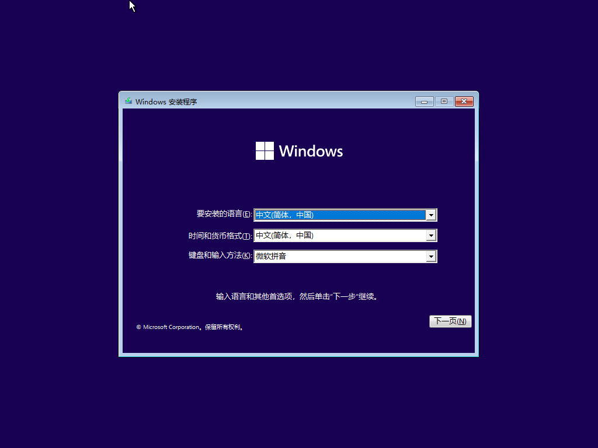

</el-card>

点击`下一页`

<el-card shadow="always">

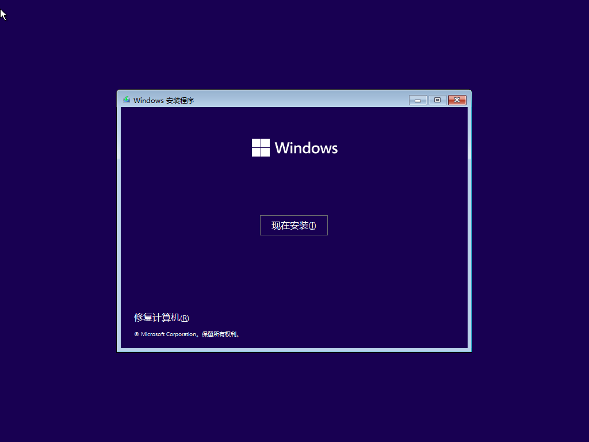

</el-card>

点击`现在安装`

<el-card shadow="always">

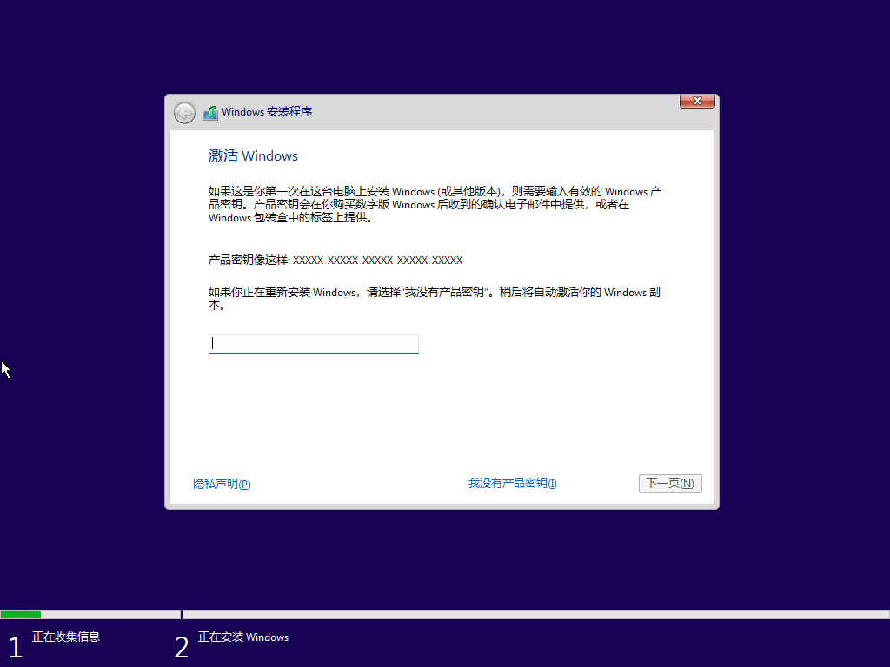

</el-card>

点击`我没有产品密钥`

<el-card shadow="always">

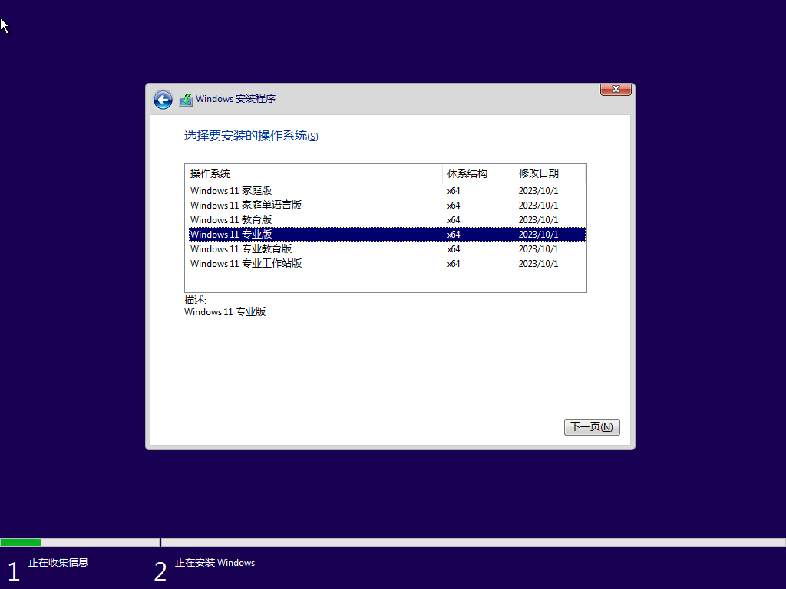

</el-card>

选中`Windows11 专业版`, 点击`下一页`

<el-card shadow="always">

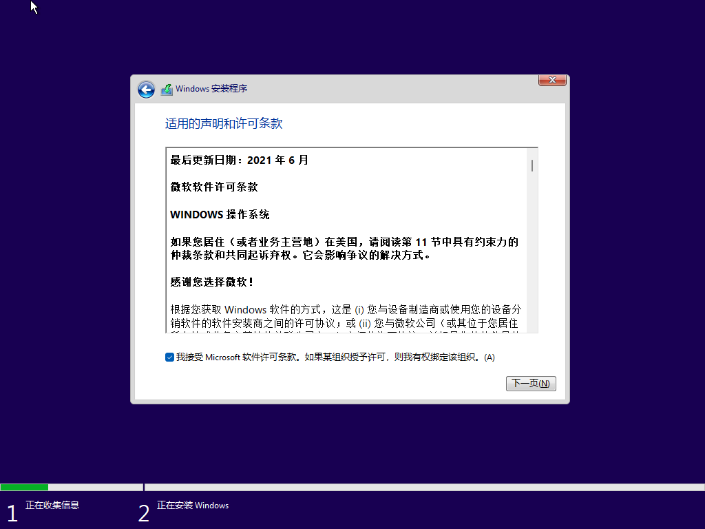

</el-card>

勾选 `我接受 Microsoft 软件许可条款。如果某组织授予许可，则我有权绑定该组织。(A)`, 点击`下一页`

<el-card shadow="always">

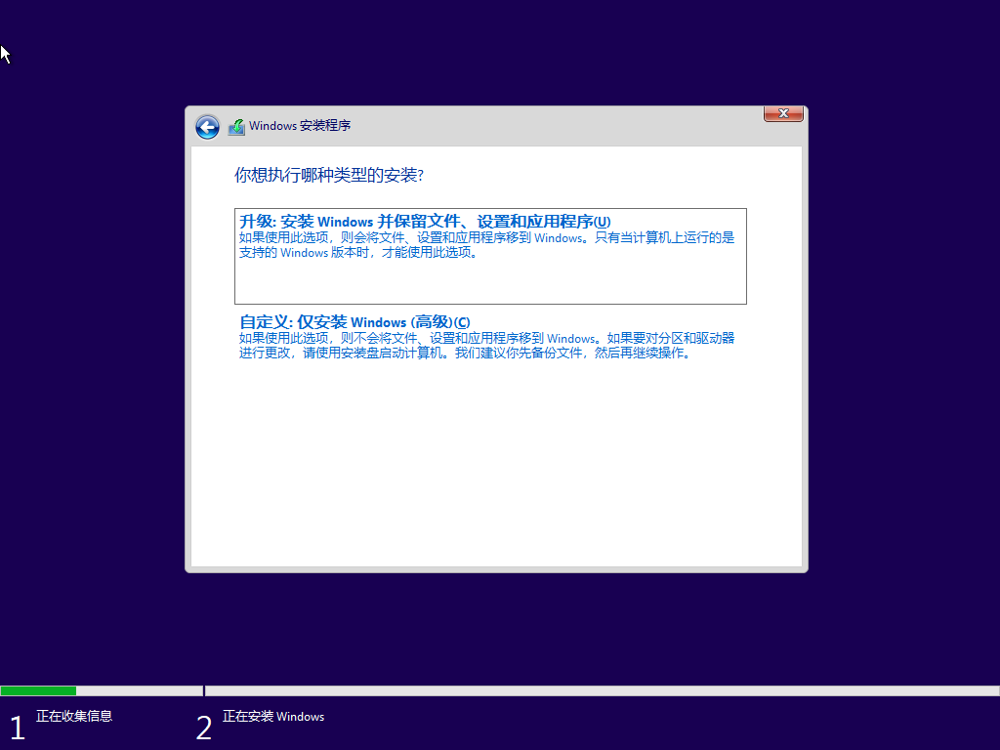

</el-card>

点击`自定义: 仅安装 Windows (高级)`

<el-card shadow="always">

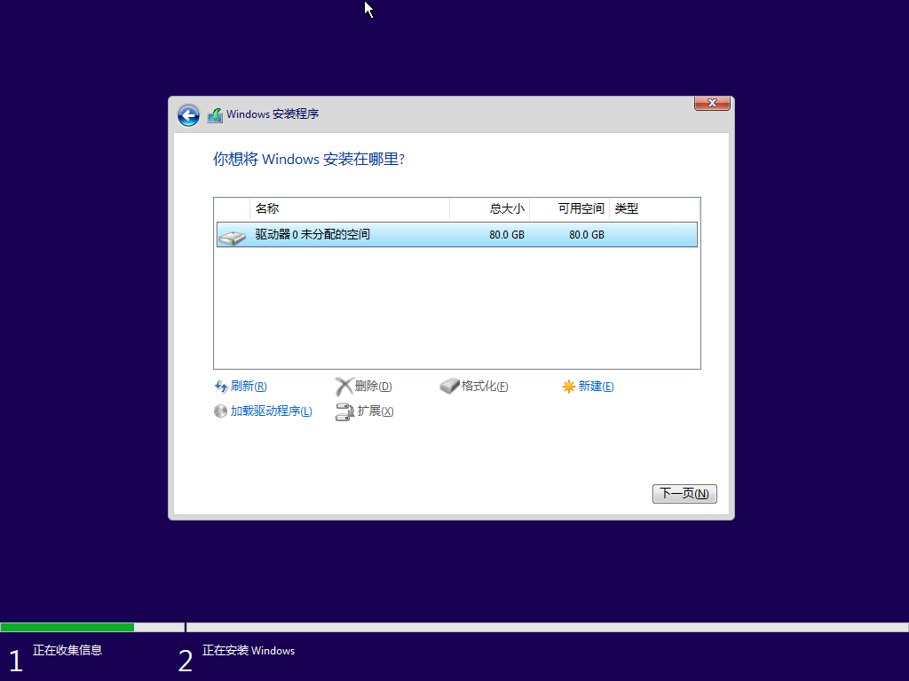

</el-card>

点击`下一页`, 等待系统文件完成复制

<el-card shadow="always">

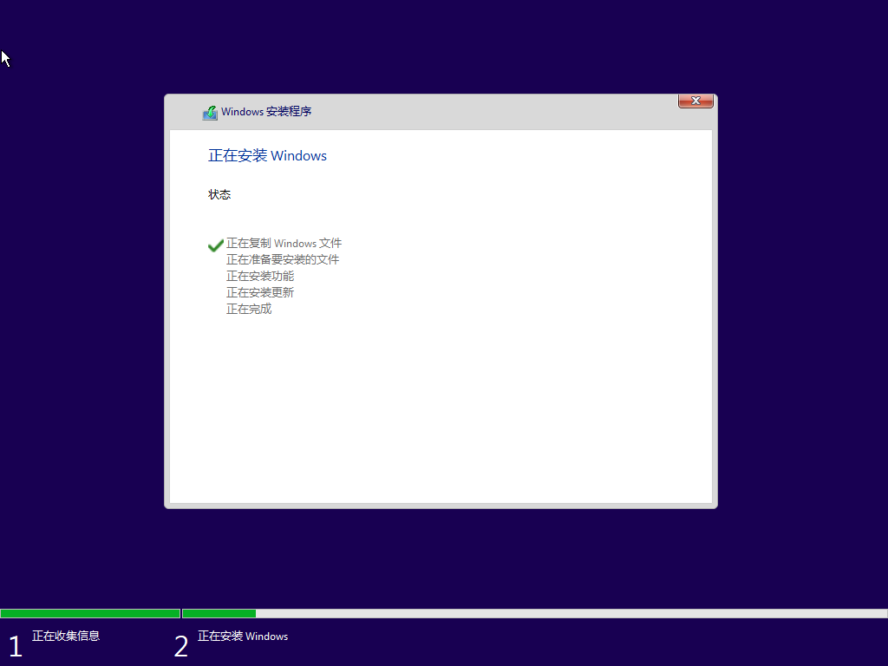

</el-card>

## 六、完成安装

系统文件完成复制后会自动重启进入系统部署阶段, 下面按照个人需求进行部署即可

<el-card shadow="always">

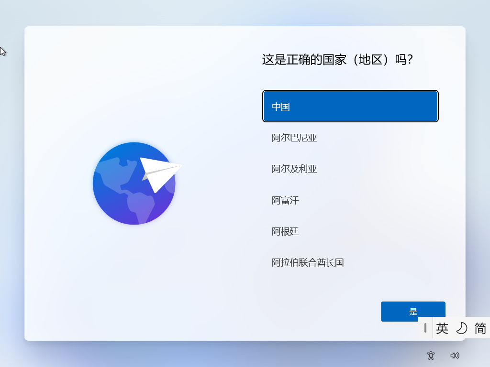

</el-card>

