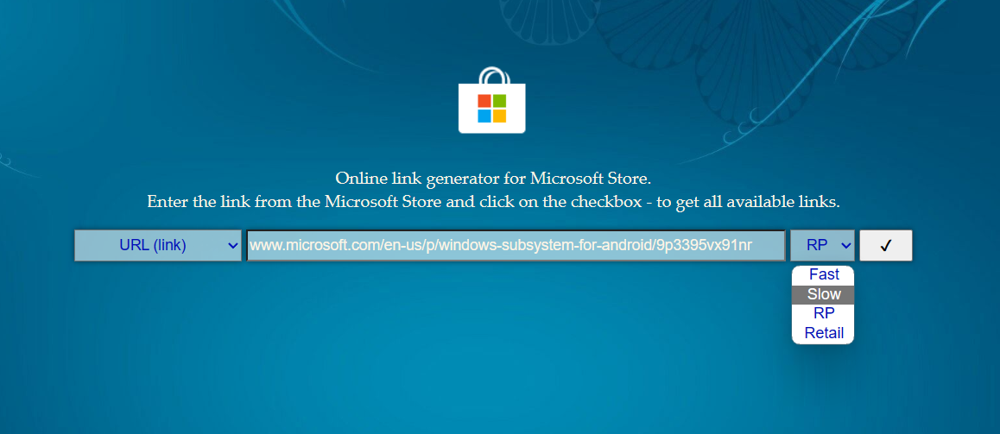
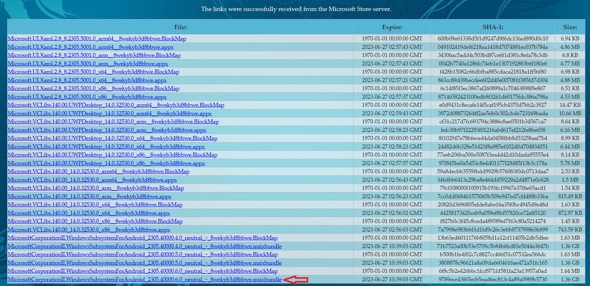
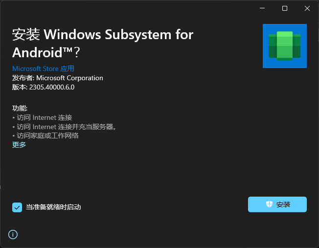

# Windows安装安卓子系统(Windows Subsystem for Android)

## 获取安装包

1. 进入https://store.rg-adguard.net/
2. 选择`Slow`ring
   
3. 搜索`www.microsoft.com/en-us/p/windows-subsystem-for-android/9p3395vx91nr`下载最新的bundle包
   

## 安装wsa

双击下载的bundle包

