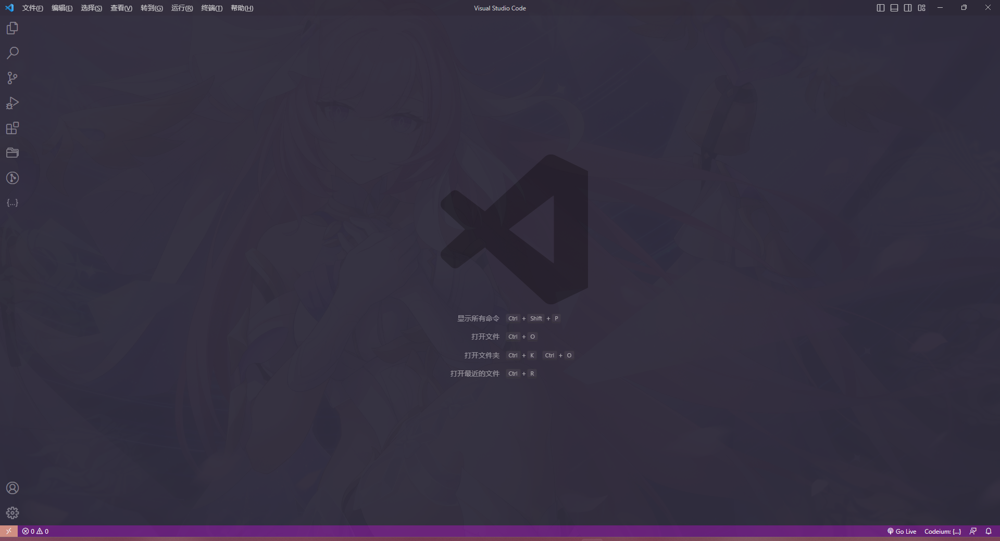

# VS Code 美化以及个人使用的 VSCode 配置



插件:

```
Auto Rename Tag  
background  
Codeium  
Flutter  
ESLint  
file-icons  
Flutter  
Git Extension Pack  
Live Server  
pink fresh  
Prettier  
translate  
TypeScript Vue Plugin (Volar)  
UnoCSS  
Vue 3 Snippets  
Vue Language Features (Volar)  
```

settings.json:

```json
{
  "workbench.iconTheme": "file-icons",
  "workbench.startupEditor": "none",
  "editor.fontFamily": "Fira Code, MiSans, HarmonyOS Sans SC ",
  "editor.fontLigatures": true,
  "background.fullscreen": {
    "images": ["file:///C:/Users/14752/Pictures/Pixiv/104655300_p0.jpg"],
    "opacity": 0.97,
    "size": "cover",
    "position": "center",
    "interval": 0
  },
  "editor.formatOnSave": true,
  "editor.formatOnPaste": true,
  "security.workspace.trust.banner": "never",
  "security.workspace.trust.emptyWindow": false,
  "security.workspace.trust.enabled": false,
  "workbench.colorTheme": "Pink Fresh"
}
```
